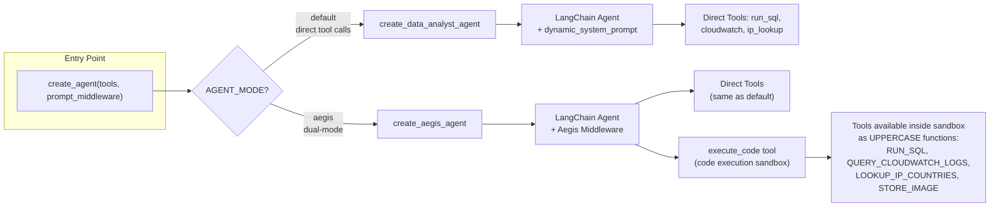
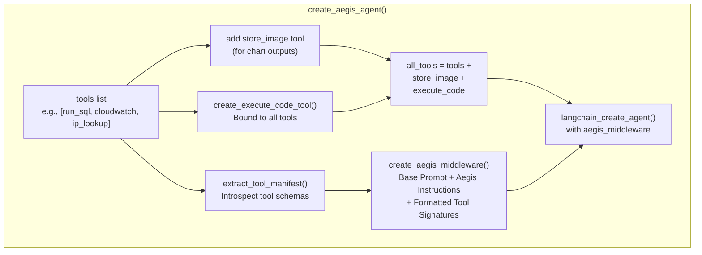
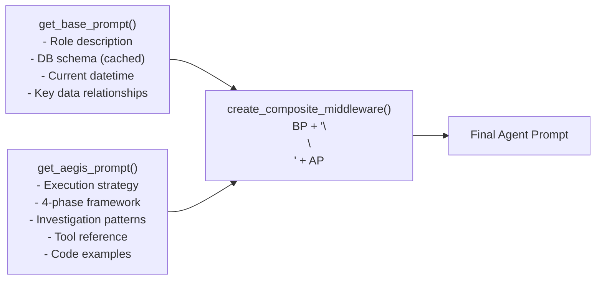

# Dual-Mode Agent System

The core design pattern is a **configurable agent factory** that supports two execution strategies controlled by the `AGENT_MODE` environment variable.

## Factory Architecture



## Mode 1: Default Agent

The default mode creates a straightforward LangChain agent with direct tool access:

```
agents/src/agent/core.py

def create_data_analyst_agent(tools):
    return langchain_create_agent(
        model=llm,
        tools=tools,
        middleware=[dynamic_system_prompt],
        checkpointer=get_checkpointer(),
    )
```

The agent calls tools as separate LangGraph actions — each tool invocation is a step in the graph. The prompt is built dynamically by `dynamic_system_prompt`, which injects the database schema and current datetime.

## Mode 2: Aegis Agent

The Aegis agent adds **code execution** as a first-class capability alongside direct tool calls:



### Tool Manifest

When Aegis creates an agent, it first **introspects every tool** to extract metadata (name, description, parameter types, required/optional). This manifest serves two purposes:

1. **Documentation** — The manifest is formatted into function signatures and injected into the system prompt so the LLM knows exactly what tools are available and how to call them
2. **Sandbox Binding** — The manifest is passed to the code executor, which dynamically creates UPPERCASE wrapper functions (e.g., `RUN_SQL`, `QUERY_CLOUDWATCH_LOGS`) that call back to the tool server via HTTP

```python
# agents/src/aegis/manifest.py
# Example manifest for run_sql tool
[
    {
        "name": "run_sql",
        "description": "Run READ-ONLY SQL queries and return JSON.",
        "parameters": [
            {
                "name": "query",
                "type": "str",
                "required": True,
                "description": "SQL query to execute"
            }
        ]
    }
]
```

### Prompt Composition

Aegis uses a **composite middleware pattern** to build the system prompt:



The base prompt describes the agent's role, the database schema, and key data relationships. The Aegis prompt adds detailed execution strategy, investigation patterns (uninstall analysis, domain investigation, user funnels, etc.), tool reference documentation, and code execution examples.

### Investigation Framework

The Aegis prompt teaches a **4-phase investigation framework**:

| Phase | Action | Tools |
|---|---|---|
| **SCOPE** | Understand the question — time range, entity type, success criteria | — |
| **EXPLORE** | Discover data with direct queries | `run_sql` (direct) |
| **COLLECT** | Gather entity IDs, fan out to related tables | `run_sql` (direct), `query_cloudwatch_logs` |
| **ANALYZE** | Complex transformations and correlation | `execute_code` with pandas |

This framework ensures the agent explores before committing to complex analysis — a key design principle to avoid wasted computation.

### LLM Configuration

**File:** `src/agent/llm.py`

```python
from langchain_openai import ChatOpenAI
import os

llm = ChatOpenAI(
    base_url="https://openrouter.ai/api/v1",
    model="x-ai/grok-4-fast",
    api_key=os.environ["API_KEY"],
    temperature=0.1,        # Low temp for analytical precision
    max_tokens=10000,        # Room for long analysis
)
```

Key decisions:
- **OpenRouter** — Single API key for any model provider. Swap to GPT-4, Claude, or Gemini by changing the model name.
- **Low temperature (0.1)** — Data analysis requires precision, not creativity.
- **Groq/xx-ai/grok-4-fast** — Fast inference for responsive streaming.

### Checkpointing

Both modes use LangGraph's `SqliteSaver` for checkpointing, stored in `data/checkpoints.db`. This enables:
- Conversation history persistence
- Message reloading on page refresh
- Streaming via LangGraph's `stream_mode="updates"`

### Screenshot: Agent in Action

When a user asks "How many users uninstalled last week?", the agent:

1. **Receives** the question via SSE stream
2. **Calls `run_sql`** to query the PostgreSQL database
3. **Calls `query_cloudwatch_logs`** to correlate with server logs
4. **Analyzes** results and returns a human-readable answer
5. **Optionally visualizes** data with matplotlib (Aegis mode)

The SSE stream shows each step in real-time: tool calls appear as collapsible accordions in the chat UI, and the final analysis is rendered as formatted markdown.
