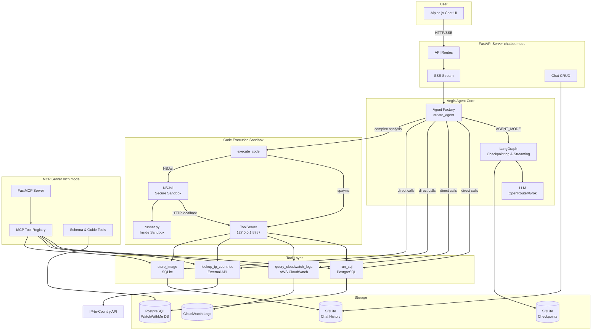
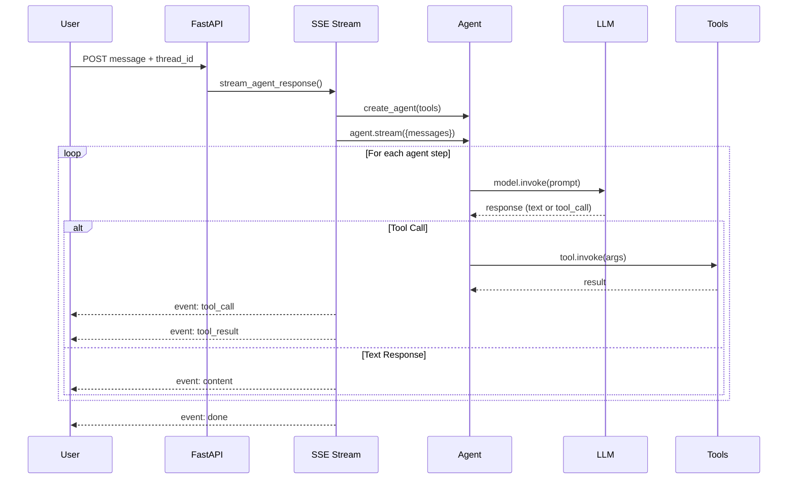
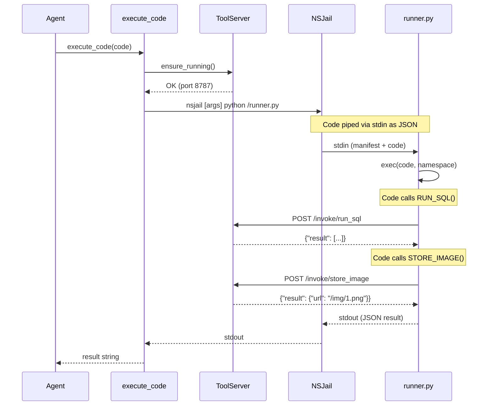

# Architecture

## High-Level System Diagram

## Component Overview

### 1. Agent Core (`agent/`)
Factory that creates LangChain agents with LLM (OpenRouter/Grok-4), checkpointing (SQLite), and configurable execution strategy.

### 2. Aegis System (`aegis/`)
The dual-mode execution engine. Includes the agent factory, sandbox executor, tool server, MCP server, and dynamic prompt instructions.

### 3. API Layer (`api/`)
FastAPI server with REST endpoints for chat CRUD and SSE streaming for real-time agent responses.

### 4. Tools (`tools/`)
Three primary LangChain tools: `run_sql` (PostgreSQL), `query_cloudwatch_logs` (AWS), `lookup_ip_countries` (external API).

### 5. Database (`db/`)
SQLAlchemy models for chat history and stored images (matplotlib charts), using SQLite.

### 6. Prompt System (`prompt/`)
Dynamic prompt builder that injects the database schema and current datetime. Supports composable middleware for extending prompts.

## Data Flow

### Chatbot Mode Flow

### Aegis Code Execution Flow

## Configuration

The system is controlled by two key environment variables:

| Variable | Values | Description |
|---|---|---|
| `APP_MODE` | `chatbot` (default), `mcp` | Deployment mode |
| `AGENT_MODE` | `default`, `aegis` | Agent execution strategy |

This separation means you can run any agent mode under any deployment mode — for example, an MCP server with Aegis code execution, or a chatbot with the default direct-tool agent.

## File-to-Component Mapping

| Component | Directory | Key Files |
|---|---|---|
| **Entry Point** | `src/` | `main.py` — dispatches by `APP_MODE` |
| **API Layer** | `src/api/` | `routes.py` (endpoints), `sse.py` (streaming engine) |
| **Agent Core** | `src/agent/` | `core.py` (factory), `llm.py` (LLM config) |
| **Prompt System** | `src/prompt/` | `system.py` (base prompt + schema), `middleware.py` (composition) |
| **Tool Layer** | `src/tools/` | `sql.py`, `cloudwatch.py`, `ip_lookup.py`, `database.py` (connection mgr) |
| **Data Layer** | `src/db/` | `models.py` (Chat, Image), `repository.py` (CRUD) |
| **Aegis Agent** | `src/aegis/` | `agent.py` (factory), `instructions.py` (prompt), `manifest.py` (introspection) |
| **Code Sandbox** | `src/aegis/sandbox/` | `executor.py` (NSJail), `runner.py` (sandbox script) |
| **ToolServer** | `src/aegis/server/` | `api.py` (FastAPI + lifecycle) |
| **MCP Server** | `src/aegis/mcp/` | `server.py` (factory), `adapters.py`, `auth.py`, `routes.py` |
| **Frontend** | `public/` | `index.html`, `js/app.js`, `js/chat.js`, `js/sidebar.js`, `js/utils.js` |

See [Project Structure](/docs/project-structure) for the full file tree.
