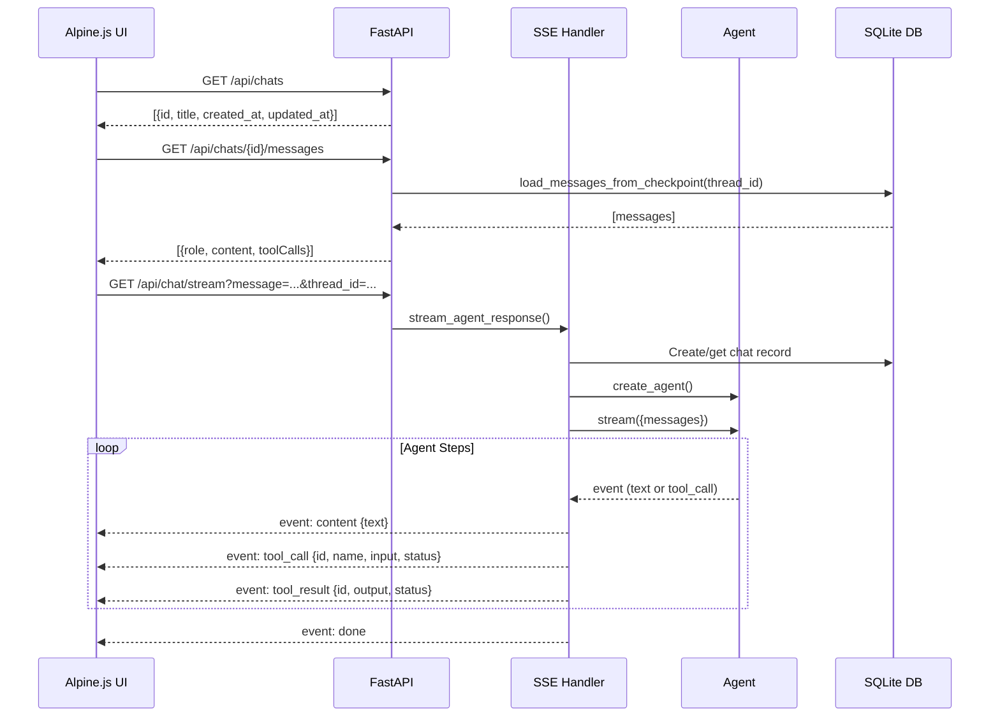

# Chat API

The chat API provides a RESTful interface for conversational data analysis, with Server-Sent Events (SSE) streaming for real-time agent responses.

## Architecture



## Endpoints

**File:** `src/api/routes.py`

### Chat CRUD

| Method | Path | Description |
|---|---|---|
| `GET` | `/` | Serve the index.html frontend |
| `GET` | `/api/chats` | List all chats, ordered by `updated_at` desc |
| `POST` | `/api/chats` | Create new chat (`title` in body) |
| `DELETE` | `/api/chats/{chat_id}` | Delete a chat |
| `GET` | `/api/chats/{chat_id}/messages` | Load messages from checkpoint |

### Streaming

| Method | Path | Description |
|---|---|---|
| `GET` | `/api/chat/stream` | SSE stream for agent response |

### Media

| Method | Path | Description |
|---|---|---|
| `GET` | `/img/{image_id}.{ext}` | Serve stored images |

### Health

| Method | Path | Description |
|---|---|---|
| `GET` | `/health` | Health check |

## SSE Streaming

**File:** `src/api/sse.py`

The streaming endpoint uses LangGraph's `stream_mode="updates"` to get real-time events as the agent processes:

```python
def stream_agent_response(message: str, thread_id: str) -> Generator[str, None, None]:
    agent = create_agent([run_sql, query_cloudwatch_logs, lookup_ip_countries])
    config = {"configurable": {"thread_id": thread_id}}
    
    for event in agent.stream(
        {"messages": [HumanMessage(content=message)]},
        config=config,
        stream_mode="updates",
    ):
        for node_name, node_output in event.items():
            # Extract AI messages with tool_calls
            # Extract ToolMessage results
            # Extract text content chunks
            yield formatted_sse_event
```

### SSE Event Types

```
event: start
data: {"thread_id": "abc-123"}

event: tool_call
data: {"id": "call_1", "name": "run_sql", "input": {"query": "SELECT ..."}, "status": "running"}

event: tool_result
data: {"id": "call_1", "output": "[{\"count\": 42}]", "status": "complete"}

event: content
data: {"text": "Here's what I found..."}

event: done
data: {}

event: error
data: {"message": "Something went wrong"}
```

### Tool Call Tracking

The streaming handler tracks tool calls by their `tool_call_id` across LangGraph nodes:

1. When an AI message has `tool_calls`, each is emitted as a `tool_call` event with status "running"
2. When the corresponding `ToolMessage` arrives, it's matched by `tool_call_id` and emitted as a `tool_result` event
3. Long outputs (>2000 chars) are truncated for SSE efficiency

### Message Loading from Checkpoints

The `load_messages_from_checkpoint()` function reconstructs the conversation for page refresh:

```python
def load_messages_from_checkpoint(thread_id: str) -> list[dict]:
    state = checkpointer.get_tuple(config)
    messages = state.checkpoint["channel_values"]["messages"]
    
    # Reconstruct: HumanMessage → AIMessage (with toolCalls) → ToolMessage (attached)
    # System messages are filtered out
    # Tool calls are matched with their results
    # Returns: [{role, content, toolCalls}]
```

This creates a clean message structure where each AI message includes both its text content and an array of `toolCalls` with their results — perfect for the frontend to render.

## Chat Repository

**File:** `src/db/repository.py`

Simple SQLAlchemy-based CRUD with SQLite:

| Operation | Method |
|---|---|
| List all | `ChatRepository.list_all()` |
| Get by ID | `ChatRepository.get(thread_id)` |
| Create | `ChatRepository.create(thread_id, title)` |
| Update timestamp | `ChatRepository.update_timestamp(thread_id)` |
| Delete | `ChatRepository.delete(thread_id)` |
| Check exists | `ChatRepository.exists(thread_id)` |

Chats are created with `thread_id` as the primary key (UUID generated client-side). The title is auto-generated from the first message (truncated to 50 chars, then to 100 for the database column).

## Design Rationale

**Why SSE over WebSockets?** The agent communication pattern is mostly unidirectional (server → client sends streaming tokens). SSE's `EventSource` API provides automatic reconnection, simpler error handling, and works over standard HTTP without upgrade negotiation. Additionally, SSE events are text-based and naturally map to the event types we need (content, tool_call, tool_result, done, error). See [Data Flow](/docs/data-flow) for the full streaming sequence.

**Why LangGraph's `stream_mode="updates"`?** This mode emits structured dictionaries with node names and outputs, rather than raw token-by-token streaming. This lets us distinguish between AI text content, tool call invocations, and tool execution results — critical for rendering the collapsible tool call accordions in the frontend.
