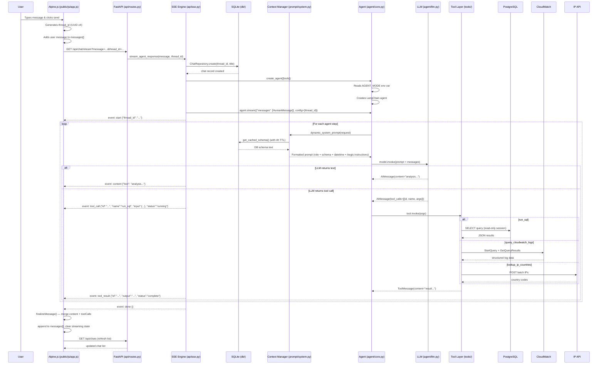
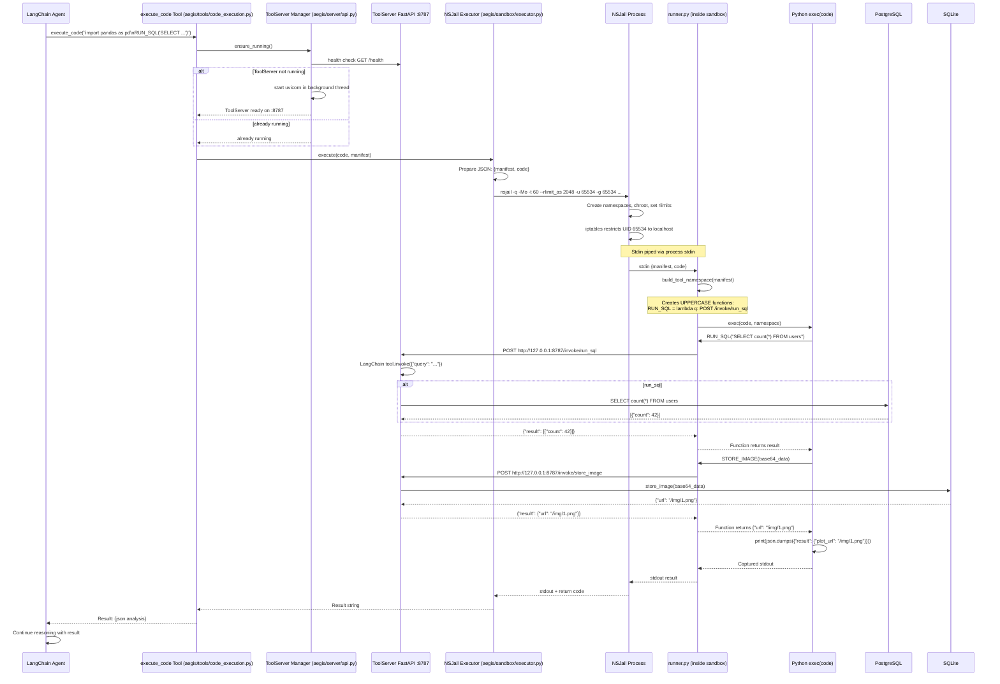
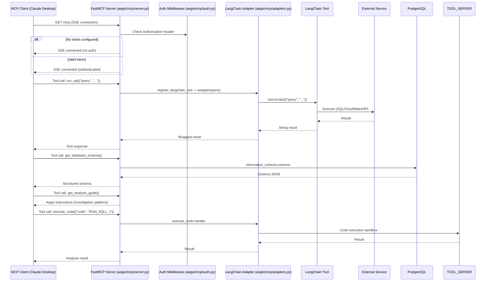
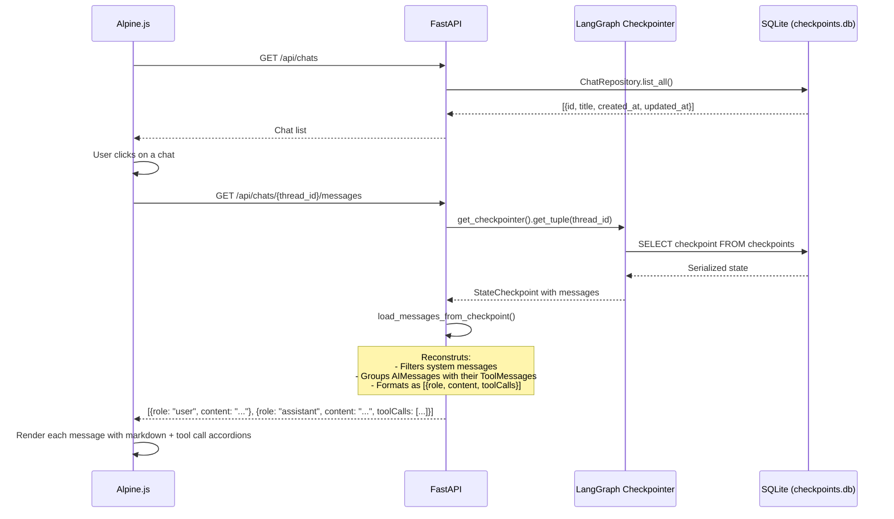
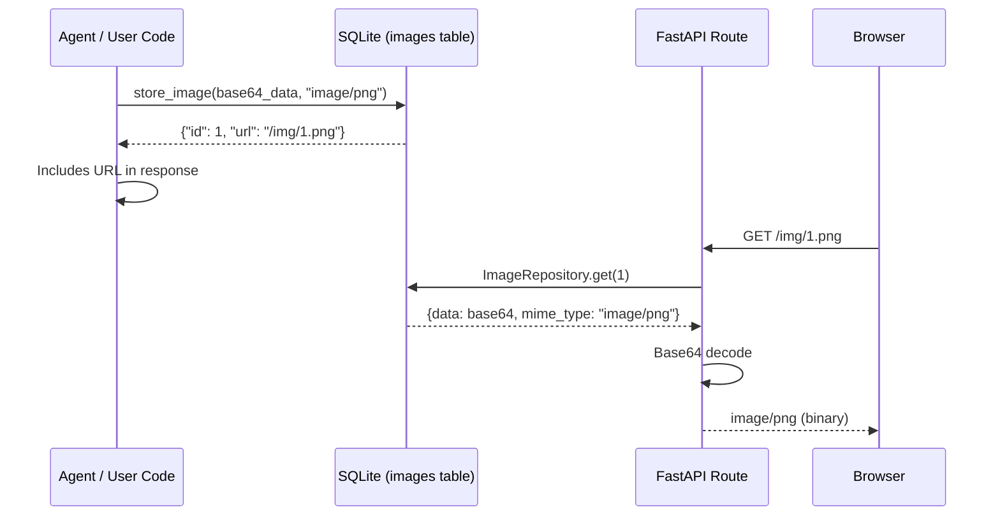

# Data Flow

This page documents the complete data flow for every mode and operation in the Aegis Agent system.

---

## 1. Chatbot Mode: User Sends a Message

The primary flow: a user types a question and receives a streaming response.

---

## 2. Aegis Code Execution Flow

When the agent decides to write and execute Python code for complex analysis:

---

## 3. MCP Mode Flow

When an external LLM client interacts via the Model Context Protocol:

---

## 4. Message Loading on Page Refresh

When a user refreshes the page and selects a previous chat:

---

## 5. Image Serving Flow

---

## Data Flow Summary Table

| Trigger | Source | Destination | Protocol | Data |
|---|---|---|---|---|
| User message | Alpine.js | FastAPI | HTTP GET + SSE | message text, thread_id |
| Agent step | LangGraph | LLM (OpenRouter) | HTTPS | prompt + message history |
| SQL query | Agent / Sandbox | PostgreSQL | TCP (read-only) | SQL query |
| Log query | Agent / Sandbox | AWS CloudWatch | HTTPS (boto3) | Logs Insights query |
| IP lookup | Agent / Sandbox | IP API | HTTPS | Batch IP addresses |
| Code execution | Agent | NSJail | Process spawn | Python code |
| Sandbox tool call | runner.py | ToolServer | HTTP localhost :8787 | Tool name + args |
| Image storage | runner.py / Agent | SQLite | SQLAlchemy | Base64 image data |
| Chat CRUD | Alpine.js | FastAPI | HTTP REST | Chat metadata |
| MCP tool call | External client | FastMCP | MCP Protocol | Tool name + args |
