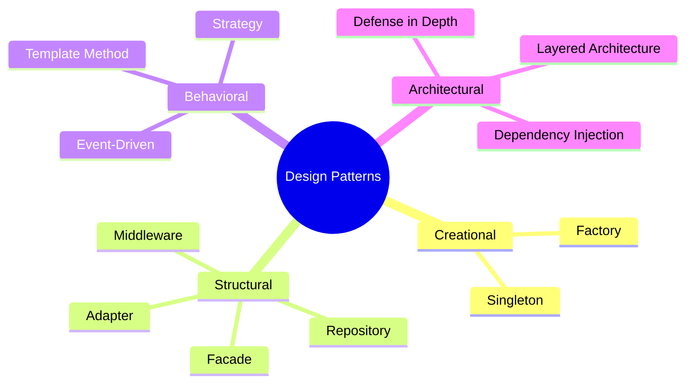
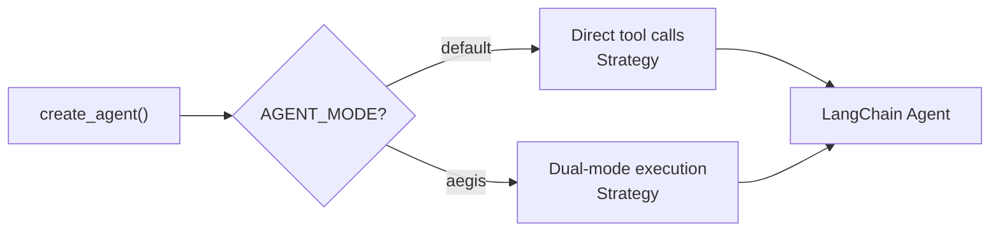
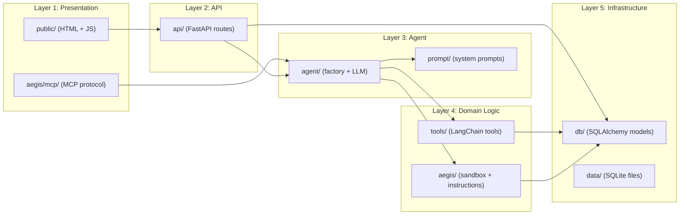

# Design Patterns

The Aegis Agent codebase demonstrates **10+ software design patterns** organized across architectural layers. This page catalogs each pattern with its implementation location and rationale.

## Pattern Map



---

## Creational Patterns

### 1. Factory Pattern

**Used in:** Agent creation, MCP server creation, tool creation, app creation

The primary creational pattern. Every major component has a factory function that encapsulates construction logic.

```python
# src/agent/core.py — Agent factory (dispatches by mode)
def create_agent(tools, prompt_middleware=None):
    mode = os.environ.get("AGENT_MODE", "default")
    if mode == "aegis":
        return create_aegis_agent(tools)
    return create_data_analyst_agent(tools)

# src/aegis/mcp/server.py — MCP server factory
def create_mcp_server(tools, name="Aegis", include_code_execution=True, auth_token=None):
    ...

# src/aegis/tools/code_execution.py — Tool factory
def create_execute_code_tool(manifest):
    ...
```

**Why:** Encapsulates complex construction logic behind a simple interface. Allows switching implementations without changing callers. The agent creation involves LLM config, tool binding, checkpoint setup, prompt middleware — callers just pass `tools`.

---

### 2. Singleton Pattern

**Used in:** Database connections, checkpoint persistence, ToolServer

```python
# db/repository.py — Single engine/session across all requests
_engine = None
_session = None

def get_engine():
    global _engine
    if _engine is None:
        _engine = create_engine("sqlite:///data/chat_history.db")
    return _engine

# agent/core.py — Single checkpointer across agent instances
_checkpointer = None
def get_checkpointer():
    global _checkpointer
    if _checkpointer is None:
        _checkpointer = SqliteSaver.from_conn_string("data/checkpoints.db")
    return _checkpointer

# aegis/server/api.py — Single ToolServer instance
_global_server = None
class ToolServer:
    def ensure_running(self):
        if self._running: return
        ...
```

**Why:** Database connections are expensive to create. LangGraph checkpointer must be shared to access past conversations. ToolServer must be a single process on a fixed port.

---

## Structural Patterns

### 3. Adapter Pattern

**Used in:** LangChain → FastMCP tool adapters

```python
# src/aegis/mcp/adapters.py
def register_langchain_tool(mcp: FastMCP, lc_tool) -> None:
    # Dynamically generates wrapper with explicit parameters
    # FastMCP doesn't support **kwargs — each param must be explicit
    func_code = f'''
def wrapper({params_str}):
    """{doc}"""
    return _tool_.invoke({{k: v for k, v in locals().items() if k != '_tool_'}})
'''
    exec(func_code, {"_tool_": lc_tool})
    wrapper.__annotations__ = {**param_types, "return": str}
    mcp.tool(wrapper)
```

**Why:** LangChain tools use Pydantic schemas with dynamic parameter resolution. FastMCP (MCP protocol) requires explicit parameter names and types. The adapter bridges the two without modifying either library.

---

### 4. Facade Pattern

**Used in:** `agent/__init__.py`, `aegis/__init__.py`, `db/__init__.py`

Each module's `__init__.py` exports a clean public API, hiding internal complexity:

```python
# agent/__init__.py — Clean public API
from .llm import llm
from .core import create_data_analyst_agent, create_agent, get_checkpointer

# aegis/__init__.py — Lazy loading facade
def __getattr__(name):
    if name == "create_aegis_agent":
        from .agent import create_aegis_agent
        return create_aegis_agent
    if name == "create_mcp_server":
        from .mcp import create_mcp_server
        return create_mcp_server
    raise AttributeError
```

**Why:** Callers get a simple import (`from agent import create_agent`) without needing to know about submodules (LLM, core, checkpointer). The lazy `__getattr__` avoids importing heavy dependencies (NSJail, uvicorn) until actually needed.

---

### 5. Middleware Pattern (Decorator)

**Used in:** Prompt construction via `@dynamic_prompt`

```python
# src/prompt/system.py
@dynamic_prompt
def dynamic_system_prompt(request: ModelRequest) -> str:
    return get_base_prompt(request)

# src/prompt/middleware.py — Composition
def create_composite_middleware(*prompt_fns: PromptFn):
    """Combine multiple prompt functions into one middleware."""
    @dynamic_prompt
    def composite_prompt(request: ModelRequest) -> str:
        parts = [fn(request) for fn in prompt_fns]
        return "\n\n".join(parts)
    return composite_prompt
```

**Why:** Allows stacking prompt components (base prompt + Aegis instructions) without hardcoding their combination. Each prompt function is independently testable and swappable.

---

### 6. Repository Pattern

**Used in:** `db/repository.py`

```python
# db/repository.py
class ChatRepository:
    @staticmethod
    def list_all(): ...
    @staticmethod
    def get(thread_id): ...
    @staticmethod
    def create(thread_id, title): ...
    @staticmethod
    def delete(thread_id): ...

class ImageRepository:
    @staticmethod
    def create(base64_data, mime_type): ...
    @staticmethod
    def get(image_id): ...
```

**Why:** Separates data access from business logic. Routes and SSE handlers work with clean method calls instead of raw SQLAlchemy queries.

---

## Behavioral Patterns

### 7. Strategy Pattern

**Used in:** Agent execution mode selection

```python
# agent/core.py
def create_agent(tools, prompt_middleware=None):
    """Strategy: Select execution algorithm based on AGENT_MODE"""
    mode = os.environ.get("AGENT_MODE", "default")
    
    if mode == "aegis":
        # Strategy 1: Dual-mode with code execution
        return create_aegis_agent(tools)
    
    # Strategy 2: Direct tool calls only
    return create_data_analyst_agent(tools)
```



**Why:** The caller (`routes.py` or `sse.py`) doesn't care about execution strategy — it just calls `create_agent(tools)`. The strategy is selected by environment variable, enabling runtime configuration without code changes.

---

### 8. Template Method Pattern

**Used in:** Lazy imports in `aegis/__init__.py`

```python
# aegis/__init__.py
def __getattr__(name):
    """Template for lazy-loading all public symbols"""
    if name == "create_aegis_agent":
        from .agent import create_aegis_agent
        return create_aegis_agent
    if name == "create_mcp_server":
        from .mcp import create_mcp_server
        return create_mcp_server
    raise AttributeError(f"module {__name__!r} has no attribute {name!r}")
```

**Why:** Ensures heavy modules (NSJail executor, FastMCP server, uvicorn) are only imported when their corresponding mode is active. This keeps startup time fast regardless of which mode is configured.

---

### 9. Event-Driven (Observer) Pattern

**Used in:** SSE streaming for real-time agent responses

```python
# api/sse.py — Event emitter
for event in agent.stream(..., stream_mode="updates"):
    for node_name, node_output in event.items():
        if isinstance(output, AIMessage) and output.tool_calls:
            yield sse_event("tool_call", ...)
        if isinstance(output, ToolMessage):
            yield sse_event("tool_result", ...)

# public/js/chat.js — Event subscriber
source.addEventListener('content', (e) => {
    streamingContent += JSON.parse(e.data).text;
});
source.addEventListener('tool_call', (e) => {
    toolCalls.push(JSON.parse(e.data));
});
```

**Why:** SSE gives real-time visibility into agent thinking without WebSocket complexity. The `EventSource` API provides automatic reconnection. Events are typed (content, tool_call, tool_result) so subscribers handle each differently.

---

## Architectural Patterns

### 10. Layered Architecture

The system is organized into strict layers with unidirectional dependencies:



**Why:** Each layer depends only on layers below it. Presentation never touches infrastructure directly. This enables testing, swapping implementations, and reasoning about the system in isolation.

---

### 11. Dependency Injection (via Parameters)

**Used in:** Agent and MCP factory functions

```python
def create_agent(tools, prompt_middleware=None):
    # tools are injected — caller controls what's available
    ...

def create_mcp_server(tools, name, include_code_execution, auth_token):
    # Everything is injected — no global state
    ...
```

**Why:** Makes testing trivial (inject mock tools), enables configuration without subclassing, and keeps functions pure. The factory owns the wiring.

---

### 12. Defense in Depth (Security Pattern)

**Used in:** `docker-entrypoint.sh`, `executor.py`, `sql.py`

Not a single pattern but a layered security architecture:

| Layer | Mechanism | Location |
|---|---|---|
| 1. Container | Docker isolation, capabilities | `Dockerfile.agent`, `docker-compose.yml` |
| 2. Network | iptables filtering by UID | `docker-entrypoint.sh` |
| 3. OS Sandbox | NSJail namespaces + seccomp | `src/aegis/sandbox/executor.py` |
| 4. Application | Read-only DB session | `src/tools/database.py`, `src/tools/sql.py` |
| 5. Auth | MCP bearer token | `src/aegis/mcp/auth.py` |

**Why:** No single security mechanism is perfect. Multiple layers ensure that a bypass in one is caught by another. For example, even if NSJail is compromised, the DB connection is read-only at the PostgreSQL session level.
