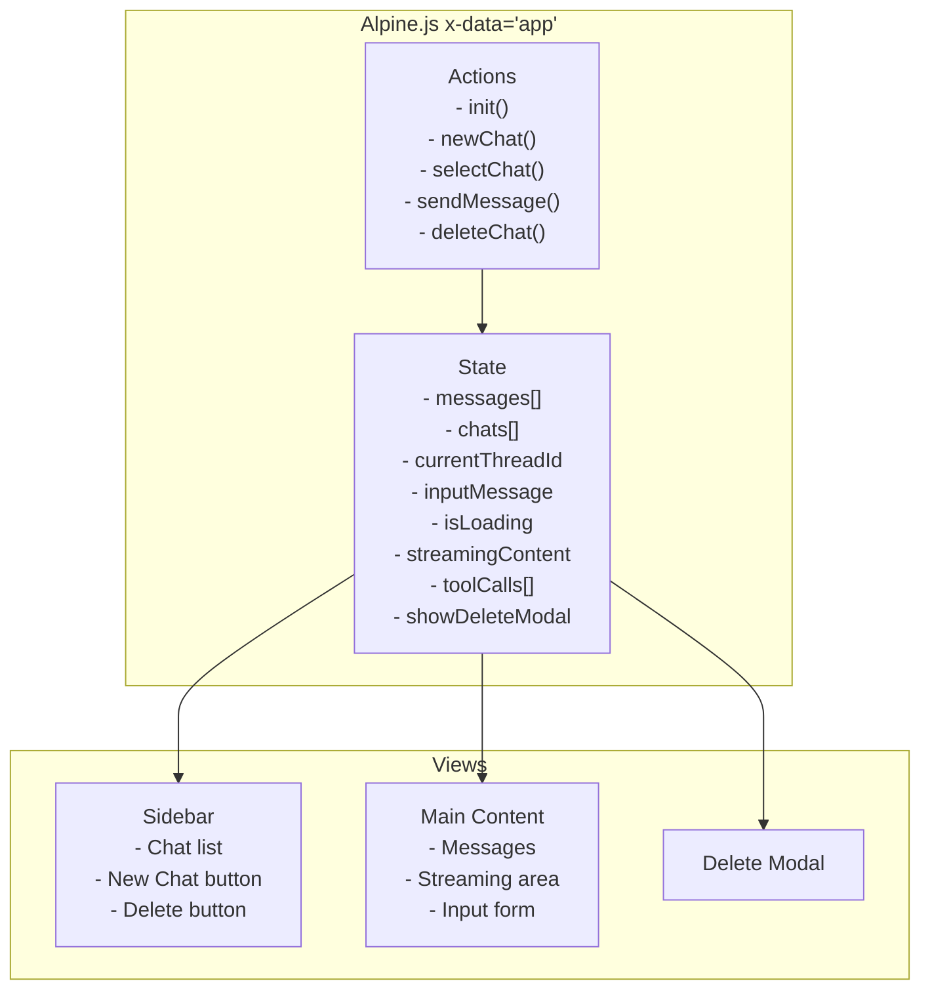

# Frontend

The frontend is a single-page application built with **Alpine.js** — a lightweight JavaScript framework that provides reactive data binding and component behavior directly in HTML.

## Architecture

```
agents/public/
├── index.html          # Main HTML (Alpine.js SPA)
└── js/
    ├── app.js          # Root Alpine component
    ├── chat.js         # SSE streaming, message rendering
    ├── sidebar.js      # Chat list management
    └── utils.js        # Helpers (date formatting, etc.)
```

## Component Model



## Key Features

### SSE Event Handling (chat.js)

The `sendMessage()` function creates an `EventSource` for streaming:

```javascript
const url = `/api/chat/stream?message=${encodeURIComponent(msg)}&thread_id=${threadId}`;
const source = new EventSource(url);

source.addEventListener('start', (e) => { /* set thread_id */ });
source.addEventListener('content', (e) => { /* append to streamingContent */ });
source.addEventListener('tool_call', (e) => { /* add to toolCalls[] */ });
source.addEventListener('tool_result', (e) => { /* update tool call status/output */ });
source.addEventListener('done', (e) => { 
    source.close(); 
    /* finalize message, reload chats */ 
});
source.addEventListener('error', (e) => { /* show error */ });
```

### Markdown Rendering (chat.js)

Messages are rendered as HTML using **Marked.js** with syntax highlighting via **Highlight.js**:

```javascript
function renderMessage(msg) {
    const html = marked.parse(msg.content);
    // After DOM update, run highlight.js on all code blocks
    document.querySelectorAll('.message-content pre code').forEach(el => {
        hljs.highlightElement(el);
    });
    return html;
}
```

### Tool Call Visualization (chat.js + index.html)

Tool calls are rendered as collapsible `<details>` elements:

```html
<details class="tool-accordion">
    <summary>
        <span>🔧 run_sql</span>
        <span class="status-badge">complete</span>
    </summary>
    <div class="tool-input">
        <pre><code class="language-sql">SELECT count(*) FROM users...</code></pre>
    </div>
    <div class="tool-output">
        <pre><code class="language-json">[{"count": 42}]</code></pre>
    </div>
</details>
```

### Chat History Management (sidebar.js)

The sidebar manages a list of chats fetched from `/api/chats`. On selection, it loads messages from the checkpoint via `/api/chats/{id}/messages`. The "New Chat" button generates a UUID and resets the UI.

## Dependencies (CDN)

| Library | Purpose |
|---|---|
| Tailwind CSS | Utility-first styling |
| Alpine.js 3.14 | Reactive UI framework |
| Marked.js 12.0 | Markdown → HTML rendering |
| Highlight.js 11.9 | Code syntax highlighting |

## Design Decisions

| Decision | Rationale |
|---|---|
| **Alpine.js over React/Vue** | For a single-page analytics chat interface, Alpine provides sufficient reactivity without a bundler, build pipeline, or node_modules. 292 lines of HTML + 570 lines of JS total. |
| **No build step** | All libraries loaded from CDN. Zero configuration, instant development. No Webpack, Vite, or bundler needed. |
| **SSE over WebSocket** | Simpler protocol, automatic reconnection, native `EventSource` API. The agent communication is mostly unidirectional (server → client). See [Data Flow](/docs/data-flow). |
| **Collapsible tool calls** | Prevents tool execution details from cluttering the conversation while keeping them accessible for debugging transparency. |
| **Tailwind CSS (CDN)** | Utility-first CSS means no custom stylesheets. The whole UI is styled inline in the HTML. |
| **Marked.js + Highlight.js** | Lightweight markdown rendering with syntax highlighting for SQL, Python, and JSON outputs — essential for a data analysis agent. |
