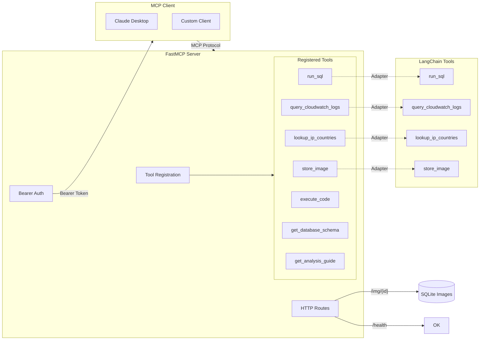

# MCP Server

The Aegis MCP (Model Context Protocol) server exposes all LangChain tools via the standardized MCP protocol. This enables any MCP-compatible client (Claude Desktop, custom UIs, etc.) to use the same tools as the chatbot agent.

## Architecture



## Server Creation

**File:** `src/aegis/mcp/server.py`

```python
def create_mcp_server(
    tools: list,
    name: str = "Aegis",
    include_code_execution: bool = True,
    auth_token: str | None = None,
) -> FastMCP:
```

Mirrors the `create_aegis_agent()` factory — pass tools, get a configured server.

## LangChain Tool Adapters

**File:** `src/aegis/mcp/adapters.py`

FastMCP doesn't support `**kwargs` — each tool parameter must be explicit. The adapter dynamically creates wrapper functions with the correct signatures:

```python
def register_langchain_tool(mcp: FastMCP, lc_tool) -> None:
    # Extract parameter info from LangChain tool schema
    params = []
    param_types = {}
    
    for field_name, field in lc_tool.args_schema.model_fields.items():
        param_types[field_name] = field.annotation
        if not field.is_required():
            params.append(f"{field_name}={field.default!r}")
        else:
            params.append(field_name)
    
    # Generate wrapper function with explicit parameters
    func_code = f'''
def wrapper({params_str}):
    """{{doc}}"""
    return _tool_.invoke({{{{k: v for k, v in locals().items() if k != '_tool_'}}}})
'''
    namespace = {"_tool_": lc_tool}
    exec(func_code.format(doc=lc_tool.description), namespace)
    wrapper = namespace["wrapper"]
    wrapper.__name__ = lc_tool.name
    wrapper.__annotations__ = {**param_types, "return": str}
    
    mcp.tool(wrapper)
```

This dynamically generates functions like:
```python
def run_sql(query: str) -> str:
    return _tool_.invoke({"query": query})
```

## Code Execution in MCP

The `execute_code` tool is registered separately with a comprehensive description that includes the full tool manifest:

```python
description = f"""Execute Python code in a secure sandbox.

## Available Tool Functions

Inside the sandbox, tools are available as UPPERCASE functions:
{format_tool_signatures(manifest)}

## Available Libraries
- pandas, numpy, matplotlib, seaborn, scipy, scikit-learn, statsmodels
- json, math, statistics, re, io, base64
- collections (Counter, defaultdict), datetime (datetime, timedelta)
"""
```

This means MCP clients see the complete documentation of what's available inside the sandbox, including tool signatures and available libraries.

## Schema and Analysis Tools

**File:** `src/aegis/mcp/registrations/schema.py`

Two additional tools are registered that are specific to the MCP server:

### get_database_schema

Returns the complete PostgreSQL schema as structured JSON by querying `information_schema.columns`, `table_constraints`, and `pg_indexes`. Used by MCP clients to understand the database structure before writing queries.

### get_analysis_guide

Returns the full Aegis investigation instructions (the same prompt injected into the agent). This allows MCP clients to understand the investigation framework, tool usage patterns, and code examples without being an agent themselves.

## Authentication

**File:** `src/aegis/mcp/auth.py`

Bearer token authentication using FastMCP's `StaticTokenVerifier`:

```python
def create_bearer_auth(auth_token: str | None = None):
    token = auth_token or os.environ.get("MCP_AUTH_TOKEN")
    if not token:
        return None
    
    return StaticTokenVerifier(tokens={
        token: {"client_id": "mcp-client", "scopes": ["read", "write", "execute"]}
    })
```

Auth is optional — if neither an explicit token nor `MCP_AUTH_TOKEN` env var is set, the server runs without authentication. All tokens grant full access (read, write, execute).

## Custom Routes

Beyond tool endpoints, the MCP server registers:

- **`GET /img/{path}`** — Serves stored images from the SQLite database (same as the chatbot API)
- **`GET /health`** — Health check returning `{"status": "ok"}`
- **`GET /mcp.json`**, **`GET /mcp`**, **`GET /sse`** — Standard MCP protocol endpoints

## Design Rationale

**Why MCP instead of a custom API?** The Model Context Protocol is an emerging standard for LLM-tool interaction. Using MCP means any MCP-compatible client (Claude Desktop, Cursor, custom UIs) can use the same tools without integration work. It also separates the tool server from the agent — the same tools work for both the chatbot and external consumers.

**Why dynamic wrapper generation?** FastMCP requires explicit parameter names for schema generation (no `**kwargs` support). Rather than manually writing wrapper functions for each tool (which would break whenever a tool's signature changes), the adapter [introspects the tool's Pydantic schema](/docs/design-patterns#3-adapter-pattern) and generates wrappers dynamically. New tools work automatically.

**Why mirror `create_aegis_agent()`?** The MCP server factory (`create_mcp_server`) follows the same pattern as the agent factory (`create_aegis_agent`) — pass tools, get a configured server. This consistency means developers only need to learn one factory pattern.

## Deployment

The MCP server runs independently of the chatbot:

```bash
APP_MODE=mcp python -m src.main
```

Or via the entry point:
```python
from main import run_mcp
run_mcp()  # FastMCP on port 8000 with HTTP transport
```
