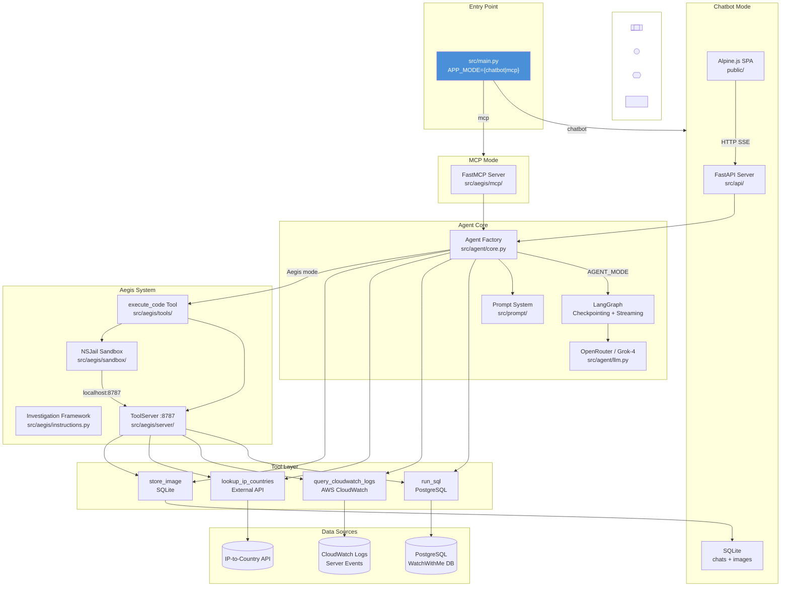

# Aegis Agent: System Overview

The **Aegis Agent** is a dual-mode AI-powered data analysis framework for **WatchWithMe** — a browser extension that lets users watch videos together in real-time sync. It enables natural-language-driven churn analysis, user behavior investigation, and system health monitoring through a sophisticated multi-layered architecture.

This documentation serves as both a technical reference and an architecture showcase demonstrating production-grade patterns for AI agent systems.

## Architecture at a Glance

## Key Design Decisions

| Decision | Rationale |
|---|---|
| **Dual-Mode Execution** | Direct tool calls for quick exploration, code execution for complex analysis — "explore first, automate second" |
| **LLM Agnostic** | Uses standard OpenAI-compatible API (OpenRouter), swap models without code changes |
| **Defense-in-Depth Security** | Docker → iptables → NSJail → seccomp → read-only DB — no single point of failure |
| **Factory Pattern** | Single `create_agent()` entry point, execution strategy controlled by env var |
| **Dynamic Tool Introspection** | Tools auto-discover their schemas via Pydantic, no manual registration needed |
| **SSE Streaming** | Real-time agent responses via Server-Sent Events — users see thinking unfold |
| **MCP Compatibility** | Standard Model Context Protocol for LLM tool access, decouples agent from LLM provider |

## System Modes

The application supports two deployment modes and two agent execution modes:

| Variable | Value | Description |
|---|---|---|
| **APP_MODE** | `chatbot` | FastAPI server with chat UI and SSE streaming (default) |
| **APP_MODE** | `mcp` | FastMCP server for LLM client consumption |
| **AGENT_MODE** | `default` | Direct LangChain tool calls only |
| **AGENT_MODE** | `aegis` | Dual-mode: direct calls + secure code execution |

Any combination works — e.g., MCP server with Aegis execution, or chatbot with default agent.

## How to Read This Documentation

| Page | What You'll Learn |
|---|---|
| [Architecture](/docs/architecture) | Full system diagram, component descriptions, data flows |
| [Project Structure](/docs/project-structure) | Every file mapped to architectural concept |
| [Agent System](/docs/agent-system) | Dual-mode agent factory, investigation framework, prompt composition |
| [Tools](/docs/tools) | The four LangChain tools and how they're registered |
| [Code Sandbox](/docs/sandbox) | NSJail-based secure code execution |  
| [Security Model](/docs/security) | Five-layer defense-in-depth security architecture |
| [Chat API](/docs/chat-api) | REST endpoints, SSE streaming protocol |
| [MCP Server](/docs/mcp-server) | Model Context Protocol server and tool adapters |
| [Frontend](/docs/frontend) | Alpine.js single-page application |
| [Design Patterns](/docs/design-patterns) | Architectural patterns catalogued from the codebase |
| [Deployment](/docs/deployment) | Docker, environment config, production checklist |
| [Data Flow](/docs/data-flow) | Detailed sequence diagrams for all modes |
