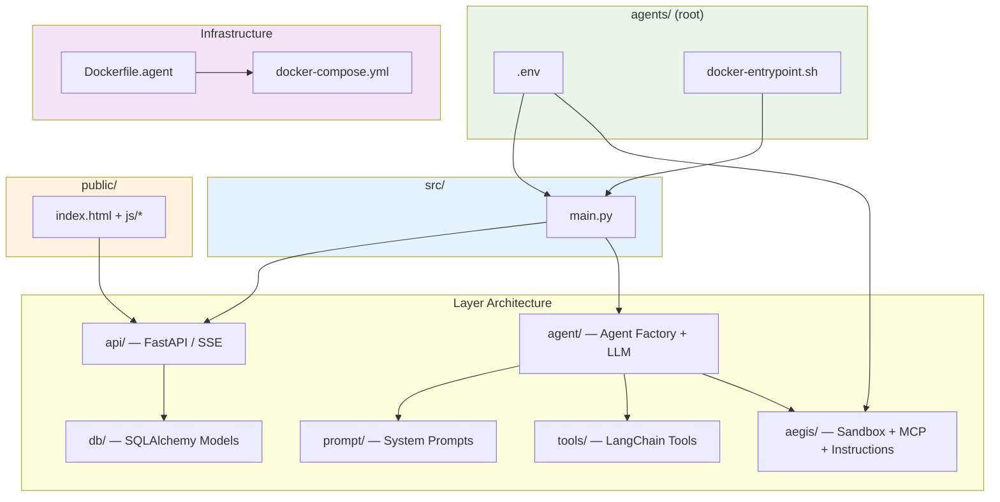
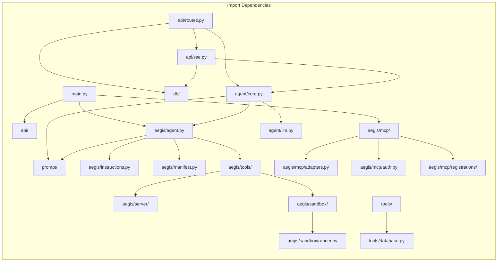

# Project Structure

Every file in the `agents/` directory mapped to its architectural role.

```
agents/
├── .env                          # Environment configuration
├── .gitignore
├── docker-entrypoint.sh          # Container firewall + entrypoint
├── remote_server.sh              # SSH remote deployment
│
├── data/                         # Runtime persistence
│   ├── chat_history.db           # SQLite: chat metadata + stored images
│   ├── checkpoints.db            # SQLite: LangGraph conversation checkpoints
│   ├── checkpoints.db-shm
│   └── checkpoints.db-wal
│
├── public/                       # Frontend (Alpine.js SPA)
│   ├── index.html                # Main HTML + Alpine.js templates
│   └── js/
│       ├── app.js                # Root Alpine component (state + actions)
│       ├── chat.js               # SSE streaming client
│       ├── sidebar.js            # Chat list CRUD API client
│       └── utils.js              # Markdown rendering, date formatting
│
└── src/                          # Backend (Python)
    ├── main.py                   # ENTRY POINT: App mode dispatcher
    │
    ├── api/                      # FastAPI Server (chatbot mode)
    │   ├── __init__.py           # App factory, static file mounting
    │   ├── routes.py             # REST endpoints: chat CRUD + SSE stream
    │   └── sse.py                # SSE streaming engine
    │
    ├── agent/                    # Agent Core
    │   ├── __init__.py           # Public exports
    │   ├── core.py               # Agent factory (dispatches by AGENT_MODE)
    │   └── llm.py                # LLM config (OpenRouter + Grok-4)
    │
    ├── prompt/                   # Prompt System
    │   ├── __init__.py           # Exports + composite middleware
    │   ├── system.py             # Base prompt + DB schema injection
    │   └── middleware.py         # Prompt composition utilities
    │
    ├── tools/                    # LangChain Tool Layer
    │   ├── __init__.py           # Tool exports
    │   ├── sql.py                # run_sql — PostgreSQL queries
    │   ├── cloudwatch.py         # query_cloudwatch_logs — AWS Logs
    │   ├── ip_lookup.py          # lookup_ip_countries — External API
    │   └── database.py           # Connection manager (read-only enforcement)
    │
    ├── db/                       # Persistence Layer
    │   ├── __init__.py           # Exports
    │   ├── models.py             # SQLAlchemy: Chat + Image models
    │   └── repository.py         # CRUD repositories
    │
    └── aegis/                    # Aegis System (code execution + MCP)
        ├── __init__.py           # Lazy imports
        ├── agent.py              # Aegis agent factory
        ├── instructions.py       # System prompt + investigation patterns
        ├── manifest.py           # Tool introspection & formatting
        │
        ├── tools/                # Aegis-specific tools
        │   ├── __init__.py
        │   ├── code_execution.py # create_execute_code_tool()
        │   └── image_store.py    # store_image tool
        │
        ├── sandbox/              # Code Execution Sandbox
        │   ├── __init__.py
        │   ├── executor.py       # NSJail process manager
        │   └── runner.py         # Script executed INSIDE sandbox
        │
        ├── server/               # ToolServer for sandbox
        │   ├── __init__.py
        │   └── api.py            # Dynamic FastAPI + lifecycle mgmt
        │
        └── mcp/                  # MCP Protocol Server
            ├── __init__.py
            ├── server.py         # FastMCP server factory
            ├── adapters.py       # LangChain → FastMCP adapters
            ├── routes.py         # Custom HTTP routes (images, health)
            ├── auth.py           # Bearer token authentication
            └── registrations/
                ├── __init__.py
                └── schema.py     # Schema + analysis guide tools
```

## How the Layers Connect



## File Dependency Graph


