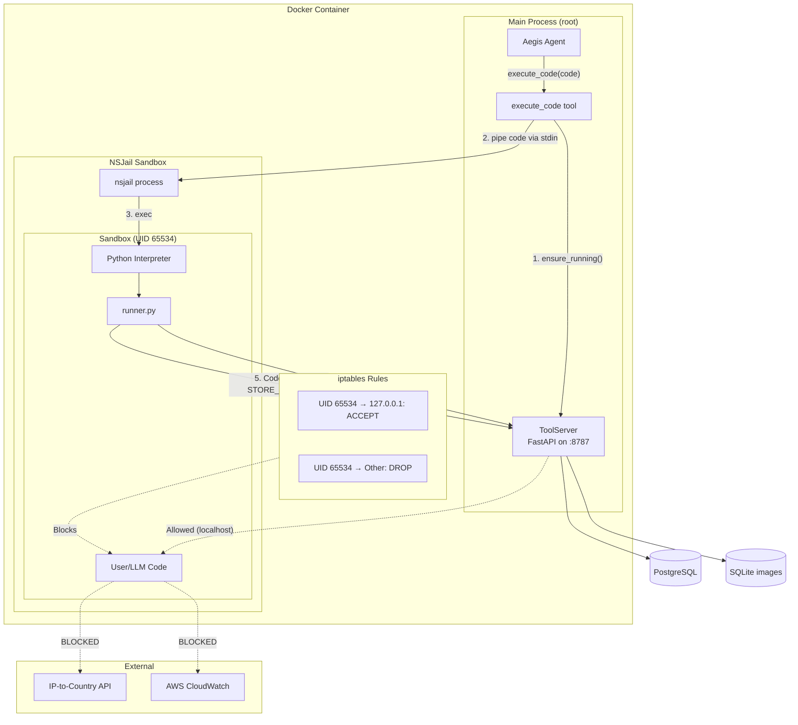

# Code Execution Sandbox

The most architecturally significant component of the Aegis system is the **secure code execution sandbox**. It allows the LLM to write and execute arbitrary Python code (with pandas, numpy, matplotlib, etc.) while maintaining strict security boundaries.

## Architecture



## NSJail Configuration

**File:** `src/aegis/sandbox/executor.py`

NSJail provides operating-system-level sandboxing using Linux namespaces, resource limits, and seccomp-bpf syscall filtering.

### Command Construction

```python
cmd = [
    nsjail,
    "-q",                           # Quiet mode
    "-Mo",                          # Execute once mode
    "-t", str(self.timeout),        # 60 second timeout
    "--rlimit_as", str(self.memory_mb),  # 2GB memory limit
    "-u", "65534",                  # Run as nobody user
    "-g", "65534",
    "--disable_clone_newuser",      # Use real UID (for iptables)
    "--disable_proc",               # Don't mount /proc
    "-R", "/usr",                   # Read-only mount /usr (Python + libs)
    "-R", "/etc/ssl",              # SSL certificates
    "-R", "/etc/resolv.conf",      # DNS
    "-R", "/etc/ld.so.cache",      # Library cache
    "-R", "/app/.venv/.../site-packages:/usr/local/lib/python3.13/site-packages",
    "-R", f"{RUNNER_SCRIPT_PATH}:/runner.py",  # Remap runner path
    "-T", "/tmp",                   # Writable temp
    "-N",                           # Disable network namespace
    "--cwd", "/tmp",
    "-E", "AEGIS_TOOL_SERVER_URL=http://127.0.0.1:8787",
    "-E", "MPLCONFIGDIR=/tmp",
    "--",
    python, "/runner.py",
]
```

### Dockerfile Integration

The sandbox is baked into the Docker image. The `Dockerfile.agent` builds NSJail from source and configures the sandbox user:

```dockerfile
# Dockerfile.agent key sections:

# 1. Build NSJail from Google source
RUN git clone --depth 1 https://github.com/google/nsjail.git /tmp/nsjail \
    && cd /tmp/nsjail \
    && make \
    && mv nsjail /usr/local/bin/

# 2. Install iptables for network isolation
RUN apt-get install -y iptables

# 3. Create sandbox user (nobody) for jailed processes
RUN useradd --uid 65534 --gid 65534 --no-create-home \
    --shell /usr/sbin/nologin sandbox || true

# 4. Entrypoint runs as root for iptables setup
ENTRYPOINT ["docker-entrypoint.sh"]
```

See [Deployment → Docker](/docs/deployment#docker-deployment) for the full Dockerfile walkthrough.

### Key Security Properties

| Setting                   | Purpose                                                         |
| ------------------------- | --------------------------------------------------------------- |
| `-u 65534`                | Process runs as`nobody` — zero privileges                       |
| `-t 60`                   | Hard timeout prevents infinite loops                            |
| `--rlimit_as 2048`        | 2GB memory cap (needed for pandas/numpy imports)                |
| `--disable_clone_newuser` | Sandbox uses real host UID (required for iptables filtering)    |
| `--disable_proc`          | No /proc access (fails in Docker, not needed anyway)            |
| `-R /usr` (read-only)     | Only Python and system libs available — no source code access   |
| `Runner path remap`       | `/app/.../runner.py` → `/runner.py` — hides directory structure |

## ToolServer

**File:** `src/aegis/server/api.py`

The ToolServer is a **dynamically generated FastAPI application** that runs on `127.0.0.1:8787`. It creates HTTP endpoints for every LangChain tool automatically:

```
GET  /health       → {"status": "healthy", "service": "aegis-tool-server", "tools": [...]}
GET  /manifest     → Tool metadata (for sandbox runner introspection)
POST /invoke/{tool_name} → Execute a tool by name
```

### Lifecycle Management

The `ToolServer` class manages the server as a daemon thread:

1. **ensure_running()** — Called before each code execution. Checks if the server is already responding on :8787; if not, starts it in a background thread.
2. **Idempotent start** — Uses a lock and health checks to avoid duplicate servers. Detects if another process already owns the port.
3. **Port conflict handling** — Clear error messages if port 8787 is already in use by a non-Aegis process.

### Thread Model

```python
class ToolServer:
    def __init__(self, tools):
        self.app = create_app(tools)
        self._thread = None

    def start(self):
        config = uvicorn.Config(self.app, host="127.0.0.1", port=8787)
        self._thread = _ServerThread(config)
        self._thread.start()
```

## Runner Script

**File:** `src/aegis/sandbox/runner.py`

The runner executes **inside** the sandbox. It:

1. Reads JSON input from stdin: `{"manifest": [...], "code": "..."}`
2. Builds a namespace with dynamically created UPPERCASE tool functions
3. Executes the code with `exec()` in that namespace
4. Captures stdout and returns it

### Function Generation

```python
def _create_tool_function(tool_name):
    def tool_fn(*args, **kwargs):
        return _make_request(f"/invoke/{tool_name}", kwargs or args)
    return tool_fn

def build_tool_namespace(manifest):
    namespace = {}
    for tool in manifest:
        func_name = tool["name"].upper().replace("-", "_")
        namespace[func_name] = _create_tool_function(tool["name"])
    return namespace
```

So `run_sql` becomes `RUN_SQL(query)` — a function that makes HTTP POST to the ToolServer.

## Unsafe Mode (Development)

For local development without NSJail, set `AEGIS_ALLOW_UNSAFE=true`. This runs the Python code directly on the host:

```python
executor.execute_unsafe(code, tool_manifest)
```

No sandbox, no security — never use in production.

## Execution Flow Summary

```
User Message → Agent decides → execute_code(code)
  → ToolServer.ensure_running() on :8787
  → NSJail sandbox with Python + runner.py
  → runner.py exec(code) where code calls RUN_SQL(), STORE_IMAGE(), etc.
  → Each tool call is HTTP POST to ToolServer at 127.0.0.1:8787
  → ToolServer invokes the real LangChain tool
  → Results flow back: ToolServer → runner.py → stdout → NSJail → execute_code → Agent
  → Agent continues with results
```
