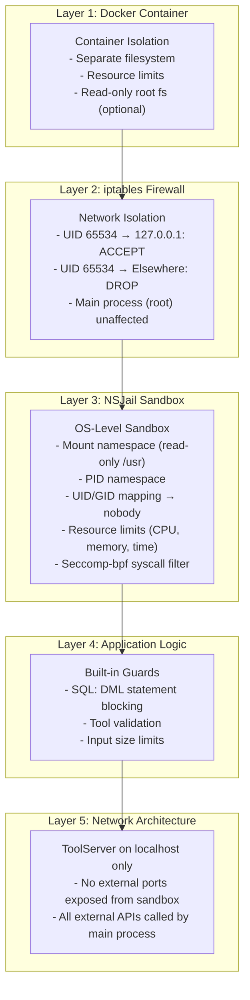

# Security Model

The system employs a **defense-in-depth** security architecture with five layers. No single layer is relied upon — each provides redundant protection.

## Layer Diagram



## Layer 1: Docker Container

The entire application runs in a Docker container. This provides:

- **Filesystem isolation** — The sandbox cannot access the host filesystem
- **Resource limits** — Docker `--memory` and `--cpus` limits apply to all processes including NSJail
- **Capability dropping** — The container only needs `SYS_ADMIN` and `NET_ADMIN` for NSJail/iptables

## Layer 2: iptables Network Firewall

**File:** `docker-entrypoint.sh`

The entrypoint script configures iptables to restrict the sandbox user:

```bash
# Allow sandbox user (UID 65534) to connect to localhost only
iptables -A OUTPUT -m owner --uid-owner 65534 -d 127.0.0.1 -j ACCEPT

# Block all other outbound connections from sandbox user
iptables -A OUTPUT -m owner --uid-owner 65534 -j DROP

# Same for IPv6 (if available)
ip6tables -A OUTPUT -m owner --uid-owner 65534 -d ::1 -j ACCEPT 2>/dev/null || true
ip6tables -A OUTPUT -m owner --uid-owner 65534 -j DROP 2>/dev/null || true
```

This is critical because NSJail's network namespace (`-N` flag) is disabled — the sandbox shares the host network. Without iptables, the sandboxed code could make arbitrary outbound connections. With iptables, it can only reach `127.0.0.1:8787` (the ToolServer).

**Warning:** If the container runs without `NET_ADMIN` capability, iptables rules fail silently and network isolation is not enforced.

## Layer 3: NSJail Sandbox

NSJail provides Linux namespace-based sandboxing:

| NSJail Flag | Security Benefit |
|---|---|
| `-u 65534 -g 65534` | Process runs as `nobody` — zero privileges |
| `-t 60` | Hard timeout — prevents runaway code |
| `--rlimit_as 2048` | 2GB memory limit |
| `-R /usr` (read-only) | Only Python and system libraries visible |
| `--disable_proc` | No `/proc` — can't enumerate processes |
| `Runner path remap` | Hides application directory structure |
| `-T /tmp` | Isolated writable space |
| seccomp-bpf | Restricts syscall surface (built into NSJail) |

### What the Sandbox CAN Access

- **Python 3.13** with pandas, numpy, matplotlib, seaborn, scikit-learn, scipy, statsmodels
- **ToolServer** via HTTP to `127.0.0.1:8787`
- **DNS** and **SSL certificates** (for ToolServer requests)

### What the Sandbox CANNOT Access

- Source code (not mounted)
- Database credentials (handled by ToolServer)
- AWS credentials (handled by ToolServer)
- Any external network (blocked by iptables)
- `/proc` or other system information
- Docker socket or host filesystem

## Layer 4: Application-Level Guards

Even if all infrastructure layers fail, the tools enforce read-only access:

```python
# In run_sql tool - PostgreSQL enforces read-only at the session level
def get_read_only_connection():
    return psycopg2.connect(
        DATABASE_URL,
        options="-c default_transaction_read_only=on",
    )
```

Any write attempt (INSERT, UPDATE, DELETE, DDL) is rejected by PostgreSQL itself with `ERROR: cannot execute INSERT in a read-only transaction` — regardless of how the query is structured or obfuscated.

## Layer 5: Network Architecture

The ToolServer runs on `127.0.0.1:8787` — localhost only, never exposed externally. All external API calls (PostgreSQL, CloudWatch, IP lookup) are made by the main process, not from within the sandbox. The sandbox communicates only with the ToolServer.

## Defense-in-Depth Philosophy

The five-layer model follows a simple principle: **no single layer is trusted**. Each layer assumes the layer below it may fail:

1. If Docker is compromised → iptables still blocks
2. If iptables fails → NSJail still sandboxes
3. If NSJail is bypassed → read-only DB rejects mutations
4. If read-only DB fails → no credentials exposed (sandbox can't access env vars)

This is especially important for an AI agent system: the LLM may attempt actions that look reasonable but are unsafe. Defense-in-depth ensures that even a compromised LLM cannot damage the system.

## Comparison to Alternatives

| Approach | Network Isolation | Filesystem Isolation | DB Protection | Complexity |
|---|---|---|---|---|
| **Aegis (iptables + NSJail + read-only DB)** | ✅ UID-level | ✅ Namespace | ✅ Session-level | Moderate |
| Python `exec()` only | ❌ | ❌ | ❌ | Low |
| Docker-only sandbox | ✅ Container-level | ✅ Container-level | ❌ | Moderate |
| gVisor | ✅ | ✅ | ❌ | High |
| Firecracker microVM | ✅ | ✅ | ❌ | Very High |

The Aegis approach provides comparable security to gVisor/Firecracker at a fraction of the operational complexity by layering simpler mechanisms.

## Running Securely

```bash
docker run --rm \
  --cap-add=SYS_ADMIN \
  --cap-add=NET_ADMIN \
  --security-opt seccomp=unconfined \
  --security-opt apparmor=unconfined \
  aegis-agent
```

The `seccomp=unconfined` and `apparmor=unconfined` flags are required because NSJail applies its own seccomp filter — double-filtering can cause conflicts. The `SYS_ADMIN` and `NET_ADMIN` capabilities are needed for NSJail namespacing and iptables respectively.
