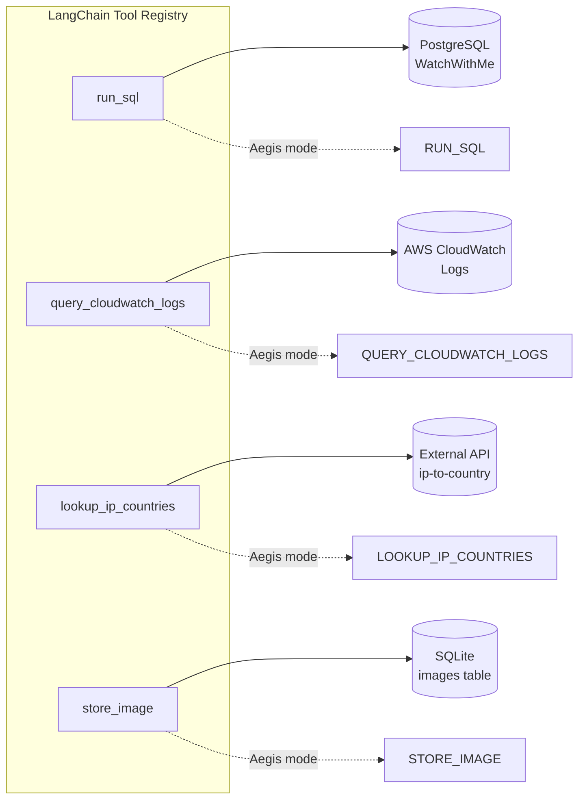

# Tool Layer

The system provides four LangChain tools that are dynamically registered and made available in both agent modes.

## Tool Overview



## 1. run_sql

**File:** `src/tools/sql.py`

Executes read-only PostgreSQL queries and returns JSON results.

```python
@tool
def run_sql(query: str) -> str:
    """Run READ-ONLY SQL queries and return JSON."""
```

**Security:** The tool connects with PostgreSQL's `default_transaction_read_only=on` session parameter, which makes the database engine itself reject any write operation. This is far more robust than string matching — it cannot be bypassed by query obfuscation. See [Security → Layer 4](/docs/security#layer-4-application-level-guards).

**Implementation:** Uses `psycopg2` with `RealDictCursor` so results are returned as a list of dicts, serialized to JSON. Connection is managed via `DATABASE_URL` environment variable.

## 2. query_cloudwatch_logs

**File:** `src/tools/cloudwatch.py`

Runs CloudWatch Logs Insights queries with configurable time ranges.

```python
@tool
def query_cloudwatch_logs(
    query: str,
    start_date: str = "",
    end_date: str = "",
) -> str:
```

**Key features:**
- Flexible date parsing — accepts ISO 8601 formats (date-only, datetime, with/without timezone)
- Smart defaults — if only time range end is provided, start defaults to end - 7 days
- Polling with 30-second timeout for query completion
- Structured response with status, count, results, time_range, and statistics

**Implementation:** Uses `boto3` CloudWatch Logs client configured via `AWS_ACCESS_KEY_ID`, `AWS_SECRET_ACCESS_KEY`, and `AWS_DEFAULT_REGION` environment variables. The log group is specified via `AWS_LOGS_GROUP`.

## 3. lookup_ip_countries

**File:** `src/tools/ip_lookup.py`

Batch IP-to-country lookup via an external API service.

```python
@tool
def lookup_ip_countries(ip_addresses: list[str]) -> str:
```

**Implementation:** Makes POST requests to a dedicated IP lookup microservice (`https://ip-to-country-production.up.railway.app`) with a batch of IPs. Returns a dict mapping each IP to its ISO country code. Includes comprehensive error handling for HTTP errors, connection issues, timeouts, and JSON parsing failures.

## 4. store_image

**File:** `src/aegis/tools/image_store.py`

Stores base64-encoded images (matplotlib/seaborn charts) and returns a URL for embedding in responses.

```python
@tool
def store_image(base64_data: str, mime_type: str = "image/png") -> str:
```

**Key features:**
- Strips data URI prefixes if present (e.g., `data:image/png;base64,...`)
- Maps MIME types to file extensions (png, jpg, gif, svg)
- Returns absolute URLs when `APP_BASE_URL` is configured, relative paths otherwise
- Images stored in SQLite `images` table, served via `/img/{id}.{ext}` route

## Tool Registration

In **Default mode**, tools are passed directly to the agent:

```python
agent = create_agent([run_sql, query_cloudwatch_logs, lookup_ip_countries])
```

In **Aegis mode**, tools are:
1. Passed directly to the agent (for direct tool calls)
2. Bound to the `execute_code` tool via the ToolServer (for sandbox execution)
3. Introspected into a manifest for prompt documentation and sandbox function generation

In **MCP mode**, tools are:
1. Adapted from LangChain format to FastMCP format via `register_langchain_tool()`
2. Registered as individual MCP tools for any MCP client to consume

## Design Rationale

**Why LangChain tools instead of direct functions?** LangChain tools provide automatic schema generation via Pydantic, which enables tool introspection (see [Design Patterns → Adapter](/docs/design-patterns#3-adapter-pattern)). The same schema is used for LLM function calling, MCP registration, and sandbox function generation — three uses from one definition.

**Why read-only SQL?** Enforcing read-only at the PostgreSQL session level (`default_transaction_read_only=on`) is more robust than SQL parsing because it cannot be bypassed by query obfuscation, subqueries, or CTEs. See [Security Model → Layer 4](/docs/security#layer-4-application-level-guards).
