# Component Hierarchy

## Full Component Tree

```mermaid
graph TB
    Root["Root Layout (app/layout.tsx)<br/>CopilotKit → ThemeProvider →<br/>SessionProvider → QueryProvider"]
    Root --> AppShell["AppShell<br/>(providers/AppShell.tsx)"]
    
    AppShell --> Sidebar["Sidebar<br/>(mail/Sidebar)"]
    AppShell --> HeaderBar["Header Bar"]
    AppShell --> Main["Main Content Area"]
    AppShell --> Approval["ApprovalDialog<br/>(approval/)"]
    AppShell --> CopilotPanel["CopilotPanel<br/>(ai/CopilotPanel.tsx)"]
    AppShell --> HistoryPoll["useHistoryPoll<br/>(polling)"]
    
    Sidebar --> NavItems["SidebarNavItem[]<br/>Inbox / Sent / Draft / Spam"]
    Sidebar --> UserProfile["UserProfile<br/>avatar + email"]
    
    Main --> ThreadList["ThreadList<br/>(mail/ThreadList)"]
    Main --> ThreadDetail["ThreadDetail<br/>(mail/ThreadDetail)"]
    Main --> ComposeForm["ComposeForm<br/>(mail/ComposeForm)"]
    
    ThreadList --> FilterBar["ThreadFilterBar<br/>(mail/ThreadFilterBar)"]
    ThreadList --> SelectionBar["ThreadSelectionBar<br/>(mail/ThreadSelectionBar)"]
    ThreadList --> ThreadRow["ThreadRow[] (virtualized)<br/>(mail/ThreadRow)"]
    ThreadList --> Empty["ThreadListEmpty"]
    ThreadList --> Error["ThreadListError"]
    ThreadList --> Skeleton["ThreadListSkeleton"]
    
    FilterBar --> DateFilter["DateFilterPopover"]
    FilterBar --> ActiveBadges["ActiveBadge[]"]
    
    ThreadRow --> Checkbox
    ThreadRow --> Sender
    ThreadRow --> Subject
    ThreadRow --> Date
    
    ThreadDetail --> DetailHeader["ThreadDetailHeader<br/>back / reply / forward"]
    ThreadDetail --> MessageCards["MessageCard[]<br/>(mail/MessageCard)"]
    
    MessageCards --> MsgHeader["MessageHeader<br/>avatar / from / date / details toggle"]
    MessageCards --> MsgDetails["MessageDetails<br/>To / Cc / Date / Subject"]
    MessageCards --> MsgBody["MessageBody<br/>dangerouslySetInnerHTML"]
    MessageCards --> Attachments["MessageAttachments"]
    
    ComposeForm --> FieldTo["ComposeField: To"]
    ComposeForm --> FieldCc["ComposeField: Cc"]
    ComposeForm --> FieldSubject["ComposeField: Subject"]
    ComposeForm --> TipTapEditor["TipTapEditor<br/>(rich text, dynamic import, ssr:false)"]
    ComposeForm --> SendButton["Send Button"]
    ComposeForm --> ComposeError["ComposeError"]
    
    subgraph Ai["AI Components"]
        AiTools["AiTools.tsx<br/>Registers all tools + context"]
        CopilotPanel
        ToolRenderers["agent-tools/<br/>EmailPreviewCard<br/>EmailPreviewList<br/>StatusBadge<br/>CollapsibleSection"]
    end
    
    subgraph Ui["UI Primitives (shadcn/ui)"]
        Button
        Input
        Select
        Checkbox
        Badge
        Avatar
        Card
        Popover
        Calendar
        Sheet
        Dialog
        Tooltip
        Skeleton
        Separator
        DropdownMenu
        ScrollArea
        Collapsible
        AlertDialog
    end
```

## Route-to-Component Mapping

| Route | Page Component | Main Content | Shell Component |
|-------|---------------|-------------|-----------------|
| `/` | `page.tsx` | `<ThreadList labelIds={["INBOX"]} />` | `<AppShell>` |
| `/sent` | `sent/page.tsx` | `<ThreadList labelIds={["SENT"]} />` | `<AppShell>` |
| `/draft` | `draft/page.tsx` | `<ThreadList labelIds={["DRAFT"]} />` | `<AppShell>` |
| `/spam` | `spam/page.tsx` | `<ThreadList labelIds={["SPAM"]} />` | `<AppShell>` |
| `/compose` | `compose/page.tsx` | `<ComposeForm />` | `<AppShell>` |
| `/r/[threadId]` | `r/[threadId]/page.tsx` | `<ThreadDetail threadId={id} />` | `<AppShell>` |

## Rendering Strategy

| Component | Render Type | Reason |
|-----------|------------|--------|
| Page shells (`page.tsx`) | Server Component | Auth check, SEO, initial data |
| `ThreadList` | Client Component | Interactivity, virtual scroll, state |
| `ThreadDetail` | Client Component | State management, dynamic content |
| `ComposeForm` | Client Component | Form state, rich text editor |
| `TipTapEditor` | Dynamic import (ssr: false) | ProseMirror needs browser DOM |
| `Sidebar` | Client Component | Navigation state, user profile |
| `ApprovalDialog` | Client Component | Conditional rendering, state machine |
