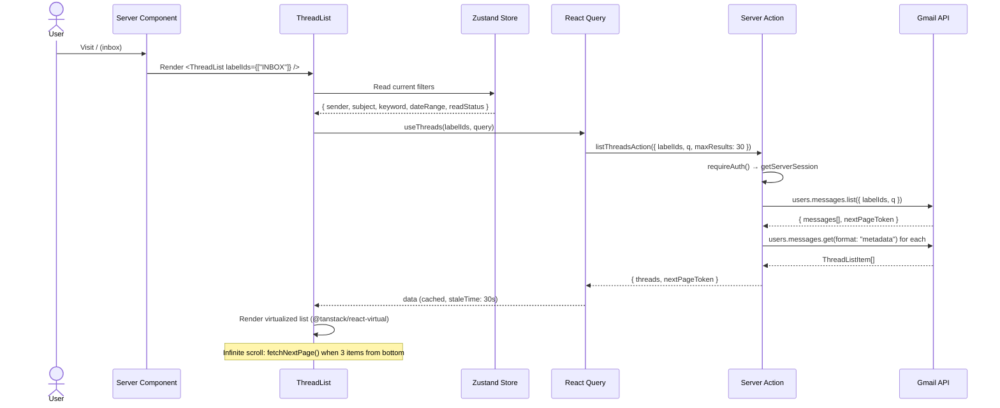
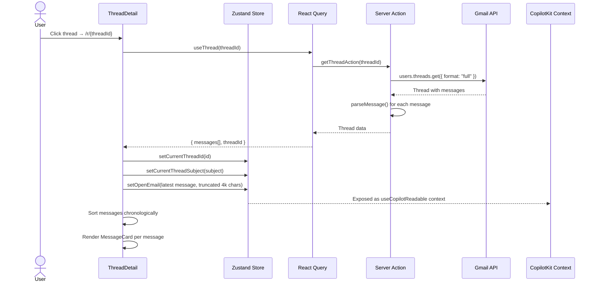
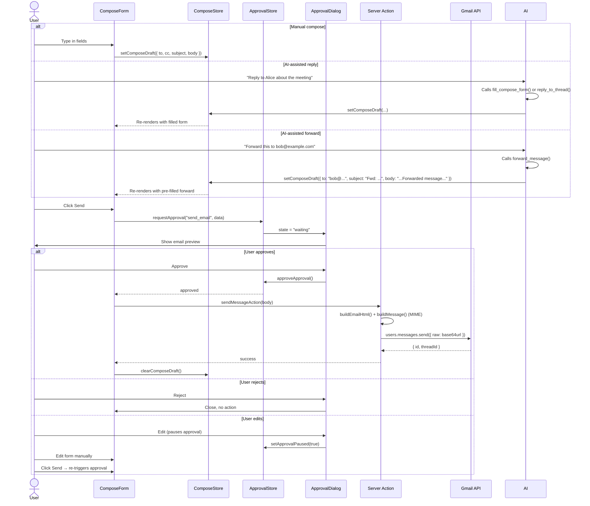
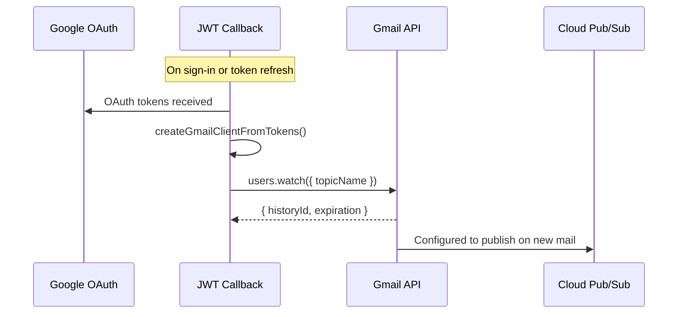
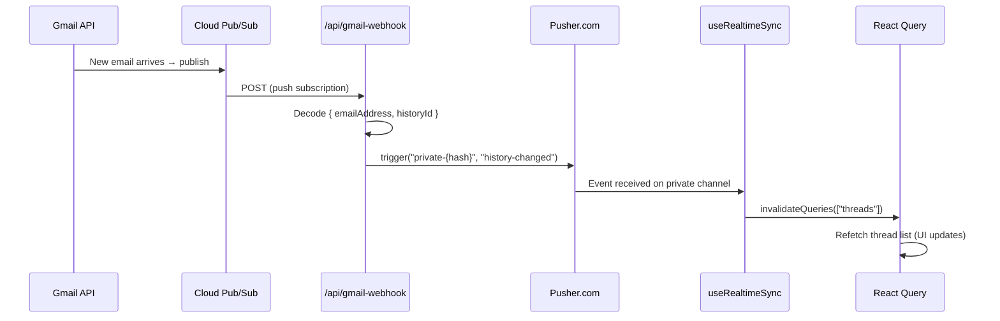
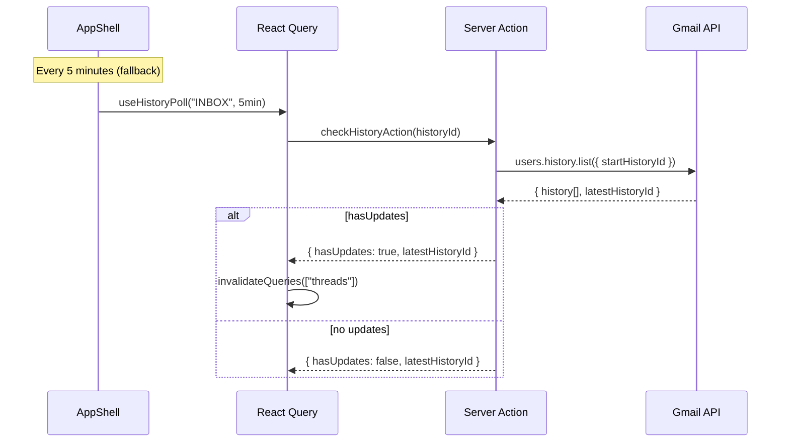
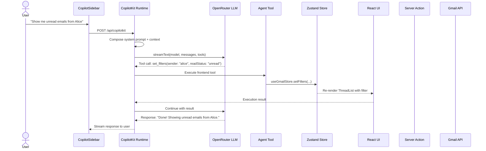

# Data Flow

This page documents the major data flows through the system.

## 1. Email Listing Flow

When a user visits a folder view (inbox, sent, drafts, spam), threads are fetched, filtered, and rendered in a virtualized list.



### Filter Compilation

Filters from the Zustand store are compiled into a Gmail search query:

```
Filters: { sender: "alice", subject: "meeting", 
            keyword: "Q4", startDate: "2025/01/01", 
            endDate: "2025/06/30", readStatus: "unread" }

Gmail Query: "from:alice subject:meeting Q4 
              after:2025/01/01 before:2025/06/30 is:unread"
```

## 2. Thread Detail Flow

Opening a thread fetches the full conversation with all messages, parsed chronologically.



## 3. Compose & Send Flow



## 4. Real-Time Sync (Pub/Sub + Pusher)

Real-time sync uses a three-stage relay. The watch is established during auth, and new mail flows through Pub/Sub → webhook → Pusher → React Query.

### Watch Setup (triggered during auth)



### Incoming Mail Flow



### Polling Fallback



## 5. AI Tool Execution Flow


