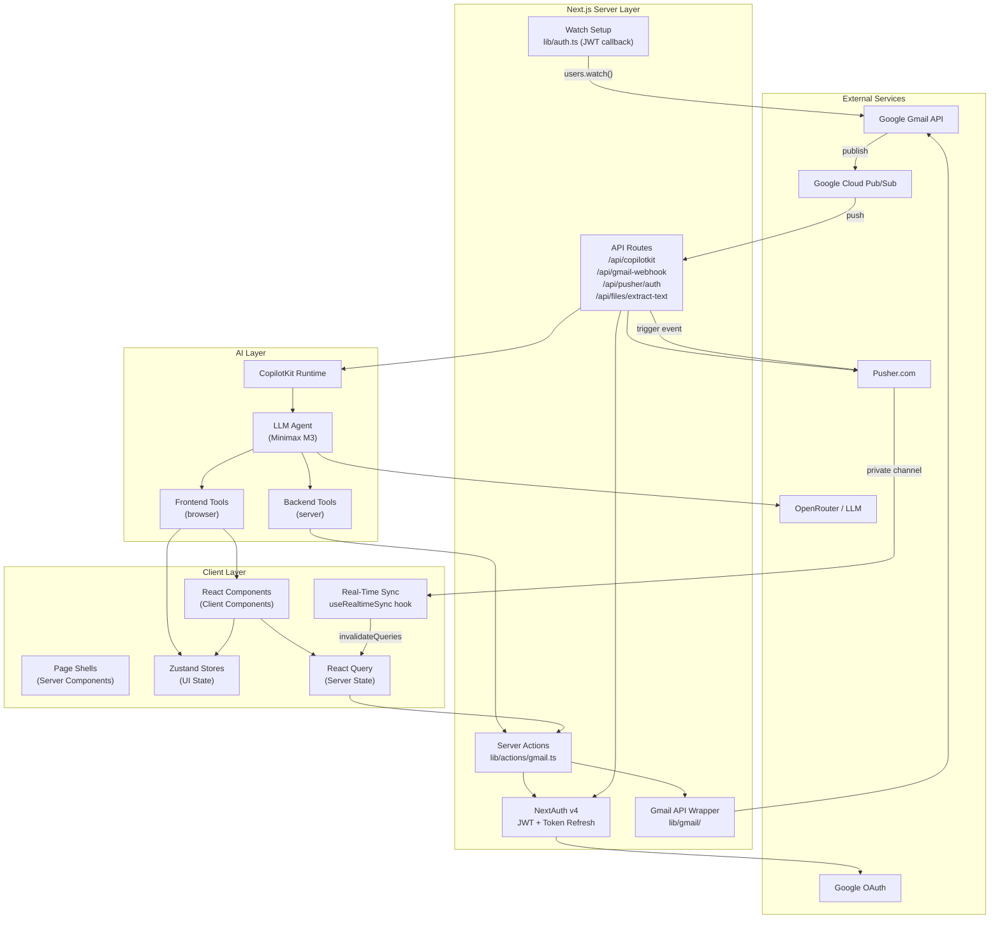

# System Architecture

Mail Pilot is built on **Next.js 16 App Router** with a clear separation between server and client concerns. The architecture is organized into six layers.

## Layer Diagram

## Layer Responsibilities

### 1. App Router Layer (Server Components)

**Location:** `app/*/page.tsx`

Each route is a **Server Component** that:
- Checks authentication via `getServerSession`
- Renders the appropriate **Client Component** shell
- Passes initial props (label IDs, thread IDs)

| Route | View | Component |
|-------|------|-----------|
| `/` | Inbox | `<ThreadList labelIds={["INBOX"]} />` |
| `/sent` | Sent | `<ThreadList labelIds={["SENT"]} />` |
| `/draft` | Drafts | `<ThreadList labelIds={["DRAFT"]} />` |
| `/spam` | Spam | `<ThreadList labelIds={["SPAM"]} />` |
| `/compose` | Compose | `<ComposeForm />` |
| `/r/[threadId]` | Thread | `<ThreadDetail threadId={threadId} />` |

### 2. Client Components Layer

**Location:** `components/`

All interactive UI lives here:

- **`AppShell`** — Root layout with sidebar, header, approval dialog, polling, and real-time sync indicator
- **`ThreadList`** — Virtualized list with infinite scroll, filters, multi-select
- **`ThreadDetail`** — Chronological message cards, reply/forward actions
- **`MessageCard`** — Single email display with headers, body, attachments
- **`ComposeForm`** — TipTap rich-text compose with To/Cc/Subject fields
- **`Sidebar`** — Navigation sidebar with folder links and user profile
- **`ThreadFilterBar`** — Date range, sender, subject, keyword, read status filters
- **`ApprovalDialog`** — Human-in-the-loop confirmation modal

### 3. State Management Layer

Two parallel state systems:

| System | Purpose | Tools |
|--------|---------|-------|
| **Zustand** | Transient UI state | `gmailStore`, `uiStore`, `composeStore`, `approvalStore` |
| **React Query** | Server state | `useThreads`, `useThread`, `useProfile`, `useLabels`, `useSendMessage` |

### 4. Data / Service Layer

**Location:** `lib/`

- **Server Actions** (`lib/actions/gmail.ts`) — `"use server"` functions that authenticate and delegate to the Gmail wrapper
- **Gmail API Wrapper** (`lib/gmail/`) — OAuth2 client creation (`auth.ts`, `client.ts`), thread/message CRUD, MIME construction, draft management, label management, history polling, watch management (`watch.ts`)
- **File Processing** (`lib/documents/`) — MIME-type registry, PDF/text extraction providers

### 5. AI Layer

**Location:** `agent/` + `components/ai/`

- **CopilotKit Runtime** — Server-side AI orchestration at `/api/copilotkit`
- **Frontend Tools** — Run in browser, mutate Zustand stores, navigate routes, fill compose forms (12 tools: navigation, filters, selection, compose, reply, forward, send, delete, file reading)
- **Backend Tools** — Run on server, call Gmail API (2 tools: `search_threads`, `get_thread`)
- **Approval System** — Human-in-the-loop state machine for send/delete operations

### 6. External Services

| Service | Purpose | Integration |
|---------|---------|-------------|
| **Google Gmail API** | Email read/write, push watch | `@googleapis/gmail` with OAuth2 |
| **Google OAuth** | Authentication | NextAuth GoogleProvider |
| **Google Cloud Pub/Sub** | Push notifications from Gmail | Gmail API `users.watch()` |
| **Pusher.com** | Real-time delivery to frontend | `pusher-js` + `pusher` SDK |
| **OpenRouter** | LLM access | `@openrouter/ai-sdk-provider` |

## Key Architectural Decisions

1. **Tool-based AI** — AI never touches the DOM; it calls typed tools. Deterministic, testable, auditable.
2. **Server Actions as bridge** — All Gmail calls go through `requireAuth()`-guarded server actions.
3. **State duality** — Zustand for UI, React Query for server data.
4. **Hybrid real-time sync** — Gmail Watch + Pub/Sub push for near-instant sync, with 5min polling as fallback.
5. **Human-in-the-loop** — Every send/delete requires explicit confirmation.
