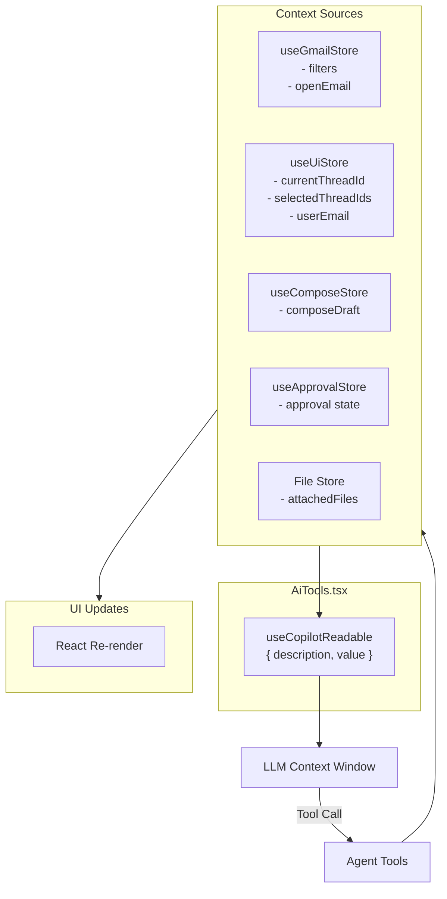

# AI Context System

The AI agent needs **awareness of the current application state** to make informed decisions. This is achieved through CopilotKit's `useCopilotReadable` hook, which exposes structured context to the LLM.

## Exposed Context

The `AiTools.tsx` component exposes a single large context object:

```typescript
{
  currentView: "inbox" | "sent" | "draft" | "spam" | "compose" | "thread",
  currentThreadId: string | null,
  currentThreadSubject: string | null,
  openEmail: {
    threadId: string,
    subject: string,
    sender: string,
    receivers: string[],
    cc?: string[],
    content: string,        // truncated to ~4000 chars
  } | null,
  activeFilters: {
    startDate?: string,
    endDate?: string,
    sender?: string,
    subject?: string,
    keyword?: string,
    readStatus?: "read" | "unread",
  },
  composeDraft: {
    to?: string,
    cc?: string,
    subject?: string,
    body?: string,
  } | null,
  selectedThreadIds: string[],
  selectionCount: number,
  approval: {
    state: "idle" | "waiting" | "approved" | "rejected",
    type: "send_email" | "delete_threads" | null,
  },
  userEmailAddress: string | null,
  attachedFiles: Array<{
    id: string,
    name: string,
    type: string,
    size: number,
  }>,
}
```

## Context Sources



## How the AI Uses Context

The system prompt (`lib/ai/system-prompt.ts`) instructs the AI to:

1. **Read the context** — understand the user's current state
2. **Reason about available actions** — which tools to call based on context
3. **Call tools with context-appropriate parameters** — e.g., using open email data for replies

```
You are an AI assistant controlling an email client.

CURRENT STATE:
- View: inbox
- Active filters: { sender: "alice" }
- Selection: 3 threads selected
- Open thread: "Project Update" from bob@example.com

Based on this context:
- You can filter, search, or navigate
- You can reply to the open thread
- You can act on selected threads
- You can compose new emails
```

## Context Truncation

Email content is truncated to **~4000 characters** to fit within the LLM's context window while preserving enough information for the AI to understand and respond. The truncation logic is in `ThreadDetail`:

```typescript
// components/mail/ThreadDetail/index.tsx
const MAX_EMAIL_LENGTH = 4000;
const emailContent = parseEmailContent(messages);
const truncated = emailContent.length > MAX_EMAIL_LENGTH
  ? emailContent.slice(0, MAX_EMAIL_LENGTH) + "\n\n[...content truncated]"
  : emailContent;
```

## Context Limitations

| Limitation | Reason | Workaround |
|-----------|--------|------------|
| Email body truncated at 4k chars | LLM context window limits | AI can ask to `get_thread` for full content |
| Only latest email in thread exposed | Simplifies context | AI can call backend `search_threads` |
| Filters not synced to URL | Zustand-only state | AI reads from context object |
| File content not auto-included | Size constraints | AI must call `read_attached_file` tool |
