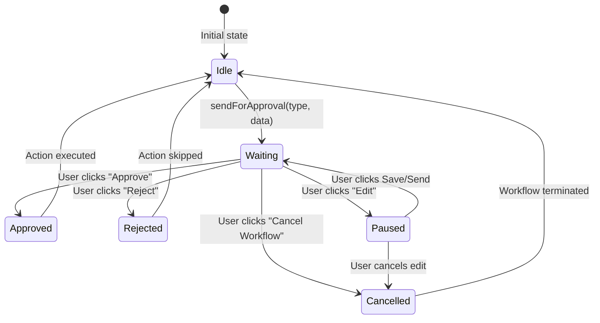
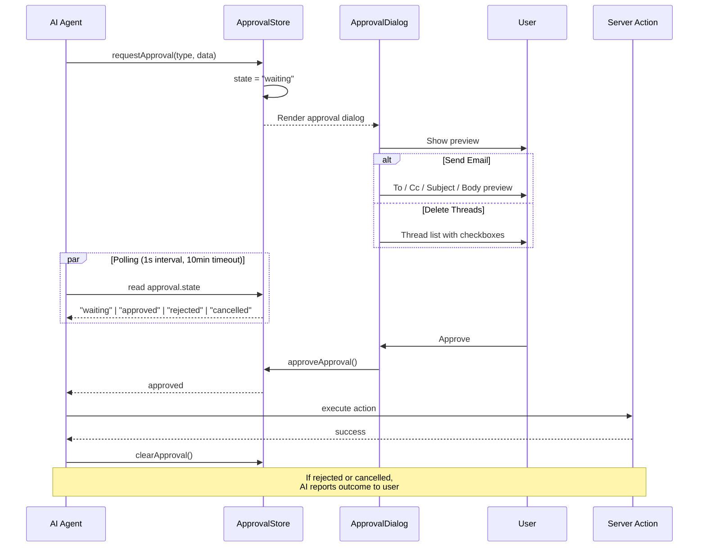

# Human-in-the-Loop Approval

Every **destructive or communication action** (send, delete) requires explicit user confirmation. This is implemented as a **state machine** that pauses the AI workflow until the user decides.

## State Machine



## Approval Data Flow



## ApprovalStore

```typescript
// lib/stores/approvalStore.ts
interface ApprovalState {
  state: "idle" | "waiting" | "approved" | "rejected";
  type: "send_email" | "delete_threads" | null;
  data: ApprovalData | null;
  error: string | null;
  paused: boolean;
  cancelled: boolean;
}

interface ApprovalData {
  type: "send_email";
  to: string;
  cc?: string;
  subject: string;
  bodyText: string;
  bodyHtml: string;
}
// or
interface ApprovalData {
  type: "delete_threads";
  ids: string[];
  threads: ThreadPreview[];
}
```

## Dialog UX

The `ApprovalDialog` component renders differently based on the approval type:

### Send Email Approval

```
┌──────────────────────────────────────────┐
│  📋 Confirm Send                         │
│                                          │
│  To:    alice@example.com                │
│  Cc:    bob@example.com                  │
│  Subject: Meeting Tomorrow               │
│                                          │
│  ┌──────────────────────────────────┐    │
│  │  Hi Alice, let's meet at 3pm... │    │
│  └──────────────────────────────────┘    │
│                                          │
│  [Edit]  [Reject]  [Approve & Send]      │
│              [Cancel Workflow]           │
└──────────────────────────────────────────┘
```

### Delete Threads Approval

```
┌──────────────────────────────────────────┐
│  🗑️ Confirm Delete                        │
│                                          │
│  ☑ Alice - "Meeting tomorrow"            │
│  ☐ Bob - "Q4 Report"                     │
│  ☑ Charlie - "Lunch?"                    │
│                                          │
│  [Edit]  [Reject]  [Approve & Delete]     │
│              [Cancel Workflow]           │
└──────────────────────────────────────────┘
```

## Polling Mechanism

The `sendForApproval()` utility uses **busy-wait polling** to synchronously wait for user input:

```typescript
async function sendForApproval(type, data): Promise<"approved" | "rejected" | "cancelled"> {
  approvalStore.requestApproval(type, data);
  
  const startTime = Date.now();
  const timeout = 10 * 60 * 1000; // 10 minutes
  
  while (Date.now() - startTime < timeout) {
    await sleep(1000); // poll every 1 second
    const state = approvalStore.state;
    if (state === "approved") return "approved";
    if (state === "rejected") return "rejected";
    if (state === "paused") {
      // Wait for user to finish editing
      // ... 
    }
  }
  return "cancelled"; // timeout
}
```

## Safety Guarantees

1. **Every send/delete requires approval** — no silent operations
2. **Clear action preview** — user sees exactly what will happen
3. **Cancellable** — terminate the entire workflow at any point
4. **Editable** — pause the workflow, edit the email, then re-submit
5. **Timeout** — 10-minute timeout prevents stuck workflows
6. **Audit trail** — chat panel records every approval decision
