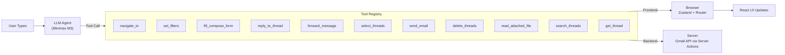

# Tool-Based Architecture

The AI agent never manipulates the DOM directly. Instead, every capability is exposed as a **typed, validated tool**. This is the core architectural pattern that makes the system deterministic, testable, and auditable.

## Architecture



## Why Tool-Based?

| Benefit | Explanation |
|---------|-------------|
| **Deterministic** | Same input → same sequence of tool calls |
| **Testable** | Each tool unit-tested in isolation |
| **Auditable** | Chat panel shows every invocation with parameters and results |
| **Extensible** | New capability = new tool file + register in one place |
| **Safe** | Tools are Zod-validated; invalid params are caught at the boundary |

## Tool Types

### Frontend Tools (12 tools)

Run **in the browser** via `useFrontendTool` hooks registered in `AiTools.tsx`.

| Tool | File | Function | Zod Schema |
|------|------|----------|------------|
| `navigate_to` | `agent/tools/ui/navigation.ts` | Switch views (inbox/sent/draft/spam/compose/thread) | `{ view, to?, cc?, subject?, body? }` |
| `set_filters` | `agent/tools/ui/filter.ts` | Apply filters (date, sender, subject, keyword, readStatus) | Partial filter object |
| `clear_filters` | `agent/tools/ui/filter.ts` | Clear all filters | None |
| `select_threads` | `agent/tools/ui/selection.ts` | Add threads to selection | `{ threadIds: string[] }` |
| `deselect_threads` | `agent/tools/ui/selection.ts` | Remove threads from selection | `{ threadIds: string[] }` |
| `clear_thread_selection` | `agent/tools/ui/selection.ts` | Clear entire selection | None |
| `fill_compose_form` | `agent/tools/gmail/draft.ts` | Fill compose form | `{ to, cc?, subject?, body? }` |
| `reply_to_thread` | `agent/tools/gmail/reply.ts` | Pre-fill reply with quoted original | `{ threadId, body, quoteOriginal? }` |
| `forward_message` | `agent/tools/gmail/forward.ts` | Pre-fill forward with original message and recipient | `{ threadId?, messageId?, to, body? }` |
| `send_email` | `agent/tools/approval/request.ts` | Request approval to send | Full email payload |
| `delete_selected_threads` | `agent/tools/approval/delete.ts` | Request approval to delete | `{ threadIds }` |
| `read_attached_file` | `agent/tools/ui/file-attachment.ts` | Read uploaded file content | `{ fileId: string }` |

### Backend Tools (2 tools)

Run **on the server** via CopilotKit's backend tools, registered in `agent/backend-tools/`.

| Tool | File | Function | Zod Schema |
|------|------|----------|------------|
| `search_threads` | `agent/backend-tools/search-threads.ts` | Search threads by sender, subject, keyword | `{ sender?, subject?, keyword?, maxResults? }` |
| `get_thread` | `agent/backend-tools/get-thread.ts` | Fetch full thread data by ID | `{ threadId: string }` |

## Registration Architecture

```typescript
// AiTools.tsx — the hub that connects everything
function AiTools() {
  // 1. Expose context to AI
  useCopilotReadable({ description: "Current application state", value: context });
  
  // 2. Register frontend tools
  useFrontendTool("navigate_to", { ... });
  useFrontendTool("set_filters", { ... });
  useFrontendTool("fill_compose_form", { ... });
  // ... etc
  
  return <ToolRenderers />;
}
```

## Tool Execution Contract

Every tool follows this contract:

1. **Zod Schema** — validates input at runtime
2. **Handler Function** — pure or side-effectful, returns a result
3. **Result Format** — string message describing what happened
4. **Error Handling** — caught exceptions → descriptive error message to LLM

```typescript
// Example: navigate_to tool
useFrontendTool("navigate_to", {
  description: "Navigate to another view in the email client.",
  parameters: z.object({
    view: ViewSchema,
    to: z.string().optional(),
    subject: z.string().optional(),
  }),
  handler: ({ view, to, subject }) => {
    switch (view) {
      case "inbox": router.push("/"); break;
      case "sent": router.push("/sent"); break;
      case "compose":
        if (to || subject) composeStore.setComposeDraft({ to, subject });
        router.push("/compose");
        break;
      // ... etc
    }
    return `Navigated to ${view}`;
  },
});
```
