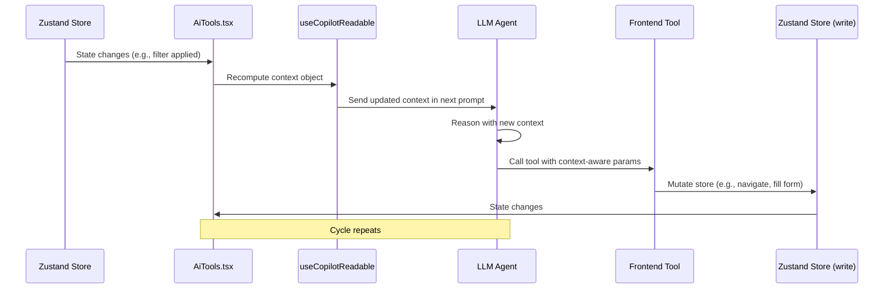
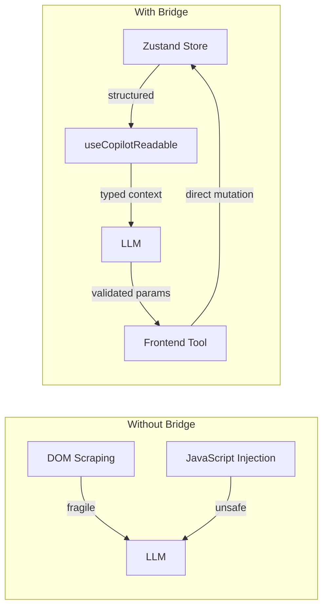

# AI Context Bridge

The bridge between Zustand stores and the AI agent is the core pattern that enables the AI to be **context-aware** without direct DOM access.

## How the Bridge Works



## Read Path: Store → AI

Data flows from Zustand stores to the AI via a **single `useCopilotReadable`** call in `AiTools.tsx`:

```typescript
// components/ai/AiTools.tsx
const context = useMemo(() => ({
  currentView: activeView,            // From useActiveView()
  currentThreadId: uiStore.currentThreadId,
  currentThreadSubject: uiStore.currentThreadSubject,
  openEmail: gmailStore.openEmail,
  activeFilters: gmailStore.filters,
  composeDraft: composeStore.composeDraft,
  selectedThreadIds: Array.from(uiStore.selectedThreadIds),
  selectionCount: uiStore.selectedThreadIds.size,
  approval: approvalStore.approval,
  userEmailAddress: uiStore.userEmailAddress,
  attachedFiles: fileStore.getFiles().map(f => ({
    id: f.id, name: f.name, type: f.mimeType, size: f.size
  })),
}), [activeView, gmailStore, uiStore, composeStore, approvalStore]);

useCopilotReadable({
  description: "Current state of the email application",
  value: context,
});
```

## Write Path: AI → Store

When the AI calls a frontend tool, the tool handler directly mutates a Zustand store:

```typescript
// agent/tools/ui/filter.ts
useFrontendTool("set_filters", {
  description: "Apply filters to the current thread list view.",
  parameters: z.object({
    sender: z.string().optional(),
    subject: z.string().optional(),
    keyword: z.string().optional(),
    startDate: z.string().optional(),
    endDate: z.string().optional(),
    readStatus: z.enum(["read", "unread"]).optional(),
  }),
  handler: (params) => {
    gmailStore.setFilters(params);
    return `Filters applied: ${JSON.stringify(params)}`;
  },
});
```

## What Makes This Pattern Powerful



| Without Bridge | With Bridge |
|---------------|-------------|
| AI scrapes DOM for state (fragile) | AI reads structured context object |
| AI injects JS to mutate UI (unsafe) | AI calls typed, validated tools |
| UI changes are unpredictable | UI changes are deterministic |
| Cannot unit test AI actions | Each tool is unit-testable |

## The Context Re-computation

The context object is recomputed every time any of the 4 Zustand stores change. The `useMemo` dependency array ensures:

- When a **filter** changes → AI sees the new filter state
- When the user **opens a thread** → AI sees the email content
- When the user **starts composing** → AI sees the draft
- When **threads are selected** → AI knows the selection count
- When an **approval is pending** → AI can wait for the result

This is **reactive context** — the AI always sees the latest state without polling.
