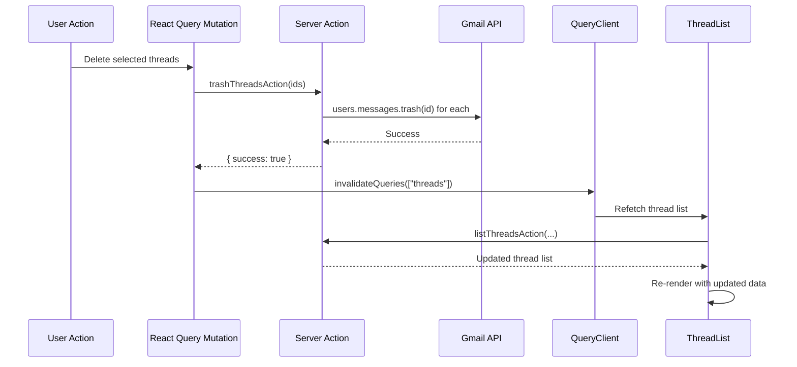

# React Query (Server State)

All **server data** — threads, messages, labels, profile — is managed by **TanStack React Query v5**. This provides caching, deduplication, automatic refetching, and pagination.

## Query Configuration

```mermaid
graph TB
    subgraph Hooks["React Query Hooks"]
        TH["useThreads<br/>Infinite Query"]
        TD["useThread<br/>Query"]
        PR["useProfile<br/>Query"]
        LB["useLabels<br/>Query"]
        HP["useHistoryPoll<br/>Query (polling)"]
        SM["useSendMessage<br/>Mutation"]
        MM["useModifyMessage<br/>Mutation"]
        DT["useDeleteThreads<br/>Mutation"]
    end
    
    subgraph Keys["Query Keys"]
        K1['["threads", labelIds..., query]']
        K2['["thread", threadId]']
        K3['["profile"]']
        K4['["labels"]']
        K5['["history-poll", labelId]']
    end
    
    subgraph Config["Caching Config"]
        C1["staleTime: 30s<br/>for threads"]
        C2["staleTime: 60s<br/>for thread detail"]
        C3["staleTime: 5min<br/>for profile & labels"]
        C4["staleTime: Infinity<br/>for history poll"]
        C5["refetchInterval: 15s<br/>for history poll"]
    end
    
    TH --> K1
    TD --> K2
    PR --> K3
    LB --> K4
    HP --> K5
    
    TH --> C1
    TD --> C2
    PR --> C3
    LB --> C3
    HP --> C4
    HP --> C5
```

## Query Details

| Hook | Type | Key Pattern | staleTime | Refetch |
|------|------|-------------|-----------|---------|
| `useThreads` | `useInfiniteQuery` | `["threads", ...sortedLabels, queryString]` | 30s | Infinite scroll + history poll |
| `useThread` | `useQuery` | `["thread", threadId]` | 60s | Manual |
| `useProfile` | `useQuery` | `["profile"]` | 5 min | Manual |
| `useLabels` | `useQuery` | `["labels"]` | 5 min | Manual |
| `useHistoryPoll` | `useQuery` | `["history-poll", labelId]` | Infinity | Every 15s |

## Mutations

| Hook | Mutates | Invalidates |
|------|---------|-------------|
| `useSendMessage` | `sendMessageAction` | `["threads"]` |
| `useModifyMessage` | `modifyMessageAction` | `["threads"]` |
| `useDeleteThreads` | `trashThreadsAction` | `["threads"]` |

## Infinite Query: `useThreads`

The thread list uses **cursor-based pagination** via `useInfiniteQuery`:

```typescript
function useThreads(labelIds: string[], q: string) {
  return useInfiniteQuery({
    queryKey: ["threads", ...labelIds.sort(), q],
    queryFn: async ({ pageParam }) => {
      return listThreadsAction({
        labelIds,
        q,
        maxResults: 30,
        pageToken: pageParam,
      });
    },
    initialPageParam: undefined as string | undefined,
    getNextPageParam: (lastPage) => lastPage.nextPageToken,
  });
}
```

## Cache Invalidation Flow



## Provider Setup

```typescript
// components/providers/QueryProvider.tsx
function QueryProvider({ children }) {
  const [queryClient] = useState(() => new QueryClient({
    defaultOptions: {
      queries: {
        staleTime: 30 * 1000,
        retry: 2,
      },
    },
  }));
  
  return (
    <QueryClientProvider client={queryClient}>
      {children}
    </QueryClientProvider>
  );
}
```
