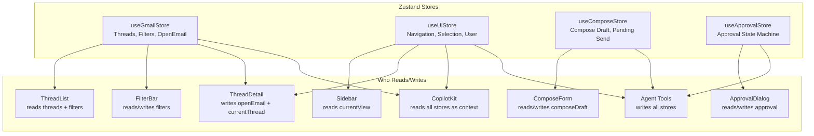

# Zustand Stores (UI State)

Four Zustand stores manage all **transient UI state** — state that is not persisted and resets on page refresh.

## Store Overview



## Store 1: `useGmailStore`

**File:** `lib/stores/gmailStore.ts`

Manages thread data, loading states, filters, and the open email context for the AI.

```typescript
interface GmailStore {
  // Data
  threads: ThreadListItem[];
  threadDetail: Thread | null;
  threadsLoading: boolean;
  threadDetailLoading: boolean;
  error: string | null;
  
  // Filters
  filters: ThreadFilters;  // { startDate, endDate, sender, subject, keyword, readStatus }
  
  // AI Context
  openEmail: OpenEmail | null;
  
  // Actions
  listThreads: (options: ListOptions) => Promise<void>;
  getThread: (threadId: string) => Promise<void>;
  setFilters: (filters: Partial<ThreadFilters>) => void;
  clearFilters: () => void;
  setOpenEmail: (email: OpenEmail | null) => void;
  buildSearchQuery: () => string;
}
```

## Store 2: `useUiStore`

**File:** `lib/stores/uiStore.ts`

Manages navigation context, thread selection, delete dialog state, and user identity.

```typescript
interface UiStore {
  currentThreadId: string | null;
  currentThreadSubject: string | null;
  selectedThreadIds: Set<string>;
  deleteDialogOpen: boolean;
  isDeletingThreads: boolean;
  userEmailAddress: string | null;
  
  setCurrentThreadId: (id: string | null) => void;
  setCurrentThreadSubject: (subject: string | null) => void;
  toggleSelectThread: (id: string) => void;
  selectVisibleThreads: (ids: string[]) => void;
  clearSelectedThreads: () => void;
  setDeleteDialogOpen: (open: boolean) => void;
  setIsDeletingThreads: (deleting: boolean) => void;
  setUserEmailAddress: (email: string | null) => void;
}
```

## Store 3: `useComposeStore`

**File:** `lib/stores/composeStore.ts`

Manages the compose form fields and pending send state.

```typescript
interface ComposeStore {
  composeDraft: {
    to: string;
    cc: string;
    subject: string;
    body: string;
  };
  pendingSend: PendingSend | null;
  
  setComposeDraft: (draft: Partial<ComposeDraft>) => void;
  clearComposeDraft: () => void;
  setPendingSend: (send: PendingSend | null) => void;
}
```

## Store 4: `useApprovalStore`

**File:** `lib/stores/approvalStore.ts`

Implements the human-in-the-loop state machine for send/delete operations.

```typescript
interface ApprovalStore {
  approval: {
    state: "idle" | "waiting" | "approved" | "rejected";
    type: "send_email" | "delete_threads" | null;
    data: ApprovalData | null;
    error: string | null;
    paused: boolean;
    cancelled: boolean;
  };
  
  requestApproval: (type: string, data: ApprovalData) => void;
  approveApproval: () => void;
  rejectApproval: () => void;
  cancelWorkflow: () => void;
  setApprovalPaused: (paused: boolean) => void;
  clearApproval: () => void;
}
```

## Why No Persistence?

All Zustand stores are **in-memory only** — no `persist` middleware. This is intentional:

- Thread data comes from the server (React Query) — not from local state
- UI state (filters, selection, compose draft) is transient and resets on refresh
- Approval state must be ephemeral — never survives a page reload
- Simplifies the mental model — state = current session only
