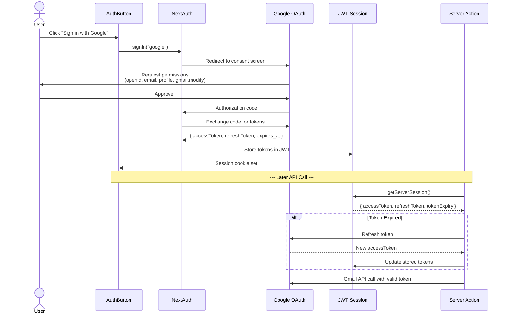

# Authentication

Authentication uses **NextAuth v4** with **Google OAuth** and JWT sessions. The `gmail.modify` scope is requested for full email access.

## Auth Flow



## NextAuth Configuration

**File:** `lib/auth.ts`

```typescript
export const authOptions: NextAuthOptions = {
  providers: [
    GoogleProvider({
      clientId: process.env.AUTH_GOOGLE_ID!,
      clientSecret: process.env.AUTH_GOOGLE_SECRET!,
      authorization: {
        params: {
          scope: "openid email profile https://www.googleapis.com/auth/gmail.modify",
          access_type: "offline",
          prompt: "consent",
        },
      },
    }),
  ],
  session: { strategy: "jwt" },
  callbacks: {
    async jwt({ token, account }) {
      // Initial sign-in: store tokens from account
      if (account) {
        token.accessToken = account.access_token;
        token.refreshToken = account.refresh_token;
        token.tokenExpiry = account.expires_at;
        return token;
      }
      
      // Return token if still valid
      if (Date.now() < (token.tokenExpiry as number) * 1000) {
        return token;
      }
      
      // Refresh expired token
      return refreshAccessToken(token);
    },
    async session({ session, token }) {
      session.accessToken = token.accessToken as string;
      session.refreshToken = token.refreshToken as string;
      session.tokenExpiry = token.tokenExpiry as number;
      return session;
    },
  },
};
```

## Type Augmentation

**File:** `types/next-auth.d.ts`

```typescript
declare module "next-auth" {
  interface Session {
    accessToken: string;
    refreshToken: string;
    tokenExpiry: number;
    error?: string;
  }
}

declare module "next-auth/jwt" {
  interface JWT {
    accessToken: string;
    refreshToken: string;
    tokenExpiry: number;
    error?: string;
  }
}
```

## Token Refresh

The `refreshAccessToken()` function handles OAuth2 token refresh:

```typescript
async function refreshAccessToken(token: JWT): Promise<JWT> {
  try {
    const response = await fetch("https://oauth2.googleapis.com/token", {
      method: "POST",
      headers: { "Content-Type": "application/x-www-form-urlencoded" },
      body: new URLSearchParams({
        client_id: process.env.AUTH_GOOGLE_ID!,
        client_secret: process.env.AUTH_GOOGLE_SECRET!,
        grant_type: "refresh_token",
        refresh_token: token.refreshToken,
      }),
    });
    
    const refreshed = await response.json();
    
    return {
      ...token,
      accessToken: refreshed.access_token,
      tokenExpiry: Math.floor(Date.now() / 1000 + refreshed.expires_in),
      refreshToken: refreshed.refresh_token ?? token.refreshToken,
    };
  } catch (error) {
    return { ...token, error: "RefreshAccessTokenError" };
  }
}
```

## Authorization in Server Actions

Every server action calls `requireAuth()` before proceeding:

```typescript
// lib/actions/gmail.ts
async function requireAuth() {
  const session = await getServerSession(authOptions);
  if (!session?.accessToken) {
    throw new Error("Unauthorized");
  }
  return session;
}
```

This ensures:
1. **No unauthenticated Gmail calls** — every action checks the session
2. **No client-side API exposure** — tokens never leave the server
3. **Automatic token refresh** — handled by OAuth2 client + JWT callback
