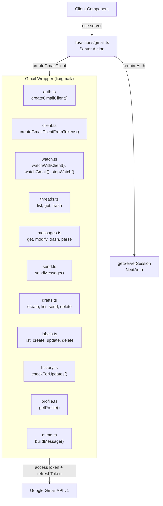
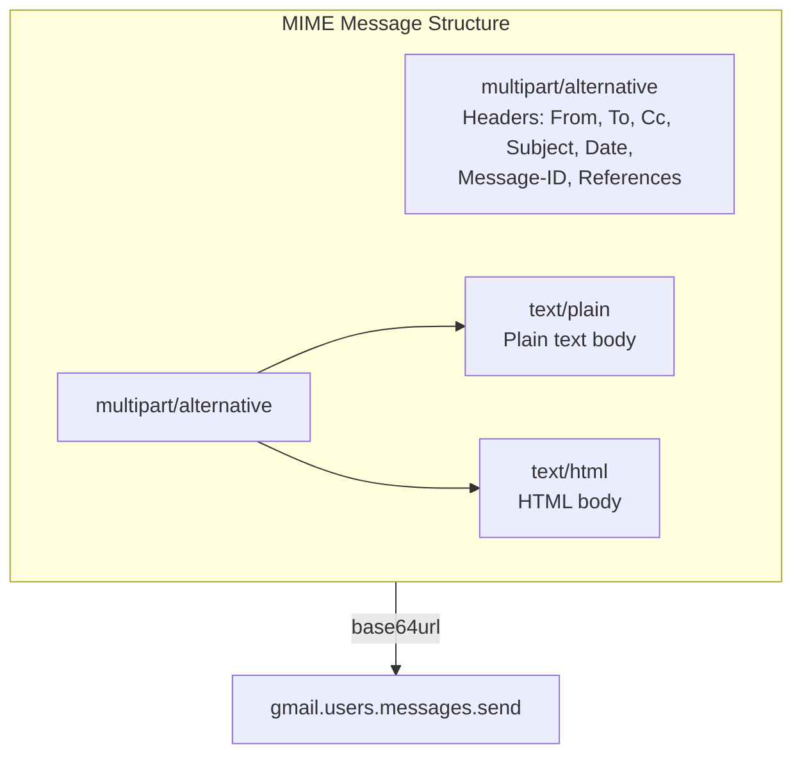

# Gmail API Integration

The Gmail API is the sole data source for email operations. All calls go through an **auth-gated wrapper** that uses the user's OAuth tokens.

## Architecture



## OAuth Client Creation

**File:** `lib/gmail/auth.ts`

```typescript
function createGmailClient() {
  const session = await getServerSession(authOptions);
  if (!session) throw new Error("Unauthorized");
  
  const oauth2Client = new OAuth2(
    process.env.AUTH_GOOGLE_ID!,
    process.env.AUTH_GOOGLE_SECRET!
  );
  
  oauth2Client.setCredentials({
    access_token: session.accessToken,
    refresh_token: session.refreshToken,
  });
  
  const gmail = google.gmail({ version: "v1", auth: oauth2Client });
  return { gmail, session };
}
```

The `@googleapis/gmail` client **auto-refreshes** tokens when expired, working with NextAuth's refresh mechanism.

### Token-Based Client (for Real-Time Sync)

**File:** `lib/gmail/client.ts`

The watch setup runs inside the NextAuth JWT callback, where `getServerSession` is not yet available. A separate function creates a client from raw tokens:

```typescript
export function createGmailClientFromTokens(
  accessToken: string,
  refreshToken: string | undefined,
  expiry: number,
): gmail_v1.Gmail {
  const oauth2Client = new auth.OAuth2(
    process.env.AUTH_GOOGLE_ID!,
    process.env.AUTH_GOOGLE_SECRET!,
  )
  oauth2Client.setCredentials({
    access_token: accessToken,
    refresh_token: refreshToken,
    expiry_date: expiry * 1000,
  })
  return gmailClient({ version: "v1", auth: oauth2Client })
}
```

## Server Action Pattern

**File:** `lib/actions/gmail.ts`

Every Gmail operation follows this pattern:

```typescript
"use server";

export async function listThreadsAction(options: ListOptions) {
  const { gmail } = createGmailClient(); // also calls requireAuth
  
  const response = await gmail.users.messages.list({
    userId: "me",
    labelIds: options.labelIds,
    q: options.q,
    maxResults: options.maxResults ?? 30,
    pageToken: options.pageToken,
  });
  
  // Enrich with metadata for each thread
  const threads = await Promise.all(
    (response.data.messages ?? []).map(async (msg) => {
      const detail = await gmail.users.messages.get({
        userId: "me",
        id: msg.id!,
        format: "metadata",
        metadataHeaders: ["From", "To", "Cc", "Subject", "Date"],
      });
      return parseThreadListItem(detail.data);
    })
  );
  
  return { threads, nextPageToken: response.data.nextPageToken };
}
```

## MIME Message Construction

**File:** `lib/gmail/mime.ts`

Email messages are built manually with proper RFC 2822 formatting:



Key encoding considerations:

- **Subject**: UTF-8 B-encoding for non-ASCII characters
- **Body**: Quoted-printable encoding for line length compliance
- **HTML**: Wrapped in a complete HTML document with email-safe CSS
- **base64url**: Standard Gmail API encoding for the raw message

## API Endpoints Used

| Method | Endpoint | Purpose |
|--------|----------|---------|
| GET | `users.messages.list` | List threads (with labelIds + query) |
| GET | `users.messages.get` | Get message detail (metadata or full) |
| POST | `users.messages.send` | Send email |
| POST | `users.messages.modify` | Add/remove labels |
| POST | `users.messages.trash` | Move to trash |
| POST | `users.messages.untrash` | Restore from trash |
| GET | `users.messages.attachments.get` | Download attachment data |
| GET | `users.threads.get` | Get full thread with messages |
| POST | `users.threads.trash` | Trash entire thread |
| POST | `users.drafts.create` | Save draft |
| GET | `users.drafts.list` | List drafts |
| POST | `users.drafts.send` | Send draft |
| DELETE | `users.drafts.delete` | Delete draft |
| GET | `users.labels.list` | List all labels |
| POST | `users.labels.create` | Create label |
| PUT | `users.labels.update` | Update label |
| DELETE | `users.labels.delete` | Delete label |
| POST | `users.watch` | Subscribe to push notifications via Pub/Sub |
| POST | `users.stop` | Unsubscribe from push notifications |
| GET | `users.history.list` | Poll for changes |
| GET | `users.getProfile` | Get user email + historyId |
