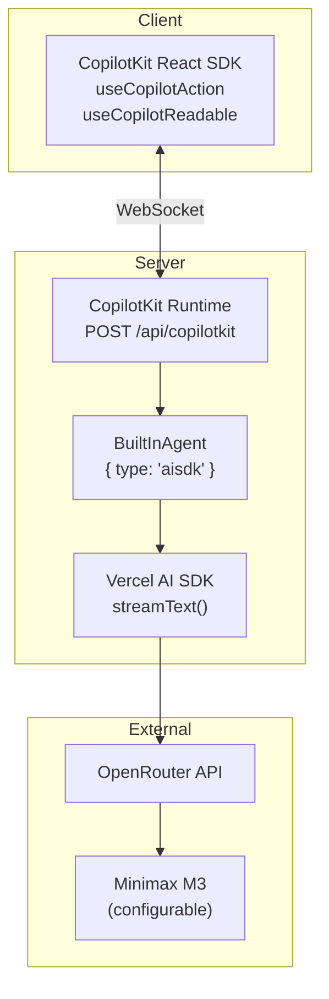

# LLM Configuration

The AI model is **configurable via environment variables**, defaulting to Minimax M3 through OpenRouter.

## Architecture



## CopilotKit Runtime Setup

**File:** `app/api/copilotkit/route.ts`

```typescript
import { CopilotRuntime, OpenAIAdapter } from "@copilotkit/runtime";
import { openrouter } from "@openrouter/ai-sdk-provider";

const runtime = new CopilotRuntime({
  remoteEndpoints: [{
    url: "/api/copilotkit",
    adapter: new OpenAIAdapter({
      model: process.env.LLM_MODEL || "minimax/minimax-m3",
      apiKey: process.env.OPENROUTER_API_KEY,
      baseURL: "https://openrouter.ai/api/v1",
    }),
  }],
});
```

## System Prompt

**File:** `lib/ai/system-prompt.ts`

The system prompt defines the AI's behavior, capabilities, and workflow rules:

```
You are an AI assistant for an email client. You can help users manage
their emails through natural language.

CAPABILITIES:
- Navigate between views: inbox, sent, draft, spam, compose
- Filter emails by date range, sender, subject, keyword, read status
- Search for threads by sender, subject, or keywords
- Fill compose forms and reply to threads
- Multi-select threads for batch operations
- Read uploaded files (PDF, text, CSV)

WORKFLOW RULES:
1. Always check the current view and context before acting
2. For sending or deleting, always use the approval system
3. When replying, quote the original message
4. After any action, inform the user of what was done
5. When reading open email, respect content truncation
```

## Model Configuration

| Variable | Default | Purpose |
|----------|---------|---------|
| `OPENROUTER_API_KEY` | (required) | API key for OpenRouter |
| `LLM_MODEL` | `minimax/minimax-m3` | Override the AI model |

The model can be changed by editing a single environment variable:

```bash
# .env.local
OPENROUTER_API_KEY=sk-or-v1-your-key-here
LLM_MODEL=anthropic/claude-sonnet-4-20250514  # or any OpenRouter model
```

## Why Minimax M3?

| Factor | Consideration |
|--------|---------------|
| **Cost** | ~$0.15/M tokens — very cost-effective for tool-calling workloads |
| **Speed** | Fast inference with good tool-calling accuracy |
| **Availability** | Reliable uptime via OpenRouter |
| **Context Window** | 128K tokens sufficient for email content + context |

The tool-based architecture means the model choice has minimal impact on behavior — as long as the model can reliably output structured tool calls, the system works the same way.
