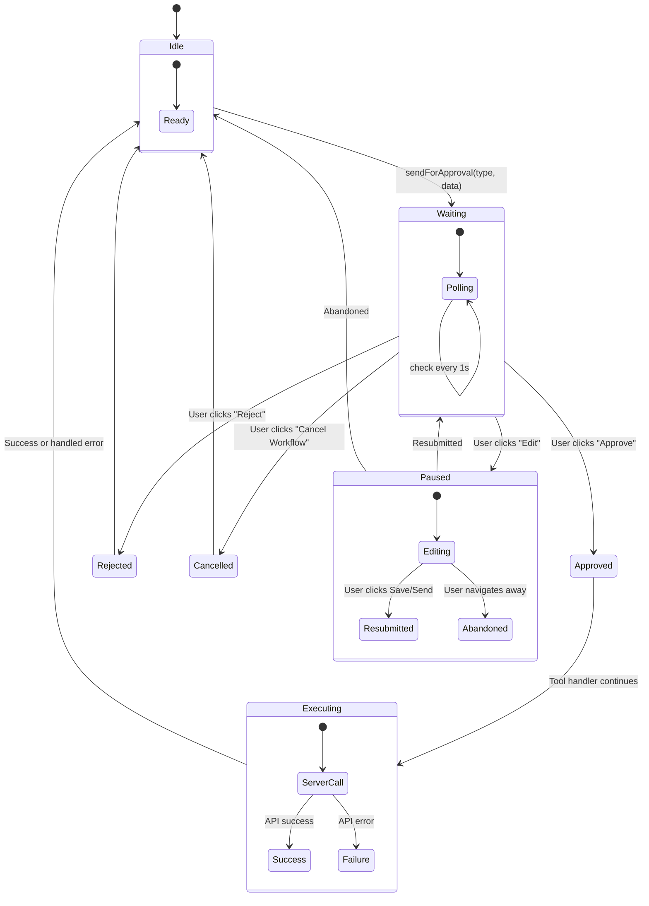

# Approval System Deep Dive

The human-in-the-loop approval system is a **state machine** that prevents the AI from executing destructive operations without explicit user consent.

## State Machine Detail



## Approval Data Structures

```typescript
// Send email approval
interface SendApprovalData {
  type: "send_email";
  to: string;
  cc?: string;
  subject: string;
  bodyText: string;
  bodyHtml: string;
  attachments?: FileMetadata[];
}

// Delete threads approval  
interface DeleteApprovalData {
  type: "delete_threads";
  ids: string[];
  threads: Array<{
    id: string;
    subject: string;
    from: string;
    snippet: string;
  }>;
}

type ApprovalData = SendApprovalData | DeleteApprovalData;
```

## sendForApproval Utility

**File:** `agent/tools/approval/send-for-approval.ts`

```typescript
async function sendForApproval(
  type: "send_email" | "delete_threads",
  data: ApprovalData,
  options?: { timeout?: number }
): Promise<ApprovalResult> {
  approvalStore.requestApproval(type, data);
  
  const timeout = options?.timeout ?? 10 * 60 * 1000; // 10 min default
  const startTime = Date.now();
  const pollInterval = 1000; // 1 second
  
  while (Date.now() - startTime < timeout) {
    const { state, paused } = approvalStore.approval;
    
    if (state === "approved") return "approved";
    if (state === "rejected") return "rejected";
    
    if (paused) {
      // Block until user finishes editing and resubmits
      // or the paused state is cancelled
      await waitForUnpauseOrTimeout();
      continue;
    }
    
    if (approvalStore.approval.cancelled) return "cancelled";
    
    await sleep(pollInterval);
  }
  
  // Timeout — cancel the workflow
  approvalStore.cancelWorkflow();
  return "cancelled";
}
```

## Timing & Safety

| Parameter | Value | Rationale |
|-----------|-------|-----------|
| Poll interval | 1 second | Fast response without CPU waste |
| Timeout | 10 minutes | Prevents stuck workflows indefinitely |
| Dialog style | Modal | Forces user attention before continuing |

## Audit Trail

Every approval action is visible in the AI chat panel:

```
🤖 "I've drafted a reply to Alice. Please review and approve:"

📧 Email Preview Card
   To: alice@example.com
   Subject: Re: Meeting Tomorrow
   Body: Hi Alice, let's meet at 3pm...

[Tool Call: send_email → waiting for approval]

🛡️ User approved the action
✓ Email sent successfully
```
