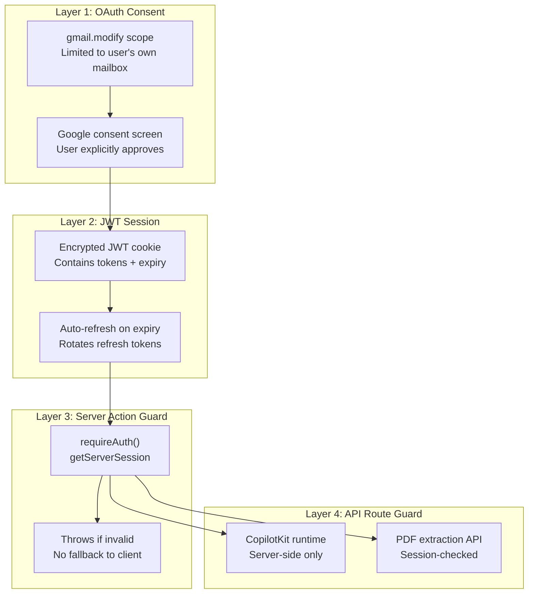
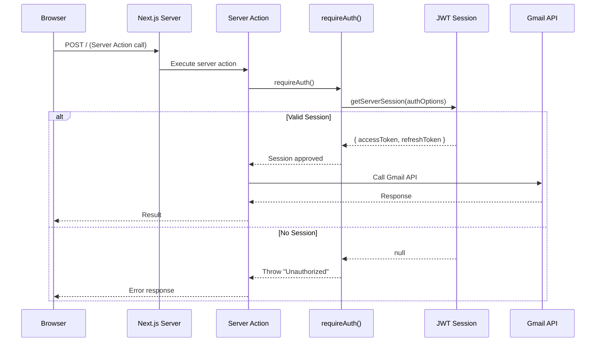

# Authentication Architecture

The auth system has security at every layer — from OAuth consent to server action guards.

## Security Layers

## Request Flow

## Security Principles

| Principle | Implementation |
|-----------|---------------|
| **No client-side tokens** | Access tokens never reach the browser |
| **Every call authenticated** | `requireAuth()` in every server action |
| **Least privilege** | Only `gmail.modify` scope requested |
| **Token rotation** | Refresh tokens rotated on each use |
| **No persistent stores** | All state is session-bound |

## Environment Variables

| Variable | Sensitivity | Exposure |
|----------|-------------|----------|
| `AUTH_SECRET` | 🔴 High | Server only (encryption key) |
| `AUTH_GOOGLE_ID` | 🟡 Medium | Server only |
| `AUTH_GOOGLE_SECRET` | 🔴 High | Server only |
| `OPENROUTER_API_KEY` | 🔴 High | Server only |
| `LLM_MODEL` | 🟢 Low | Server only |
