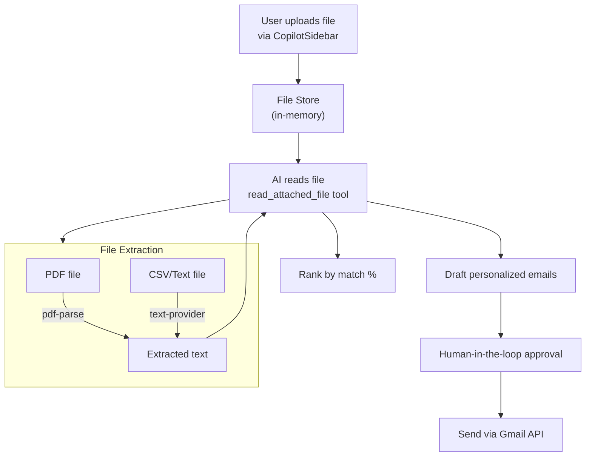

# Job Cold Emails Workflow

Upload a résumé and a list of job listings, then ask the AI to rank and apply. This showcases the **file reasoning** and **multi-step workflow** capabilities.

## Demo Video

<div class="video-container">
  <video controls width="100%">
    <source src={require('@site/static/demo/job cold emails-compressed.mp4').default} type="video/mp4" />
    Your browser does not support the video tag.
  </video>
</div>

## What You'll See

1. User uploads a résumé PDF and a CSV of job listings
2. AI reads both files using `read_attached_file`
3. AI analyzes the résumé against each job requirement
4. AI ranks jobs by match percentage
5. AI drafts personalized cold emails for top matches
6. Each email goes through approval before sending

## Architecture Involved

| Component | File | Role |
|-----------|------|------|
| `read_attached_file` tool | `agent/tools/ui/file-attachment.ts` | Reads uploaded file content |
| File store | `lib/file-store.ts` | In-memory file storage |
| PDF provider | `lib/documents/providers/pdf-provider.ts` | Server-side PDF text extraction |
| Text provider | `lib/documents/providers/text-provider.ts` | Text/CSV file extraction |
| `/api/files/extract-text` | `app/api/files/extract-text/route.ts` | PDF extraction API endpoint |
| CopilotPanel | `components/ai/CopilotPanel.tsx` | File attachment upload UI |

## File Processing Pipeline



## Multi-Step Workflow

This is the most complex workflow the AI can handle:

```
Step 1: Read résumé → understand skills, experience, education
Step 2: Read job listings → parse requirements for each role
Step 3: Cross-reference → match skills against requirements
Step 4: Rank → order by match percentage
Step 5: Draft → compose personalized cold emails
Step 6: For each email → human-in-the-loop approval
Step 7: Send → via Gmail API with cache invalidation
```

## File Upload Architecture

Files are uploaded through CopilotKit's attachment system and stored in an in-memory store:

```typescript
// lib/file-store.ts
const fileStore = new Map<string, FileEntry>();

function extractAndStoreFile(file: File): FileEntry {
  const id = crypto.randomUUID();
  const entry = {
    id,
    name: file.name,
    mimeType: file.type,
    size: file.size,
    content: null as string | null,
  };
  
  // Determine provider by MIME type
  const provider = registry.getProvider(file.type);
  entry.content = provider.extract(file);
  
  fileStore.set(id, entry);
  return entry;
}
```
