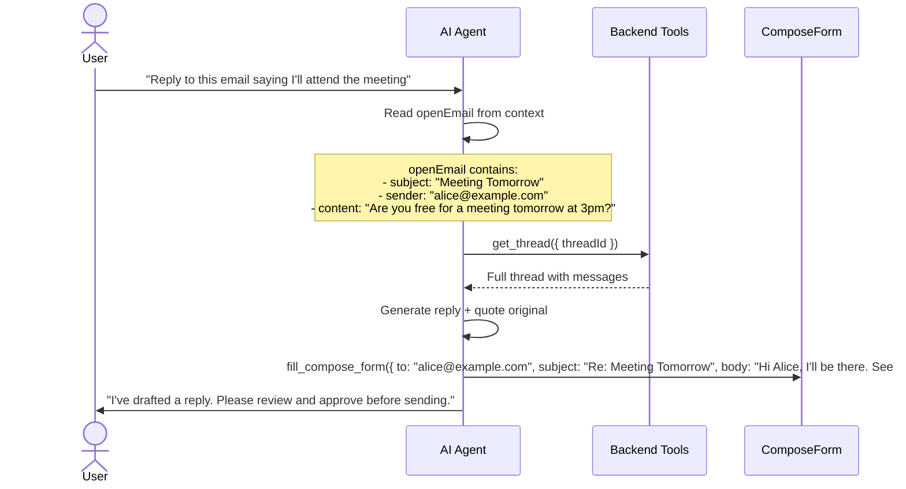

# Send Replies

Reply to emails with the AI generating context-aware responses that include quoted originals.

## Demo Video

<div class="video-container">
  <video controls width="100%">
    <source src={require('@site/static/demo/send replies-compressed.mp4').default} type="video/mp4" />
    Your browser does not support the video tag.
  </video>
</div>

## What You'll See

1. User navigates to a thread and the AI reads the open email context
2. AI calls `reply_to_thread` with a generated reply body
3. The compose form opens pre-filled with the reply, quoted original, and proper `Re:` subject
4. User can edit the reply before sending
5. Send triggers the approval workflow

## Architecture Involved

| Component | File | Role |
|-----------|------|------|
| `reply_to_thread` tool | `agent/tools/gmail/reply.ts` | Pre-fills compose with reply |
| `get_thread` tool | `agent/backend-tools/get-thread.ts` | Fetches full thread data |
| `ThreadDetail` | `components/mail/ThreadDetail/index.tsx` | Open email context |
| `useComposeStore` | `lib/stores/composeStore.ts` | Compose draft state |

## Reply Generation Flow



## Quote Format

The quoted original is rendered in Markdown:

```markdown
Hi Alice, I'll be there. See you at 3pm.

---

On Jan 15, 2025, Alice wrote:
> Are you free for a meeting tomorrow at 3pm?
> Let me know if that works for you.
```
