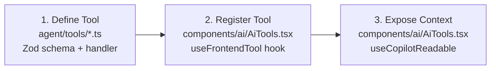
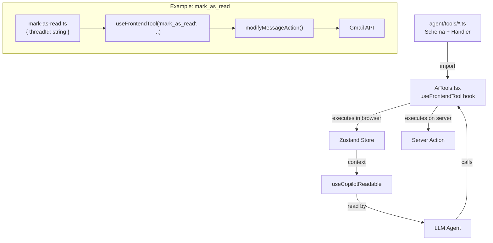

# Adding New Tools

The tool-based architecture makes adding new AI capabilities a **three-step process** that doesn't affect existing workflows.

## The Three Steps



## Step 1: Define the Tool

Create a file in `agent/tools/` with a Zod schema and handler function:

```typescript
// agent/tools/gmail/mark-as-read.ts
import { z } from "zod";

export const markAsReadSchema = z.object({
  threadId: z.string().describe("The thread ID to mark as read"),
});

export type MarkAsReadParams = z.infer<typeof markAsReadSchema>;

export function createMarkAsReadHandler() {
  return async ({ threadId }: MarkAsReadParams) => {
    // Call server action to modify labels
    await modifyMessageAction(threadId, {
      removeLabelIds: ["UNREAD"],
    });
    
    return `Marked thread ${threadId} as read`;
  };
}
```

## Step 2: Register the Tool

Add the `useFrontendTool` hook call in `AiTools.tsx`:

```typescript
// components/ai/AiTools.tsx
import { createMarkAsReadHandler } from "@/agent/tools/gmail/mark-as-read";

function AiTools() {
  const markAsRead = useCallback(createMarkAsReadHandler(), []);
  
  useFrontendTool("mark_as_read", {
    description: "Mark a specific thread as read by removing the UNREAD label.",
    parameters: markAsReadSchema,
    handler: markAsRead,
  });
  
  // ... existing tools
}
```

## Step 3: Expose Context (Optional)

If the tool needs additional context, add it to the `useCopilotReadable` value:

```typescript
const context = useMemo(() => ({
  // ... existing context
  unreadCount: threads.filter(t => t.labelIds?.includes("UNREAD")).length,
}), [/* ... */]);
```

## Tool Registration Architecture



## Adding Backend Tools

For tools that need server-side execution (API calls, data processing):

1. Create in `agent/backend-tools/` instead
2. Register in `app/api/copilotkit/route.ts` under `runtime.backendTools`
3. No need for `AiTools.tsx` changes

```typescript
// app/api/copilotkit/route.ts
const runtime = new CopilotRuntime({
  backendTools: {
    mark_as_read: {
      description: "...",
      parameters: markAsReadSchema,
      execute: async ({ threadId }) => {
        "use server";
        return modifyMessageAction(threadId, { removeLabelIds: ["UNREAD"] });
      },
    },
  },
});
```

## What Doesn't Change

- **Existing tools** — continue working without modification
- **Zustand stores** — unchanged unless new state is needed
- **React Query hooks** — unchanged unless new queries are needed
- **UI components** — unchanged unless new visual elements are needed
