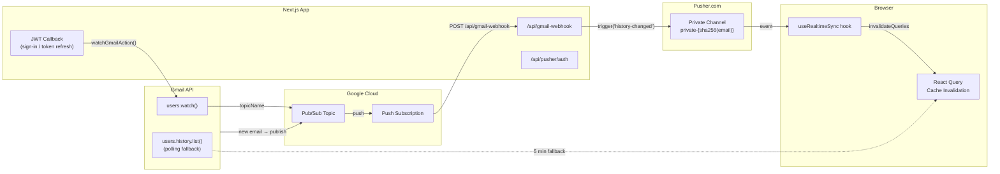

# Real-Time Sync

Real-time email sync uses a three-stage relay: **Gmail Watch** → **Pub/Sub** → **Pusher**, with a polling fallback.

## Architecture



## Watch Lifecycle

The Gmail watch is managed through the NextAuth **JWT callback** — not from the client:

| Trigger | Action |
|---------|--------|
| **Sign-in** (first time) | `users.watch()` called with fresh OAuth tokens |
| **Token refresh** (~1 hour) | `users.watch()` called again with refreshed tokens |
| **Re-sign-in** (re-consent) | `users.watch()` called with new tokens |
| **App mount** | No watch call — delegated entirely to JWT callback |
| **Sign-out** | Watch auto-expires in 7 days |

## Implementation

### lib/gmail/client.ts

Creates an authenticated client from raw OAuth tokens (no server session required):

```typescript
export function createGmailClientFromTokens(
  accessToken: string,
  refreshToken: string | undefined,
  expiry: number,
): gmail_v1.Gmail {
  const oauth2Client = new auth.OAuth2(clientId, clientSecret)
  oauth2Client.setCredentials({
    access_token: accessToken,
    refresh_token: refreshToken,
    expiry_date: expiry * 1000,
  })
  return gmailClient({ version: "v1", auth: oauth2Client })
}
```

### lib/gmail/watch.ts

```typescript
export async function watchWithClient(gmail: gmail_v1.Gmail): Promise<WatchResult> {
  const topicName = `projects/${projectId}/topics/${topic}`
  const res = await gmail.users.watch({
    userId: "me",
    requestBody: { topicName, labelIds: ["INBOX"] },
  })
  return { historyId: res.data.historyId!, expiration: res.data.expiration!.toString() }
}
```

### lib/auth.ts (JWT callback)

Watch is triggered in two places — on initial sign-in and after token refresh:

```typescript
async jwt({ token, account }) {
  // Initial sign-in
  if (account) {
    token.accessToken = account.access_token
    token.refreshToken = account.refresh_token
    token.tokenExpiry = account.expires_at
    setupGmailWatch(account.access_token, account.refresh_token, account.expires_at ?? 0)
    return token
  }

  // Token still valid
  if (token.tokenExpiry && Date.now() < token.tokenExpiry * 1000) return token

  // Token expired → refresh → renew watch
  const refreshed = await refreshAccessToken(token)
  if (!refreshed.error) {
    setupGmailWatch(refreshed.accessToken, refreshed.refreshToken, refreshed.tokenExpiry ?? 0)
  }
  return refreshed
}
```

### app/api/gmail-webhook/route.ts

Receives Pub/Sub push notifications and relays to Pusher:

```typescript
export async function POST(request: NextRequest) {
  const body = await request.json()
  const { emailAddress, historyId } = JSON.parse(
    Buffer.from(body.message.data, "base64").toString(),
  )

  const channel = `private-${sha256(emailAddress)}`
  await pusher.trigger(channel, "history-changed", { historyId })

  return NextResponse.json({ success: true })
}
```

### hooks/use-realtime-sync.ts

Client-side hook that subscribes to Pusher and invalidates React Query:

```typescript
export function useRealtimeSync() {
  const { data: session } = useSession()
  const queryClient = useQueryClient()

  useEffect(() => {
    const pusher = getPusherClient()
    const channel = pusher.subscribe(`private-${sha256(session.email)}`)

    channel.bind("history-changed", () => {
      queryClient.invalidateQueries({ queryKey: ["threads"] })
    })
  }, [session?.user?.email])

  return { isConnected }
}
```

## Fallback: Polling

A **5-minute polling interval** (`useHistoryPoll`) acts as a safety net:

- Missed webhooks during deployment or serverless cold starts
- Watch expiry (7 days since last sign-in)
- Pusher connection drops

The polling interval was increased from 15s (previous implementation) to 5 minutes since the primary sync path is now push-based.

## Infrastructure Setup

### Google Cloud Pub/Sub

1. Create a topic (e.g., `gmail-notifications`)
2. Create a push subscription → `https://your-domain.com/api/gmail-webhook?token=YOUR_TOKEN`
3. Grant `gmail-api-push@system.gmail.com` the `roles/pubsub.publisher` role on the topic

### Pusher.com

1. Create an app in the Pusher dashboard
2. Enable private channels
3. Set the auth endpoint to `/api/pusher/auth`
4. Note your app credentials: `app_id`, `key`, `secret`, `cluster`
