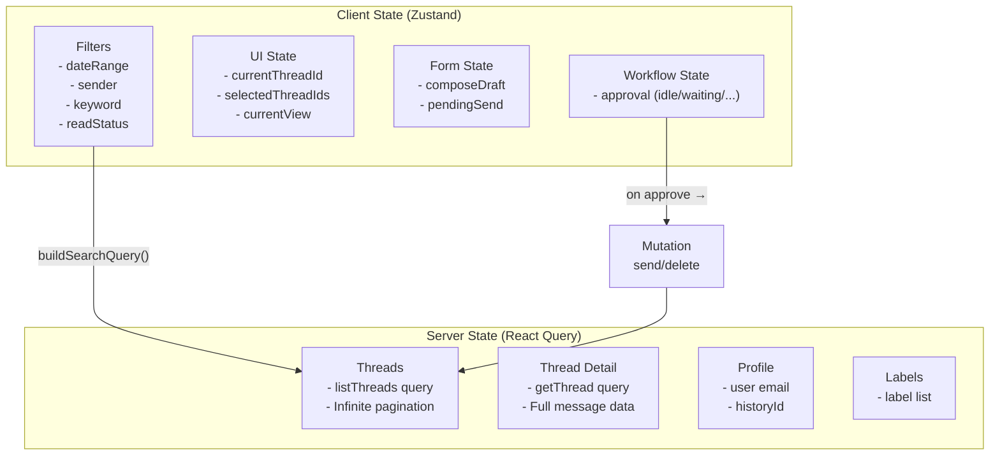

# Zustand vs React Query: State Split

The application uses **two parallel state management systems** with clear separation of concerns.

## The Split



## Why Two Systems?

| Concern | Zustand | React Query |
|---------|---------|-------------|
| **Purpose** | Transient UI state | Server data cache |
| **Source of truth** | Browser memory | Gmail API |
| **Persistence** | None (ephemeral) | Cache with staleTime |
| **Pagination** | Manual | Built-in (infinite query) |
| **Cache invalidation** | Manual | Automatic on mutation |
| **Loading states** | Manual | Built-in |
| **Deduplication** | Manual | Built-in |
| **DevTools** | Zustand DevTools | React Query DevTools |

## When to Use Each

### Use Zustand when:
- State is **UI-only** (filters, selection, form draft)
- State represents a **workflow** (approval state machine)
- State is **ephemeral** (not worth caching on server)
- State needs to be **read by the AI** context

### Use React Query when:
- Data comes from an **external API** (Gmail)
- Data benefits from **caching** (threads, labels)
- Data needs **pagination** (thread list)
- Mutations should **invalidate** related queries

## Cross-Store Example: Filter → Query

```typescript
// ThreadList component
function ThreadList({ labelIds }: { labelIds: string[] }) {
  // Zustand: read filters
  const filters = useGmailStore((s) => s.filters);
  
  // Build Gmail query from filters
  const q = useMemo(() => buildSearchQuery(filters), [filters]);
  
  // React Query: fetch with filters
  const { data, fetchNextPage, hasNextPage } = useThreads(labelIds, q);
  
  // Render virtualized list
  return <VirtualList items={data?.pages.flatMap(p => p.threads) ?? []} />;
}
```

The **filters** (Zustand) drive the **query** (React Query), which fetches the **threads** (server state) and renders the **list** (UI). Each system handles what it does best.
