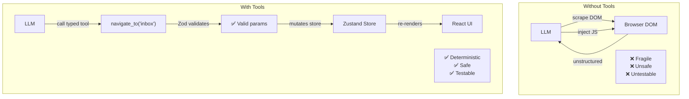

# Why Tool-Based Architecture?

The single most important architectural decision: the AI assistant **never touches the DOM**.

## The Problem

Most AI-enabled web applications give the AI direct browser access — scraping the DOM for context and injecting JavaScript to manipulate the UI. This is:

- **Fragile** — any UI change breaks the AI
- **Unsafe** — arbitrary JS execution
- **Untestable** — can't unit test DOM interactions
- **Non-deterministic** — subtle timing and rendering differences change behavior

## The Solution: Typed Tools

Instead of giving the AI a browser, we give it a **keyboard of capabilities** — each one a typed, validated function with a clear contract.



## Benefits Realized

| Benefit | How It Works |
|---------|-------------|
| **Deterministic** | Same input → same tool call sequence |
| **Testable** | Each tool handler is a pure function |
| **Auditable** | Chat panel shows every call with params + result |
| **Extensible** | New tool = one file + one registration line |
| **Model-agnostic** | Works with any LLM that can call tools |

## The Contract

```
LLM → Tool Call: { name: "set_filters", args: { sender: "alice" } }
     ↓
Zod Validation: args matches schema? 
     ↓
Handler Execution: gmailStore.setFilters({ sender: "alice" })
     ↓
Return Value: "Filters applied: { sender: 'alice' }"
     ↓
LLM: "Done! Showing only emails from Alice."
```

This contract means:

- **Invalid arguments** are caught before execution
- **Execution is synchronous** — no race conditions
- **Results are predictable** — the LLM knows exactly what happened
- **The UI updates reactively** — Zustand → React re-render
