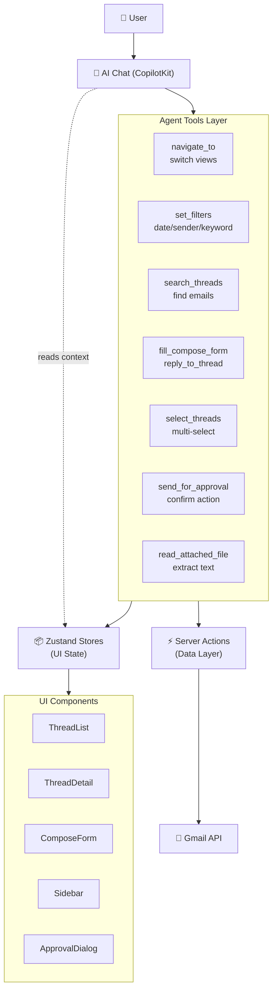

# Overview

**Mail Pilot** is an AI-native email client where you control everything through **natural language**. The AI assistant has full control of the UI — navigating between views, filtering threads, composing replies, searching your inbox, and managing labels — while a **human-in-the-loop** approval system guards every action.

> **Try it live:** [mail-pilot-psi.vercel.app](https://mail-pilot-psi.vercel.app/)

## Key Capabilities

- **AI-powered email management** — navigate, filter, compose, reply, search, and delete through natural language
- **Human-in-the-loop approval** — confirm or reject every send/delete with a modal dialog
- **Tool-based AI architecture** — typed, validated tools for deterministic behavior
- **Rich email UI** — virtualized thread lists, TipTap rich-text editor, Gmail label management
- **File reasoning** — upload PDFs, text files, and CSVs; the AI reads and reasons about their content
- **Resume-to-job matching** — upload a résumé and job listings, the AI ranks and drafts personalized applications

## Architecture at a Glance

## Tech Stack

| Layer | Technology |
|-------|-----------|
| **Framework** | Next.js 16 (App Router) |
| **Language** | TypeScript 5.x |
| **Styling** | Tailwind CSS v4 + shadcn/ui |
| **Auth** | NextAuth v4 (Google OAuth, JWT, token refresh) |
| **Mail Provider** | Gmail API (`@googleapis/gmail`) |
| **Server State** | TanStack React Query v5 |
| **Client State** | Zustand v5 |
| **AI Framework** | CopilotKit v2 |
| **AI Model** | Configurable (Minimax M3 via OpenRouter default) |
| **Virtualization** | `@tanstack/react-virtual` |
| **Rich Text** | TipTap v3 (ProseMirror) |

## Documentation Structure

This site documents the complete architecture:

- **[Architecture](/docs/architecture/system-overview)** — system layers, data flows, component hierarchy
- **[AI Agent System](/docs/ai-agent/tool-architecture)** — tool-based design, HITL approval, context system
- **[State Management](/docs/state-management/zustand-stores)** — Zustand stores, React Query, AI context bridge
- **[Integrations](/docs/integrations/gmail-api)** — Gmail API, authentication, LLM configuration
- **[Security & HITL](/docs/security/auth-architecture)** — authorization flow, approval state machine
- **[Demo Videos](/docs/demo/inbox-management)** — feature walkthroughs
- **[Extensibility](/docs/extensibility/adding-tools)** — adding new tools, configuration
- **[Engineering Decisions](/docs/engineering-decisions/tool-based-architecture)** — architectural rationale
- **[Testing](/docs/testing/overview)** — test strategy, mock Gmail client, unit & E2E patterns
