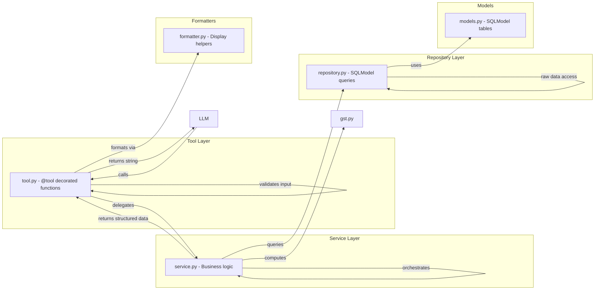

# Module Architecture

Every business domain follows a strict **three-layer pattern** that separates concerns and keeps the LLM from ever touching the database directly.

## The Three-Layer Pattern



### 1. Tool Layer (`tools.py`)

- Exports `@tool`-decorated functions
- Validates inputs (types, ranges)
- Opens DB session, calls service, formats result
- Returns **plain string** to the LLM
- Never contains business logic

```python
@tool
def add_to_bill(bill_id: int, inventory_id: int, quantity: int) -> str:
    """Add an item to a draft bill."""
    with get_session() as session:
        inv = get_inventory_item(session, inventory_id)
        if not inv:
            return f"Product #{inventory_id} not found."
        bill_item = billing_service.add_to_bill(session, bill_id, inv, quantity)
    return f"Added {inv.name} (qty: {quantity}) to bill #{bill_id}."
```

### 2. Service Layer (`service.py`)

- Contains all **business rules** (oversell, below-cost, GST, idempotency)
- Reads `RequestContext` from `contextvars` for chat isolation
- Calls repository for data access
- Returns Python objects (SQLModel instances, dataclasses)

```python
def finalize_bill(session, bill_id, payment_mode, idempotency_key=None):
    chat_id = get_request_context().thread_id
    bill = repository.get_bill(session, bill_id, chat_id)
    # Business rules:
    if bill.status == "finalized":
        raise ValueError("Already finalized")
    for item in items:
        if stock < item.quantity:
            raise ValueError("Insufficient stock")
    # Atomic stock decrement
```

### 3. Repository Layer (`repository.py`)

- Raw SQLModel queries only
- No business logic
- Receives `chat_id` explicitly for isolation
- Returns SQLModel instances or `None`

```python
def get_bill(session, bill_id, chat_id):
    return session.exec(
        select(Bill).where(Bill.id == bill_id, Bill.chat_id == chat_id)
    ).first()
```

### 4. Models (`models.py`)

- SQLModel table definitions
- All prices in **paise** (integer)
- Every table has `chat_id: str` for multi-chat isolation

### 5. Formatters (`formatter.py`)

- Pure functions that convert service-layer dataclasses to display text
- Used exclusively by the tool layer

## All 8 Modules

| Module | Tools | Key Models | Purpose |
|--------|-------|------------|---------|
| **inventory** | `find_inventory`, `receive_inventory`, `update_product`, `discontinue_product`, `discover_product_info` | `Inventory` | Search, stock-in, update, soft-delete SKUs. HSN/GST auto-lookup |
| **preferences** | `set_preference`, `get_preferences` | `Preference` | Key-value shop settings (shop_name, gstin, payment_mode) |
| **customers** | `find_or_create_customer` | `Customer` | Lookup by name/phone, auto-create with case-insensitive matching |
| **billing** | `start_bill`, `add_to_bill`, `remove_from_bill`, `update_bill_item`, `get_bill`, `get_bills`, `cancel_bill`, `finalize_bill` | `Bill`, `BillItem` | Multi-turn draft bills, GST computation, idempotent finalize |
| **khata** | `add_khata_credit`, `record_khata_payment`, `get_khata_balance`, `get_khata_statement` | `KhataTransaction` | Customer credit ledger (credit/payment, balance tracking) |
| **documents** | `generate_pdf_invoice`, `send_file` | — | LaTeX → PDF pipeline, file delivery via Telegram |
| **analytics** | `get_sales_summary`, `get_reorder_suggestions` | — | Sales aggregation, velocity-based reorder suggestions |
| **reminders** | `set_reminder`, `get_reminders`, `remove_reminder` | `Reminder` | Scheduled reminders with daily/weekday recurrence |

## Module File Template

Every module follows this convention:

```
modules/<name>/
├── __init__.py        # Re-exports TOOLS list
├── models.py          # SQLModel table definitions
├── repository.py      # Raw database queries
├── service.py         # Business logic (the "hard parts")
├── tools.py           # @tool-decorated LLM-facing functions
├── formatter.py       # Display helpers (optional)
└── middleware.py      # Middleware that injects into system prompt (optional)
```

## Wiring

All tools are assembled in `core/builder.py`:

```python
ALL_TOOLS = [
    *inventory_tools, *preference_tools, *customer_tools,
    *billing_tools, *khata_tools, *document_tools,
    *analytics_tools, *reminder_tools,
]
```

A new module is added by:
1. Creating the module directory with the five standard files
2. Adding the `TOOLS` list to `__init__.py`
3. Extending `ALL_TOOLS` in `builder.py`
4. Importing models in `db/models/__init__.py` (for Alembic autogenerate)
