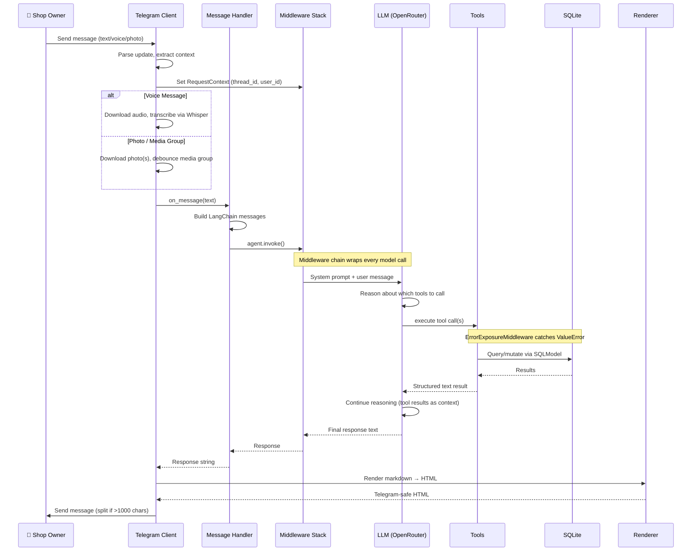
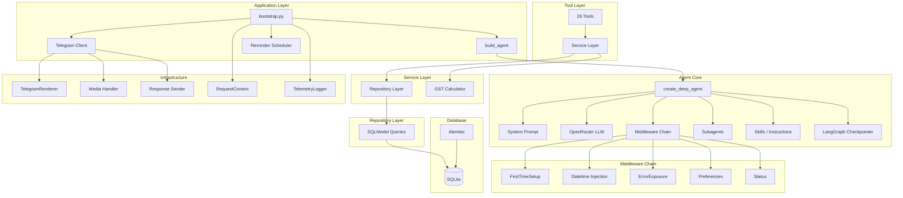
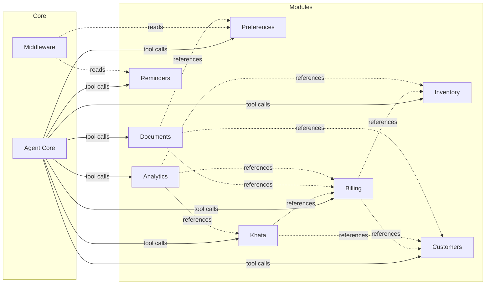

# System Architecture

## A Morning in the Shop

> *"Good morning! Show me what needs reordering."*
>
> The agent checks stock levels, identifies low-running items, and lists them. *"Receive 25kg Moong Dal."* Stock updated. *"Start a bill for Sharma-ji — 2kg Sugar, 1L Oil."* Items added. *"Finalize, cash."* The bill is saved, stock decremented, and a khata credit logged for the balance. *"Generate invoice for that bill."* A GST-compliant PDF arrives in chat. *"Remind me every Monday to check expiry dates."* Done.
>
> The shop owner never opened a web app. They just chatted.

This is the experience Quartermaster is built for — a running conversation that replaces a POS system, inventory software, and accounting ledger.

Want to try it? Open [**@artemis_py_bot**](https://t.me/artemis_py_bot) on Telegram and say *"Hi"*.

## Data Flow

Every user message follows this path through the system:

## Component Architecture

## Module Dependency Graph

Modules are independent — they communicate only through the agent's tool list:

## Key Architectural Decisions

| Decision | Rationale |
|----------|-----------|
| **deepagents over custom state machine** | The LLM can chain arbitrary tool calls in one turn without pre-defined paths. Adding a new workflow doesn't require graph edits. |
| **SQLite over PostgreSQL** | Single-user shop, zero ops overhead. WAL mode handles concurrent reads; writes are serialized by the database. |
| **SQLModel over raw SQL** | Type-safe models, Alembic autogenerate, seamless migration from ORM to SQL when needed. |
| **Paise everywhere** | Avoids float rounding errors in currency calculations. ₹1 = 100 paise. |
| **Tool → Service → Repository** | Thin tools (input validation), services (business rules), repositories (data access). The LLM never sees a cursor. |
| **Middleware for injection** | Cross-cutting concerns (datetime, preferences, status) are transparent to tools and the LLM. |
| **`contextvars` for isolation** | Multi-chat safety without passing context through every function signature. |
