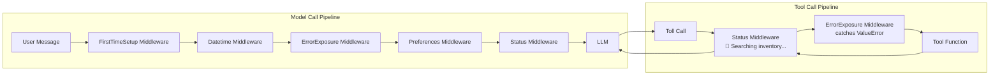
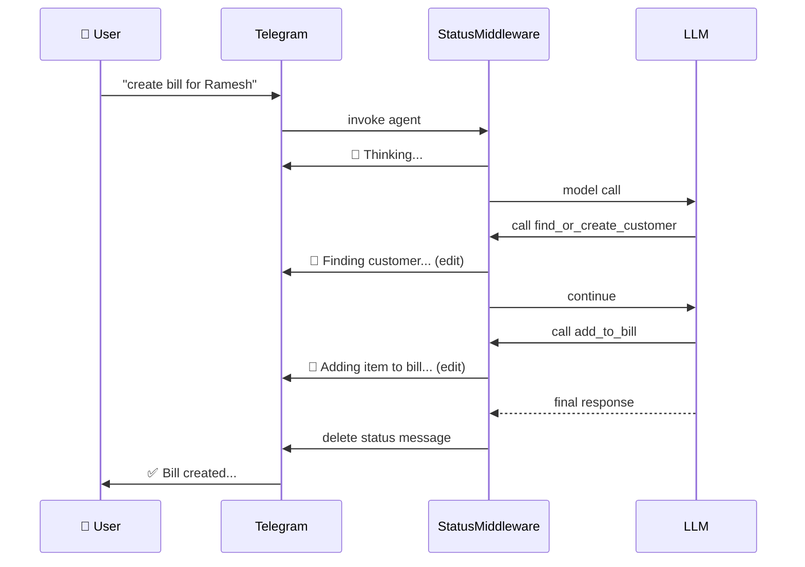

# Middleware Pipeline

The agent uses a **middleware chain** — a stack of interceptors that wrap every model call and tool call. Middleware can inject context into the system prompt, intercept errors, and send progress updates — all without the tools or the LLM knowing.

## Why Middleware?

Without middleware, every tool would need to fetch preferences, check the datetime, and send Telegram "thinking" updates itself. Middleware makes these **transparent cross-cutting concerns**:

- Tools stay focused on business logic
- The LLM sees enriched context without being asked
- Status updates are sent automatically

## The Middleware Chain



Middleware is **ordered** — the order in `builder.py` matters:

```python
middleware=[
    FirstTimeSetupMiddleware(),   # 1. First-run setup (creates weekly reminder)
    DatetimeMiddleware(),          # 2. Injects current datetime
    ErrorExposureMiddleware(),     # 3. Catches tool errors gracefully
    PreferencesMiddleware(),       # 4. Injects user preferences (shop_name, GSTIN)
    StatusMiddleware(),            # 5. Telegram "Thinking..." / "🔧 Searching..." updates
],
```

## Middleware Details

### 1. FirstTimeSetupMiddleware

Runs on the very first model call for a new chat. Creates a default **Saturday 9 PM weekly sales report reminder** so the owner never forgets to review the business.

```python
class FirstTimeSetupMiddleware(AgentMiddleware):
    def _do_setup(self):
        if "first_time_setup_done" in prefs:
            return
        create_reminder(session, notes="Generate weekly PPT...",
                        reminder_at=next_saturday_9pm(), frequency="saturday")
        set_preference(session, "first_time_setup_done", "true")
```

### 2. DatetimeMiddleware

Injects the current date/time into the system prompt so the LLM knows the context:

```
<current_datetime>2026-07-12 14:30 (Sunday)</current_datetime>
```

This lets the LLM interpret queries like "this morning's sales" or "next Monday" without asking the user.

### 3. ErrorExposureMiddleware

Catches `ValueError` raised by tools and returns it as a **structured error `ToolMessage`** instead of letting it propagate up as an unhandled exception:

```python
class ErrorExposureMiddleware(AgentMiddleware):
    def wrap_tool_call(self, request, handler):
        try:
            return handler(request)
        except ValueError as e:
            return ToolMessage(content=str(e), status="error")
```

This is critical because:
- Without it, an oversell raises `ValueError` → caught by generic handler → LLM never sees it
- With it, the error text reaches the LLM → LLM can say *"Sorry, we only have 80 kg of Atta, not 100"*

### 4. PreferencesMiddleware

Fetches all key-value preferences from the database and injects them into the system prompt before every model call:

```
<current_preferences>
  default_payment_mode = UPI
  gstin = 33ABCDE1234F1Z5
  shop_name = My Kirana Store
</current_preferences>
```

The LLM sees these values without calling a tool. This is how the model "knows" the shop name for invoices, the GSTIN, and the default payment mode.

### 5. StatusMiddleware

Sends real-time progress updates to the Telegram chat while the LLM is thinking:



The middleware tracks a **pending counter** — when multiple tools chain, it shows `Processing (2 steps left)...`.

## Implementation Pattern

Each middleware implements the `AgentMiddleware` protocol from deepagents:

```python
class AgentMiddleware:
    def wrap_model_call(self, request, handler): ...
    async def awrap_model_call(self, request, handler): ...
    def wrap_tool_call(self, request, handler): ...
    async def awrap_tool_call(self, request, handler): ...
```

The `wrap_*` methods are synchronous (for sync agent calls), and `awrap_*` are async (for async calls). Implementing all four ensures the middleware works in both paths.
