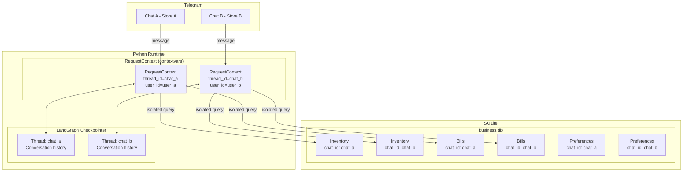

# Multi-Chat Isolation

A single instance of Quartermaster serves **one shop owner**. However, the architecture is designed for multi-chat safety from day one — every database row is tagged with the Telegram `chat_id`, and the runtime uses `contextvars` to ensure each request has unambiguous context.

## The Problem

Without isolation, a user asking *"how much stock is left?"* could get data from another chat. Two owners running separate stores on the same bot would see each other's inventory, bills, and customers.

## Solution: Two Layers of Isolation



### Layer 1: `RequestContext` (Runtime)

Defined in `infrastructure/telemetry/context.py`:

```python
@dataclass
class RequestContext:
    user_id: str = ""
    username: str = ""
    thread_id: str = ""       # = Telegram chat_id
    message_id: int = 0
    generated_files: set[str] = field(default_factory=set)
    images_base64: list[str] = field(default_factory=list)

_request_context: ContextVar[RequestContext] = ...
```

Every Telegram message handler sets the context **before** invoking the agent:

```python
set_request_context(RequestContext(
    user_id=str(update.effective_user.id),
    username=update.effective_user.username,
    thread_id=str(update.effective_chat.id),    # ← isolation key
    message_id=update.effective_message.message_id,
))
```

Tools and services read the context via `get_request_context()`:

```python
chat_id = get_request_context().thread_id
```

The `contextvars` module ensures **async safety** — each concurrent request has its own copy, even across threads.

### Layer 2: `chat_id` on Every Row

Every SQLModel table has a `chat_id: str = Field(index=True)` column:

| Table | chat_id Usage |
|-------|--------------|
| `inventory` | Owner A's stock is invisible to Owner B |
| `bills` | Bills scoped per shop |
| `bill_items` | Line items scoped per shop |
| `customers` | Customer names can overlap across shops |
| `khata_transactions` | Credit ledgers isolated |
| `preferences` | Shop name, GSTIN per shop |
| `reminders` | Reminders fire only in the right chat |

All repository queries filter by `chat_id`:

```python
def get_bill(session, bill_id, chat_id):
    return session.exec(
        select(Bill).where(Bill.id == bill_id, Bill.chat_id == chat_id)
    ).first()
```

### Layer 3: LangGraph Thread Isolation

The LangGraph checkpointer (`SqliteSaver`) stores conversation history per `thread_id`:

```python
config = {"configurable": {"thread_id": thread_id}}
result = agent.invoke({"messages": [...]}, config=config)
```

The `/new` command clears the conversation thread without affecting the database:

```python
async def new_chat(self, update, _context):
    chat_id = str(update.effective_chat.id)
    self.checkpointer.delete_thread(chat_id)
    # Business data in business.db is untouched
```

## Migration: Adding chat_id

`chat_id` was added via Alembic revision `f7859c6ea011`:

- Added `chat_id` column to all existing tables (with `server_default=''`)
- Changed unique indexes to composite `(chat_id, column)` constraints
- Example: `ix_customers_name` (unique) → `uq_customers_chat_id_name` (unique per chat)

## File Security

Generated files (PDFs, PPTXs) are also isolated by `thread_id`:

```python
_generated_files_by_thread: dict[str, set[str]] = {}
_lock = threading.Lock()

def register_generated_file(thread_id: str, path: str):
    with _lock:
        _generated_files_by_thread.setdefault(thread_id, set()).add(path)

def is_generated_file(thread_id: str, path: str):
    with _lock:
        return path in _generated_files_by_thread.get(thread_id, set())
```

The `send_file` tool checks that the file was generated **by the same thread** before allowing delivery, preventing cross-chat file leaks.
