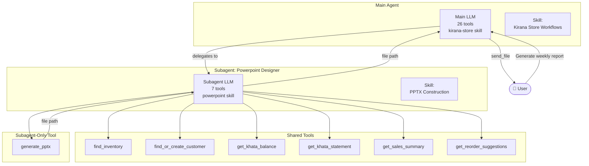

# Subagent Delegation

Complex tasks that require focused reasoning are delegated to **subagents** — separate LLM instances with their own system prompt, tools, and instruction files.

## Why Subagents?

The main agent has 26 tools and a broad "kirana store" context. When a user asks for a PowerPoint deck, two problems arise:

1. **Context overflow** — PPTX construction instructions dilute the billing/inventory system prompt
2. **Tool overload** — the main agent doesn't need `generate_pptx` cluttering its tool list
3. **Focus** — building a deck requires multi-step data gathering and structured output, which is better handled by a dedicated LLM session

## Architecture



## How Delegation Works

1. The main agent's system prompt tells it to use the `powerpoint-designer` subagent for deck creation
2. deepagents routes the request to a **fresh LLM session** with the subagent's system prompt
3. The subagent gathers data, builds a `PresentationSchema`, and calls `generate_pptx`
4. The subagent returns only the **absolute file path** to the main agent
5. The main agent calls `send_file` to deliver the `.pptx` to the user

## Subagent Configuration

Defined in `core/subagents/powerpoint.py`:

```python
POWERPOINT_SUBAGENT_CONFIG = {
    "name": "powerpoint-designer",
    "description": "Creates professional PowerPoint analysis decks...",
    "model": settings.llm_model,
    "system_prompt": "You are a PowerPoint presentation designer...",
    "tools": [
        find_inventory, find_or_create_customer,
        get_khata_balance, get_khata_statement,
        get_sales_summary, get_reorder_suggestions,
        generate_pptx,   # ← subagent-only, NOT in ALL_TOOLS
    ],
    "skills": ["/subagent_skills/"],
}
```

Key detail: `generate_pptx` is in the subagent's tool list but **NOT** in the main agent's `ALL_TOOLS`. The main agent cannot generate PPTX files directly — it must delegate.

## The Powerpoint Skill

The subagent receives instructions from `subagent_skills/powerpoint/SKILL.md` — a 217-line document with:

- **6 slide types**: title, bullets, table, two_column, bar_chart, pie_chart
- **5 presentation templates**: Sales Analysis, Inventory Health, Business Review, GST Report, Customer Report
- **Design guidelines**: font sizes, colors (#4472C4 blue headers), currency formatting
- **Build steps**: plan → gather data → build schema → generate → return path

## Presentation Schema

The subagent builds a Pydantic-validated `PresentationSchema`:

```python
class PresentationSchema(BaseModel):
    slides: list[Slide]  # Union of 6 slide types

class BarChartSlide(BaseModel):
    type: Literal["bar_chart"]
    title: str
    categories: list[str]
    values: list[float]
    y_axis_label: str | None = None
```

The `generate_pptx` tool validates the schema and renders it via `python-pptx`:

```python
def build_presentation(schema: PresentationSchema, output_path: str) -> str:
    prs = Presentation()
    for slide_def in schema.slides:
        builder = _BUILDERS[slide_def.type]
        builder(slide, slide_def)
    prs.save(output_path)
    return output_path
```

## File Delivery Contract

Since the subagent and main agent run in **different LLM sessions**, they can't share Python objects. The contract is a **file path string**:

1. Subagent calls `generate_pptx` → registers path with `register_generated_file(thread_id, path)`
2. Subagent returns `"/tmp/analysis.pptx"` as a plain string
3. Main agent calls `send_file(file_path="/tmp/analysis.pptx")` → checks `is_generated_file()` → sends via Telegram

The cross-task file registry uses a `threading.Lock`-protected dict keyed by `thread_id`, so the subagent (running in its own `RequestContext`) can register files the main agent can later deliver.

## Extending: Adding a Subagent

1. Define the subagent config dict with name, description, model, system_prompt, tools, skills
2. Create the skill file in `subagent_skills/<name>/SKILL.md`
3. Add the config to the `subagents` list in `build_agent()`
4. The main agent's system prompt should reference the subagent's capability
