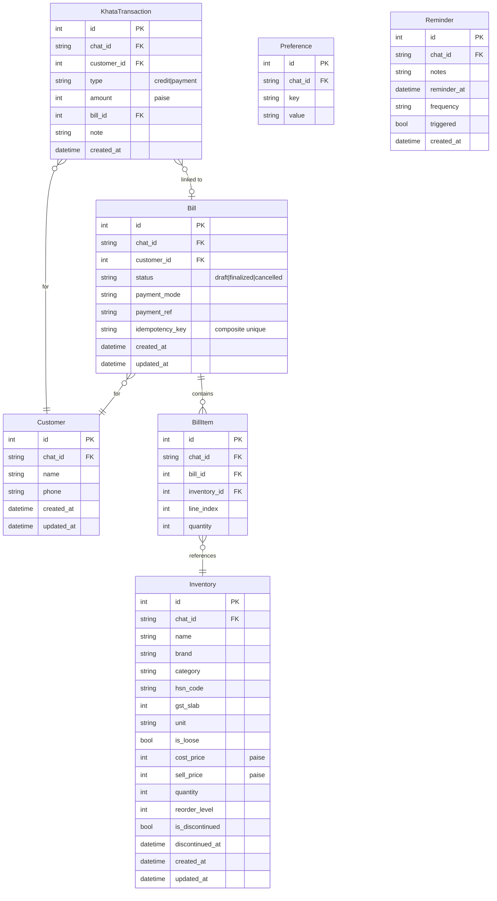
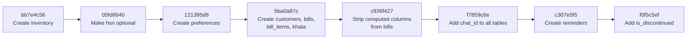

# Data Model

Six SQLModel tables, all stored in a single SQLite file (`db/business.db`). Schema is managed by Alembic.

## Entity Relationship Diagram



## Migration Chain

All tables were created through 8 sequential Alembic revisions:



| Rev | Down Rev | Key Change |
|-----|----------|------------|
| `bb7e4c56` | — | `inventory` table with all fields |
| `05fd8640` | `bb7e4c56` | `hsn_code` made nullable |
| `121395d8` | `05fd8640` | `preferences` table (key-value) |
| `5ba0a87c` | `121395d8` | `customers`, `bills`, `bill_items`, `khata_transactions` |
| `c936f427` | `5ba0a87c` | Removed computed columns (subtotal, GST totals) from bills — now computed at display time |
| `f7859c6e` | `c936f427` | **Multi-chat isolation**: added `chat_id` to all tables, changed unique constraints to per-chat |
| `c307e5f5` | `f7859c6e` | `reminders` table |
| `f0f5c5ef` | `c307e5f5` | `is_discontinued`, `discontinued_at` on inventory |

## Key Schema Decisions

### No Computed Columns

`Bill` and `BillItem` were originally designed with computed columns (`subtotal`, `cgst_total`, `sgst_total`, `grand_total`, `sell_price`, `unit`, etc.). Revision `c936f427` removed them because:

- **Prices change** — the stored snapshot could become stale
- **GST is invariant** — it's always recomputed from the inventory item's current `sell_price` and `gst_slab`
- **DRY** — the service layer computes these at display time

### chat_id on Every Table

Revision `f7859c6e` added `chat_id` to all existing tables and changed indexes:

| Before | After |
|--------|-------|
| `UNIQUE (name)` on customers | `UNIQUE (chat_id, name)` |
| `UNIQUE (key)` on preferences | `UNIQUE (chat_id, key)` |
| `UNIQUE (idempotency_key)` on bills | `UNIQUE (chat_id, idempotency_key)` |

### Paise Everywhere

All monetary fields are integers:

| Field | Table | Unit |
|-------|-------|------|
| `cost_price` | inventory | paise |
| `sell_price` | inventory | paise |
| `amount` | khata_transactions | paise |

### Soft Delete for Inventory

Products are soft-deleted (`is_discontinued=True`) rather than hard-deleted to preserve:
- Historical bill data (BillItem references inventory_id)
- Analytics accuracy
- Audit trail

## Checkpointer Database

A separate SQLite file (`db/short_memory.db`) stores LangGraph conversation checkpoints:

- LangGraph's `SqliteSaver` serializes thread state
- One row per conversation turn per thread
- Cleared on `/new` command
- Not managed by Alembic — created at runtime by `SqliteSaver.from_conn_string()`

## Creating a New Migration

```bash
# 1. Define/modify SQLModel in modules/<name>/models.py
# 2. Import it in db/models/__init__.py (critical for Alembic autogenerate)
# 3. Run:
uv run alembic revision --autogenerate -m "description"
# 4. Review and apply:
uv run alembic upgrade head
```

The `env.py` registers models via:

```python
from agent.db import models  # noqa: F401 — registers all models with SQLModel.metadata
target_metadata = SQLModel.metadata
```
