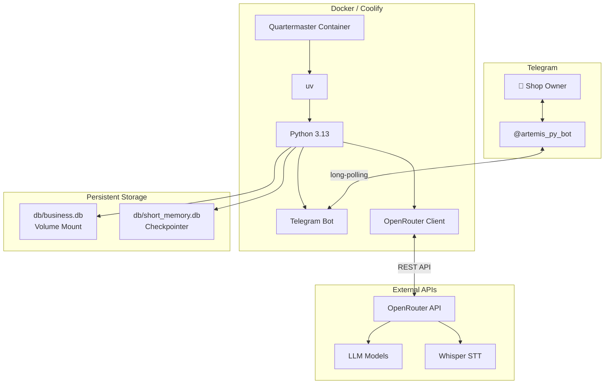

# Deployment

## Quick Start (Local)

```bash
# Prerequisites: Python 3.13+, uv
cd agent
uv sync

# Create .env
cat > .env << EOF
OPENROUTER_API_KEY=sk-or-...
TELEGRAM_API_KEY=<from @BotFather>
LLM_MODEL=openrouter:minimax/minimax-m3
EOF

# Run migrations
uv run alembic upgrade head

# Start polling
uv run python main.py
```

## Environment Variables

| Variable | Default | Required | Description |
|----------|---------|----------|-------------|
| `OPENROUTER_API_KEY` | — | Yes | API key for OpenRouter (LLM + transcription) |
| `TELEGRAM_API_KEY` | — | Yes | Bot token from @BotFather |
| `LLM_MODEL` | `openrouter:minimax/minimax-m3` | No | Model identifier in OpenRouter format |
| `TRANSCRIPTION_MODEL` | `openai/whisper-1` | No | STT model for voice messages |

## Docker

```yaml
# docker-compose.yml
services:
  quartermaster:
    build: ./agent
    environment:
      - OPENROUTER_API_KEY=sk-or-...
      - TELEGRAM_API_KEY=...
    volumes:
      - ./agent/db:/app/db
```

```dockerfile
# Dockerfile
FROM python:3.13-slim

RUN pip install uv
WORKDIR /app
COPY . .

RUN uv sync

ENTRYPOINT ["./docker-entrypoint.sh"]
```

```bash
# Build & run
docker compose up -d

# Or manually
docker build -t quartermaster .
docker run -d --env-file ./agent/.env -v ./agent/db:/app/db quartermaster
```

### docker-entrypoint.sh

```bash
#!/bin/sh
set -e
uv run alembic upgrade head          # Run migrations at startup
exec uv run python -c "from agent.app.bootstrap import run; run()"
```

## File Layout in Container

```
/app/
├── agent/                    # Code root (PYTHONPATH)
│   ├── src/agent/...
│   └── main.py
├── db/
│   ├── business.db           # Persist via volume mount
│   └── short_memory.db       # Created at runtime
├── skills/
├── subagent_skills/
├── alembic.ini
└── .env                      # Or environment variables
```

Key points:
- `db/` directory must be persisted (volume mount) to retain data
- `.env` can be mounted or injected via environment variables
- xelatex must be available in the container for PDF invoice generation

## Configuration Details

### alembic.ini

```
sqlalchemy.url = sqlite:///db/business.db
script_location = %(here)s/db/alembic
```

The path is relative to `agent/` (the working directory). This is why every command must run from `agent/`.

### AppConfig

```python
@dataclass
class AppConfig:
    llm_model: str = os.getenv("LLM_MODEL", "openrouter:minimax/minimax-m3")
    openrouter_api_key: str = os.getenv("OPENROUTER_API_KEY", "")
    telegram_api_key: str = os.getenv("TELEGRAM_API_KEY", "")
    transcription_model: str = os.getenv("TRANSCRIPTION_MODEL", "openai/whisper-1")
    conv_buffer_db_path: str = "db/short_memory.db"
    business_db_path: str = "db/business.db"
```

`PROJECT_ROOT` is auto-detected as `Path(__file__).resolve().parents[3]` from `config/settings.py` — this is `agent/`.

## Docker Dependencies

| Package | Purpose | Notes |
|---------|---------|-------|
| `python:3.13-slim` | Base image | Includes pip/uv |
| `texlive-xetex` | xelatex for PDF invoices | Optional — without it, PDF generation fails |
| `fonts-dejavu-core` | DejaVu Sans font | Required by LaTeX template |

For the minimal image (no PDF support):

```dockerfile
FROM python:3.13-slim
RUN pip install uv
# ... copy and install deps ...
# PDF invoice will fail; everything else works
```

## Architecture Diagram (Production)



## Health Check

There is no built-in health endpoint. The bot starts polling and responds to `/start`:

```
Hello {name}! I'm your AI assistant.
```

A monitoring service should send `/start` periodically and verify the response.
