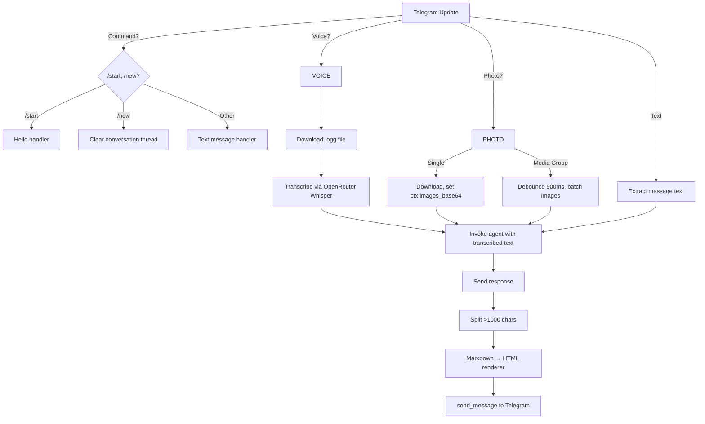

# Telegram Integration

The Telegram client is the sole interface between the user and the agent. It handles multiple message types, media groups, voice transcription, and response delivery.

## Message Routing



## Media Group Handling

Telegram sends each photo in an album as a **separate update** with the same `media_group_id`. The system debounces these with a 500ms timer:

```python
MEDIA_GROUP_WAIT = 0.5  # seconds

media_buffers: dict[tuple[str, str], dict] = {}
_media_group_timers: dict[tuple[str, str], asyncio.Task] = {}

def schedule_flush(key, first_update, process_cb):
    prev = _media_group_timers.pop(key, None)
    if prev:
        prev.cancel()               # Reset timer on each new photo
    _media_group_timers[key] = asyncio.create_task(
        _debounced_flush(key, first_update, process_cb),
    )
```

When the timer expires, all buffered images are packed into a single `RequestContext` and sent to the agent as a multi-image `HumanMessage`:

```python
content = [
    {"type": "text", "text": caption or "What is in these images?"},
    *[{"type": "image", "base64": b64, "mime_type": "image/jpeg"}
      for b64 in ctx.images_base64],
]
```

## Voice Transcription

Voice messages are transcribed using OpenRouter's STT endpoint (Whisper):

```python
async def transcribe_audio(audio_bytes, model=None) -> str:
    client = AsyncOpenAI(base_url="https://openrouter.ai/api/v1")
    for attempt in range(3):  # Exponential backoff
        try:
            result = await client.audio.transcriptions.create(
                model=model or "openai/whisper-1",
                file=io.BytesIO(audio_bytes),
            )
            return result.text.strip()
        except Exception:
            await asyncio.sleep(1 * 2 ** attempt)
```

The transcription replaces the voice message with text — the agent never sees the audio file.

## Response Pipeline

### Rendering: Markdown → HTML

The agent responds in Markdown (LLM-native). The `TelegramRenderer` converts it to Telegram-safe HTML:

| Markdown | Telegram HTML |
|----------|---------------|
| `**bold**` | `<b>bold</b>` |
| `*italic*` | `<i>italic</i>` |
| `- list item` | `• list item` |
| `1. ordered` | `1. ordered` |
| `| col1 | col2 |` | Smart table rendering |
| `` `code` `` | `<code>code</code>` |

**Smart table rendering** adapts to table width:

| Columns | Rendering |
|---------|-----------|
| 1-2 | Key-Value pairs: `<b>Key:</b> Value` |
| 3-5 | Card layout per row |
| 6+ | Monospace `<pre>` grid |

### Message Splitting

Telegram has a 4096 character limit per message. The system splits at natural boundaries:

```python
def _split_message(text, max_chars=1000):  # 1000 for safety
    split_at = text.rfind("\n\n", 0, max_chars)  # Try paragraph first
    split_at = text.rfind("\n", 0, max_chars)    # Then line
    split_at = text.rfind(" ", 0, max_chars)      # Then word
    split_at = max_chars                          # Then character
```

### Status Message Cleanup

Before the final response is sent, `StatusMiddleware` deletes its "🤔 Thinking..." / "🔧 Searching..." message:

```python
async def clear_status(chat_id):
    state = _state.pop(chat_id, None)
    if state and state.get("msg_id"):
        await state["bot"].delete_message(
            chat_id=int(chat_id), message_id=state["msg_id"]
        )
```

## Configuration

```python
app = (
    Application.builder()
    .concurrent_updates(10)      # Handle up to 10 updates concurrently
    .token(settings.telegram_api_key)
    .job_queue(JobQueue())
    .build()
)
```

### Error Handler

```python
async def _error_handler(self, update, context):
    logger.error("Unhandled error: %s", context.error, exc_info=context.error)
    if update and update.effective_message:
        await update.effective_message.reply_text(
            "Sorry, something went wrong. Please try again."
        )
```

The generic error handler catches any unhandled exception and sends a friendly message to the user.
