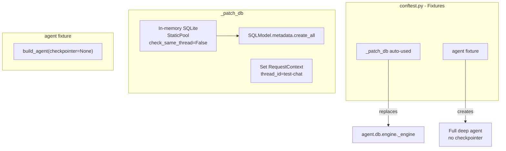
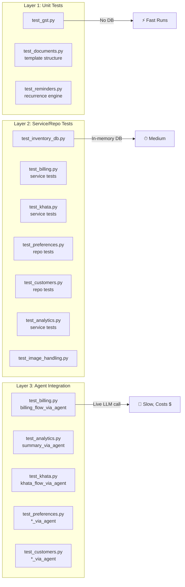

# Testing Strategy

Tests use **pytest** (optional extra) and follow a **three-layer pattern** — from pure unit tests to full live LLM integration.

## Test Infrastructure



### In-Memory Database

The `_patch_db` fixture (auto-used) replaces the global engine with an in-memory SQLite:

```python
@pytest.fixture(autouse=True)
def _patch_db():
    new_engine = create_engine(
        "sqlite:///:memory:",
        poolclass=StaticPool,
        connect_args={"check_same_thread": False},
    )
    SQLModel.metadata.create_all(new_engine)
    eng_mod._engine = new_engine
    set_request_context(RequestContext(thread_id=TEST_CHAT_ID))
```

Key properties:
- **StaticPool**: single connection, shared across tests
- **check_same_thread=False**: allows SQLAlchemy to use the connection across async boundaries
- **Auto-used**: every test automatically gets a clean DB
- The real `db/business.db` is **never touched**

### The `agent` Fixture

```python
@pytest.fixture
def agent():
    return build_agent(checkpointer=None)
```

Builds the full deep agent with all 26 tools, middleware chain, and skills — but **without a LangGraph checkpointer** (avoid creating `db/short_memory.db`).

## Testing Layers



### Layer 1: Pure Unit Tests

No database needed. Test pure functions and algorithms.

**`test_gst.py`** — 7 test cases for `split_gst`:
```python
def test_five_percent():
    cgst, sgst = split_gst(10000, 5)
    assert cgst == 238
    assert sgst == 238

def test_eighteen_percent():
    cgst, sgst = split_gst(10000, 18)
    assert cgst == 762
    assert sgst == 763
```

Tests verify all common slabs: 0%, 5%, 12%, 18%, and edge cases (odd amounts, large amounts).

**`test_documents.py`** — LaTeX template structural tests:
- Header cells match data rows (no misaligned columns)
- No `\multicolumn` in header (known root cause of invisible headers)
- `\pagestyle{empty}` present
- HSN field doesn't leak into item rows

**`test_reminders.py`** — Recurrence engine tests:
```python
def test_monday_to_wednesday():
    # Mon Jul 6 → Wed Jul 8
    assert compute_next(...) == expected

def test_friday_to_monday():
    # Fri Jul 10 → Mon Jul 13 (skips weekend)
    assert compute_next(...) == expected
```

### Layer 2: Service & Repository Tests

Use the in-memory database via `_patch_db`. Helpers like `_add_inv()` and `_session()` make test setup concise:

```python
def test_add_item():
    session = _session()
    inv = _add_inv(session, "Maggi", qty=50, price=1400, gst=5)
    bill = billing_service.start_bill(session)
    item = billing_service.add_to_bill(session, bill.id, inv, 5)
    assert item.quantity == 5
```

**What's tested** (60+ test cases across all modules):
- CRUD operations for inventory, customers, preferences, reminders
- Oversell guard (`add_to_bill` with qty > stock raises `ValueError`)
- Idempotent finalize (same key returns same bill)
- Double-finalize blocked
- Bill cancellation (draft only, finalized raises error)
- Khata balance computation (credits - payments)
- Chat isolation (data from "other-chat" invisible)
- Sales analytics aggregation (date filtering, mode breakdown)
- Below-cost price validation

### Layer 3: Agent Integration Tests

**Live LLM tests** that call OpenRouter. They verify the full pipeline:

```python
def test_billing_flow_via_agent(agent):
    # Seed inventory
    _add_inv(_session(), "Maggi", qty=50, price=1400, gst=5)
    # Invoke the agent
    response = agent.invoke({
        "messages": [{"role": "user",
                      "content": "Start a bill for Ramesh"}]
    })
    # Assert DB state
    session = _session()
    bill = session.exec(select(Bill)).first()
    assert bill.status == "draft"
```

These test the agent's ability to:
- Understand natural language and map it to the right tool calls
- Chain multiple tools in one turn (find customer → start bill → add item)
- Format responses correctly

**Important**: These tests have latency (~5-15s per call) and cost (OpenRouter API usage). They are not run in CI on every commit.

## Running Tests

```bash
# Full suite
uv run --extra test pytest tests/ -v

# Single test file
uv run --extra test pytest tests/test_billing.py -v

# Single test case
uv run --extra test pytest tests/test_billing.py::test_add_item -v

# Fast tests only (layer 1 + 2, skip agent integration)
uv run --extra test pytest tests/ -v -k "not via_agent"
```

## Test Coverage Summary

| Module | Unit Tests | Service Tests | Agent Tests | Total Scenarios |
|--------|-----------|---------------|-------------|-----------------|
| GST | 7 | — | — | 7 |
| Billing | — | 15 | 1 | 16 |
| Inventory | — | 10 | — | 10 |
| Customers | — | 4 | 2 | 6 |
| Khata | — | 10 | 1 | 11 |
| Preferences | — | 7 | 5 | 12 |
| Analytics | — | 20 | 1 | 21 |
| Documents | 10 | 5 | — | 15 |
| Reminders | 12 | 4 | — | 16 |
| Image Handling | 6 | — | — | 6 |
| **Total** | **35** | **75** | **10** | **~120** |
