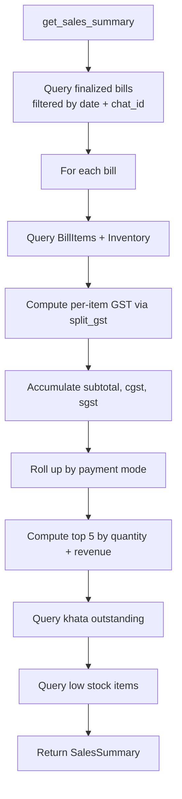
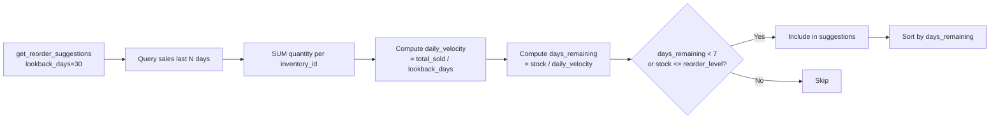

# Analytics Module

Provides sales performance summaries and velocity-based reorder suggestions. All computations are done via SQL aggregation queries — no separate analytics store.

## Tools

| Tool | Description | Key Parameters |
|------|-------------|----------------|
| `get_sales_summary` | Sales performance over a date range | `start_date`, `end_date` |
| `get_reorder_suggestions` | Products needing reorder soon | `lookback_days` |

## Display Types

```python
@dataclass
class SalesSummary:
    start_date: str
    end_date: str
    bill_count: int
    item_count: int
    subtotal_paise: int
    cgst_paise: int
    sgst_paise: int
    grand_total_paise: int
    by_mode: dict[str, tuple[int, int]]   # mode → (count, total)
    top_by_quantity: list[ItemRanking]    # top 5
    top_by_revenue: list[ItemRanking]     # top 5
    average_bill_paise: int
    outstanding_khata_paise: int
    low_stock_items: list[LowStockItem]

@dataclass
class ReorderSuggestion:
    name: str
    unit: str
    current_stock: int
    reorder_level: int
    daily_velocity: float
    days_remaining: float
```

## Sales Summary Flow



### Date Filter Behavior

| Args | Scope |
|------|-------|
| No args | Today only |
| `start_date` only | Single day |
| `end_date` only | Single day |
| Both | Inclusive range |
| `start > end` | `ValueError` raised |

## Reorder Suggestions Flow



Items with no recent sales data get `days_remaining = inf` and are included only if below reorder level.

## Test Coverage

**21 test cases** — empty day, single bill, multiple payment modes, draft/cancelled exclusion, GST correctness, top-N ranking, date filtering, chat isolation, khata outstanding in summary, low stock detection, reorder velocity computation, invalid date handling.
