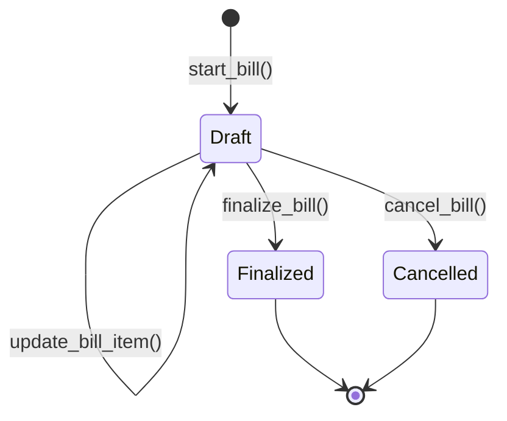
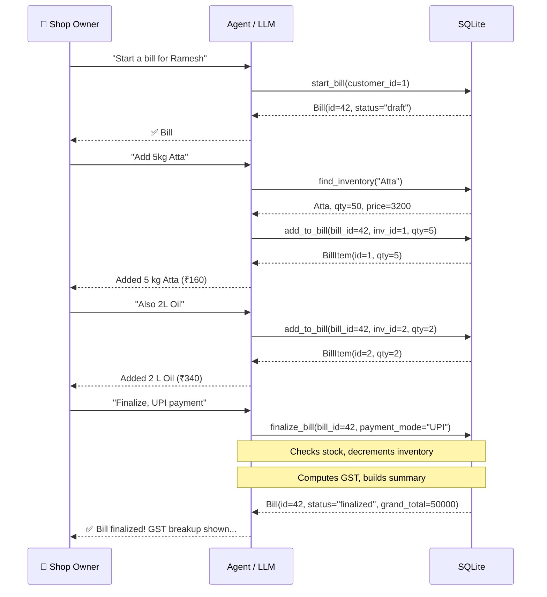
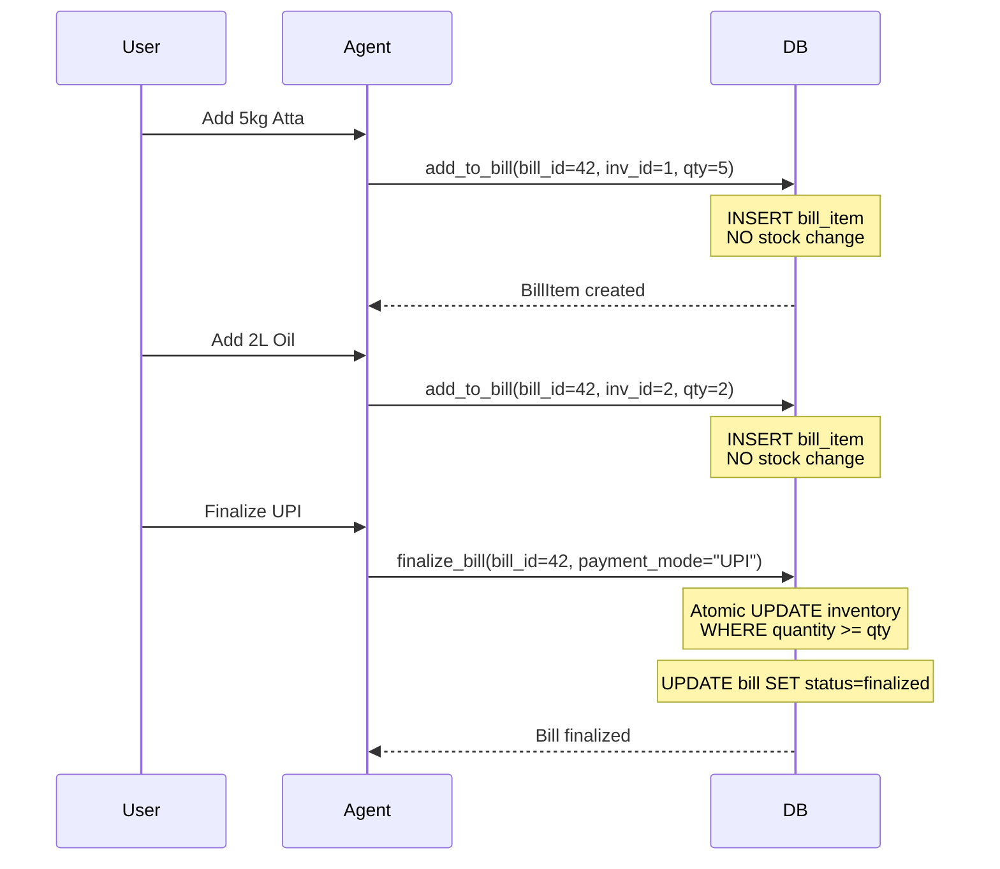
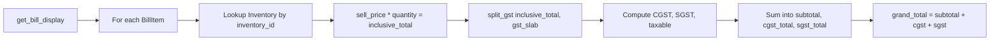

# Billing Module

Multi-turn draft bills with GST computation. The most complex module — 8 tools, 2 models, and a full state machine lifecycle.

## Tools

| Tool | Description | Key Parameters |
|------|-------------|----------------|
| `start_bill` | Create a new draft bill | `customer_id` |
| `add_to_bill` | Add an inventory item to a draft | `bill_id`, `inventory_id`, `quantity` |
| `remove_from_bill` | Remove a line item from a draft | `bill_id`, `item_id` |
| `update_bill_item` | Change quantity on a line item | `bill_id`, `item_id`, `new_quantity` |
| `get_bill` | Get details of a single bill | `bill_id` |
| `get_bills` | List bills with optional filters | `customer_id`, `status`, `start_date`, `end_date` |
| `cancel_bill` | Cancel a draft bill | `bill_id` |
| `finalize_bill` | Finalize a draft — decrements stock | `bill_id`, `payment_mode`, `payment_ref` |

## Data Model

```python
class Bill(SQLModel, table=True):
    id: int
    chat_id: str
    customer_id: int | None
    status: str               # draft | finalized | cancelled
    payment_mode: str | None
    payment_ref: str | None
    idempotency_key: str | None
    created_at: datetime
    updated_at: datetime

class BillItem(SQLModel, table=True):
    id: int
    chat_id: str
    bill_id: int
    inventory_id: int
    line_index: int
    quantity: int
```

No monetary fields on `BillItem` — GST and totals are computed at display time from the inventory item's current `sell_price` and `gst_slab`.

## Lifecycle

### State Machine




### Multi-Turn Flow

Bills are built incrementally across several messages — the LLM adds, removes, and updates items before finalizing:



## Business Logic

### Stock Deferred Until Finalize

Stock is **not** decremented when items are added to a draft. This allows the owner to change quantities, remove items, or cancel the bill without restoring stock.



If stock drops below the drafted quantity between "add" and "finalize" (e.g. another sale sold the last unit), the atomic guard catches it:

```python
for item in items:
    result = session.execute(
        sa_update(Inventory)
        .where(Inventory.id == item.inventory_id)
        .where(Inventory.quantity >= item.quantity)
        .values(quantity=Inventory.quantity - item.quantity)
    )
    if result.rowcount == 0:
        raise ValueError(f"Insufficient stock for {item_name}")
```

The error is caught by `ErrorExposureMiddleware` and returned to the LLM as a tool error.

### Idempotent Finalize

Uses `idempotency_key` (typically Telegram `message_id`) to prevent double-billing on retries:

```python
if idempotency_key:
    existing = session.exec(
        select(Bill).where(
            Bill.idempotency_key == idempotency_key,
            Bill.chat_id == chat_id,
            Bill.status == "finalized",
        )
    ).first()
    if existing:
        return existing  # silent replay
```

The database enforces this with a unique constraint on `(chat_id, idempotency_key)`, preventing double-billing even if `finalize_bill` is called twice with the same key.

### Atomic Oversell Guard

```python
result = session.execute(
    sa_update(Inventory)
    .where(Inventory.id == item.inventory_id)
    .where(Inventory.quantity >= item.quantity)    # atomic guard
    .values(quantity=Inventory.quantity - item.quantity)
)
if result.rowcount == 0:
    raise ValueError(f"Insufficient stock for {item_name}")
```

The `WHERE quantity >= item.quantity` makes the check-and-decrement atomic — no race condition between reading and writing.

### Cancel Restores Nothing

Since stock is decremented only on finalize, cancelling a draft bill is a simple status change:

```python
def cancel_bill(session, bill_id):
    bill.status = "cancelled"
    # No stock to restore — it was never deducted
```

This is safe, fast, and avoids the complexity of "restore" logic.

### GST Computation at Display Time



## Guardrails

| Situation | Behavior |
|-----------|----------|
| Add qty > stock | `ValueError`: `"Insufficient stock for {name}"` |
| Finalize with insufficient stock | `ValueError`: atomic check fails |
| Double-finalize (same key) | Returns cached bill silently |
| Double-finalize (different key) | `ValueError`: "already finalized" |
| Cancel finalized bill | `ValueError`: "Cannot cancel a finalized bill" |
| Below-cost sale | `ValueError`: "must be >= cost price" |

## Test Coverage

**16 test cases** — create bill, add item with GST, oversell blocked, remove item, update qty, finalize decrements stock, oversell guard, idempotent finalize, double-finalize blocked, cancel bill, cancel finalized blocked, and 1 agent integration test.
