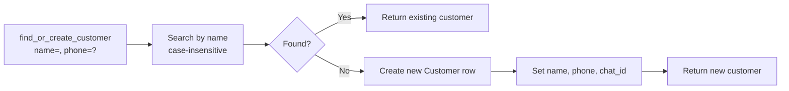

# Customers Module

Simple customer lookup and auto-creation. Every billing, khata, and invoice operation references a customer.

## Tools

| Tool | Description | Key Parameters |
|------|-------------|----------------|
| `find_or_create_customer` | Lookup by name (case-insensitive) or auto-create | `name`, `phone` |

## Data Model

```python
class Customer(SQLModel, table=True):
    __tablename__ = "customers"

    id: int
    chat_id: str
    name: str
    phone: str | None
    created_at: datetime
    updated_at: datetime
```

Unique constraint: `(chat_id, name)` — customer names are unique per chat.

## Business Logic



### Case-Insensitive Matching

```python
def find_by_name(session, name, chat_id):
    return session.exec(
        select(Customer).where(
            Customer.name.ilike(name),     # ← case-insensitive
            Customer.chat_id == chat_id
        )
    ).first()
```

"ramesh" matches "Ramesh", "RAMESH", or "RaMeSh".

### Phone Auto-Tagging

If the customer already exists, the phone from a subsequent call is **ignored** — the first phone number sticks. To update a phone, the user must explicitly call an update (currently not exposed as a tool).

## Repository Layer

| Method | Purpose |
|--------|---------|
| `find_by_name` | Case-insensitive customer lookup |
| `find_or_create` | Lookup or insert |
| `get_by_id` | Get customer by ID + chat_id |

## Test Coverage

**6 test cases** — create new, find existing (case-insensitive), store phone, missing name returns None, 2 agent integration tests.
