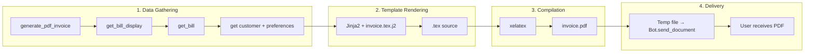
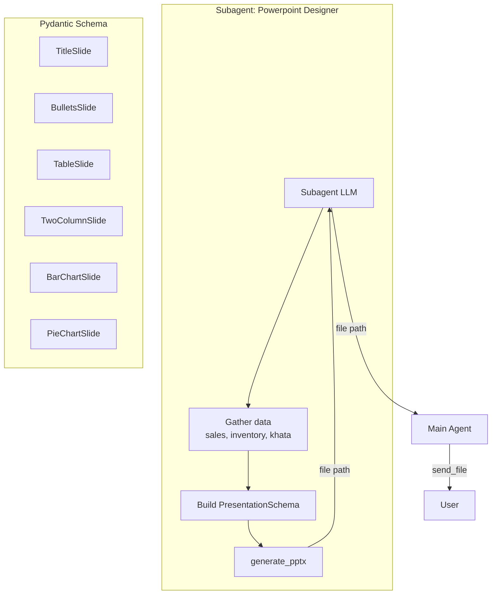

# Documents Module

Generates real-world artifacts — GST-compliant PDF invoices and PowerPoint analysis decks. Also provides file delivery to the Telegram chat.

## Tools

| Tool | Description | Key Parameters | Scope |
|------|-------------|----------------|-------|
| `generate_pdf_invoice` | Generate and send a GST invoice PDF | `bill_id`, `shop_name` | Main agent |
| `send_file` | Send a generated file to the user | `file_path`, `caption` | Main agent |
| `generate_pptx` | Generate a .pptx from a PresentationSchema | `schema`, `output_path` | Subagent-only |

## PDF Invoice Generation

### Pipeline



### Architecture

```python
def generate_invoice_pdf(session, bill_id, shop_name="") -> bytes:
    display = bill_service.get_bill_display(session, bill_id)
    prefs = pref_service.get_all_preferences(session)
    shop_name = prefs.get("shop_name", "My Kirana Store")
    tex = _render_tex(bill_id, display, prefs, bill, customer)
    return _compile_tex(tex, bill_id)
```

### Business Rules

| Condition | Behavior |
|-----------|----------|
| Bill not found | `ValueError`: `"Bill #{id} not found"` |
| Bill not finalized | `ValueError`: "not finalized (status: draft)" |
| No line items | `ValueError`: "has no line items" |
| xelatex fails | `RuntimeError` with log tail |
| Shop name override | Optional param; otherwise uses Preference `shop_name` |

### LaTeX Template Features

The template (`documents/templates/invoice.tex.j2`) uses:
- **fontspec** with DejaVu Sans for Unicode support (Hindi, ₹ symbol)
- **tabularx** for the 9-column item table
- **xcolor** + **colortbl** for alternating row colors and blue headers
- **geometry** for compact margins (1.5cm)
- `\pagestyle{empty}` — no page numbers on single-page invoices
- `\vfill` footer with "Thank you" message
- Payment mode and reference displayed below totals

Template macros keep the document structure clean:

```latex
{{ header(shop_name, gstin) }}
{{ meta(invoice_no, date, customer_name, phone) }}
{{ item_header() }}

{{ item_row(item.idx, item.name, item.qty, item.unit,
            item.rate, item.amount, item.gst,
            item.cgst, item.sgst) }}

{{ item_footer() }}
{{ totals(subtotal, cgst, sgst, grand_total) }}
{{ payment_info(payment_mode, payment_ref) }}
{{ footer() }}
```

### Compilation

`xelatex` is run with `-interaction=nonstopmode` in a temporary directory:

```python
def _compile_tex(tex_source, bill_id) -> bytes:
    with _temp_workspace(bill_id) as tmpdir:
        result = subprocess.run(
            ["xelatex", "-interaction=nonstopmode",
             "-output-directory", tmpdir, tex_path],
            capture_output=True, timeout=60,
        )
        return pdf_bytes
```

On failure, the last 2000 characters of the `.log` file are included in the `RuntimeError`.

### Delivery

The PDF bytes are written to a temporary file and sent via `telegram.Bot.send_document()`:

```python
def _send_pdf_to_telegram(pdf_bytes, bill_id):
    tmp = tempfile.NamedTemporaryFile(suffix=f"_{bill_id}.pdf", delete=False)
    tmp.write(pdf_bytes)
    await send_file_safe(bot, chat_id, tmp.name,
                         caption=f"Invoice #{bill_id}",
                         filename=f"invoice_{bill_id}.pdf")
```

## PowerPoint Generation (Subagent Delegated)



`generate_pptx` is **subagent-only** — the main agent cannot call it directly. See [Subagent Delegation](../core-patterns/subagent-delegation) for details.

### The Schema System

The subagent builds a `PresentationSchema` using Pydantic models:

```python
class PresentationSchema(BaseModel):
    slides: list[Slide]  # Union of 6 types
```

Six slide types are supported:

| Type | Description | Fields |
|------|-------------|--------|
| `title` | Cover slide | `title`, `subtitle` |
| `bullets` | Key takeaways | `title`, `bullets[]` |
| `table` | Data grid | `title`, `headers[]`, `rows[][]` |
| `two_column` | Side-by-side | `title`, `left/right_heading`, `left/right_content` |
| `bar_chart` | Column chart | `title`, `categories[]`, `values[]`, `y_axis_label` |
| `pie_chart` | Pie chart | `title`, `labels[]`, `values[]` |

### Five Presentation Templates

Defined in `subagent_skills/powerpoint/SKILL.md`:

1. **Sales Analysis Report** — 6 slides (revenue chart, category pie, top items table, stock health)
2. **Inventory Health Report** — 5 slides (stock levels, stock vs sales, category pie)
3. **Weekly/Monthly Business Review** — 8 slides (exec summary, revenue, category, payment modes, khata)
4. **GST Period Report** — 4 slides (GST collected, CGST vs SGST)
5. **Customer & Khata Report** — 5 slides (outstanding table, distribution pie, recent activity)

## File Security

Generated files are registered by thread_id and can only be delivered within the same chat:

```python
register_generated_file(thread_id, path)   # called by generate_pdf_invoice / generate_pptx

def send_document_file(file_path, caption):
    if not is_generated_file(thread_id, file_path):
        raise PermissionError("File not generated for this user")
```

This prevents one chat from accessing files generated by another.

## Test Coverage

**15 test cases** — LaTeX template structural invariants (header count, no multicolumn, no fancyhdr, VFill, HSN isolation), PPTX tool registration (subagent-only), send-file permission checks (rejects unregistered, accepts registered, cross-chat isolation), xelatex compilation (auto-skipped if binary missing).
