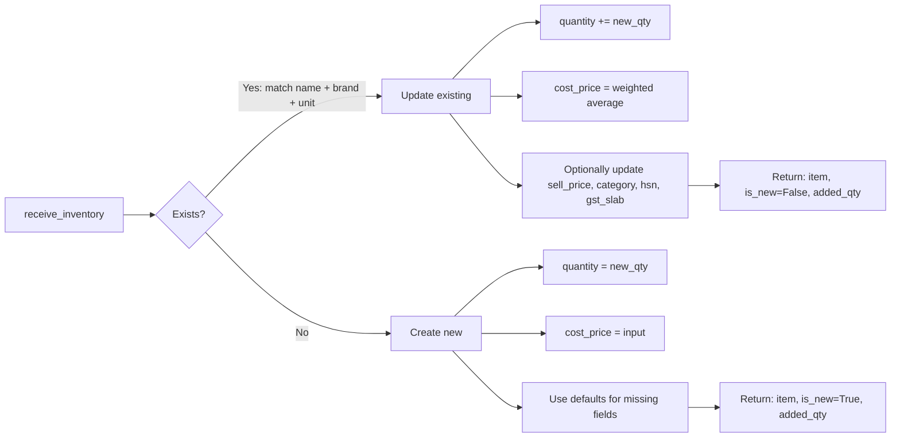

# Inventory Module

Manages the product catalog — searching, receiving stock, updating prices, and discontinuing products.

## Tools

| Tool | Description | Key Parameters |
|------|-------------|----------------|
| `find_inventory` | Search products by name/category/brand/low stock | `name`, `category`, `brand`, `low_stock`, `limit` |
| `receive_inventory` | Add stock (new product or existing SKU) | `product_name`, `quantity`, `cost_price`, `sell_price`, `unit`, `brand`, `category`, `hsn_code`, `gst_slab`, `is_loose`, `reorder_level` |
| `update_product` | Update product fields | `item_id` + any field as kwarg |
| `discontinue_product` | Soft-delete a product | `item_id` |
| `discover_product_info` | Auto-lookup HSN/GST slab via LLM | `product_name`, `category` |

## Data Model

```python
class Inventory(SQLModel, table=True):
    __tablename__ = "inventory"

    id: int
    chat_id: str
    name: str
    brand: str | None
    category: str | None
    hsn_code: str | None          # 8-char HSN code for GST
    gst_slab: int                 # 0, 5, 12, 18, 28
    unit: str                     # kg, L, piece, packet, etc.
    is_loose: bool                # sold by weight vs piece
    cost_price: int               # in paise
    sell_price: int               # GST-inclusive MRP in paise
    quantity: int                 # current stock
    reorder_level: int            # low-stock threshold
    is_discontinued: bool         # soft-delete flag
    discontinued_at: datetime | None
```

## Business Logic

### Stock-In Flow



### Weighted-Average Cost Price

When adding stock to an existing product, the cost price is recalculated as a weighted average:

```python
new_cost = (
    (existing.quantity * existing.cost_price) +
    (quantity * cost_price)
) // new_qty
```

This prevents cost basis distortion when buying at different prices.

### Below-Cost Guard

```python
if sell_price < cost_price:
    raise ValueError(
        f"Sell price (₹{sell_price/100:.2f}) must be >= "
        f"cost price (₹{cost_price/100:.2f})"
    )
```

Enforced on both `receive_inventory` (new products) and `update_product`.

### Soft Delete

Products are never hard-deleted. `discontinue_product` sets `is_discontinued=True` and records the timestamp. Discontinued items are excluded from search results but remain queryable by ID for historical bill references.

### HSN/GST Auto-Lookup

`discover_product_info` uses the LLM to suggest HSN code and GST slab for a given product name/category. This is the only place the model's knowledge is trusted — for classification, not pricing.

## Repository Layer

| Method | Purpose |
|--------|---------|
| `add_item` | Insert new inventory row |
| `get_item` | Get by ID + chat_id |
| `find_existing_item` | Match by name + brand + unit for stock-in |
| `update_item` | Update fields + enforce below-cost |
| `soft_delete_item` | Set is_discontinued flag |
| `search_items` | Partial case-insensitive match on name/category/brand |
| `search_low_stock` | Items where quantity is at or below reorder level |
| `list_items` | All active items |

All queries filter by `chat_id` for multi-chat isolation and exclude discontinued items.

## Test Coverage

**10 test cases** — CRUD operations, soft delete, search with partial names, empty results, item without HSN, non-existent item query.
