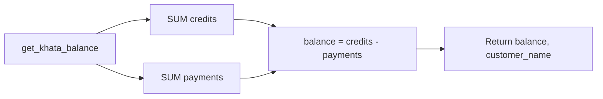
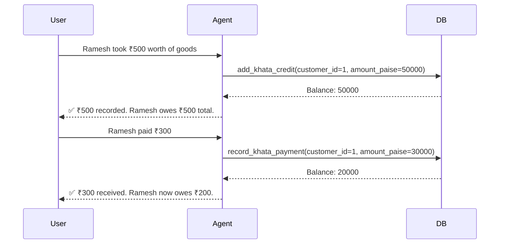

# Khata Module

Customer credit ledger — tracks who owes how much, records payments, and provides transaction history.

## Tools

| Tool | Description | Key Parameters |
|------|-------------|----------------|
| `add_khata_credit` | Record credit given to a customer | `customer_id`, `amount_paise`, `note` |
| `record_khata_payment` | Record payment received from a customer | `customer_id`, `amount_paise`, `note` |
| `get_khata_balance` | Get outstanding balance for a customer | `customer_id` |
| `get_khata_statement` | Get recent transaction history | `customer_id`, `limit` |

## Data Model

```python
class KhataTransaction(SQLModel, table=True):
    __tablename__ = "khata_transactions"

    id: int
    chat_id: str
    customer_id: int
    type: str                   # "credit" or "payment"
    amount: int                 # in paise
    bill_id: int | None         # optional link to a bill
    note: str | None            # description
    created_at: datetime
```

## Business Logic

### Balance Computation

Balance is computed as the difference between total credits and total payments:

```python
def get_balance(session, customer_id, chat_id):
    credits = session.exec(
        select(func.sum(KhataTransaction.amount))
        .where(type == "credit", chat_id == chat_id)
    ).one()

    payments = session.exec(
        select(func.sum(KhataTransaction.amount))
        .where(type == "payment", chat_id == chat_id)
    ).one()

    return int(credits) - int(payments)
```



### Positive Amount Guard

```python
if amount_paise <= 0:
    raise ValueError("Amount must be positive")
```

Both `add_khata_credit` and `record_khata_payment` enforce this — no zero or negative transactions.

### Customer Validation

```python
customer = get_customer(session, customer_id, chat_id)
if not customer:
    raise ValueError(f"Customer #{customer_id} not found.")
```

All four tools validate that the customer exists in the current chat before operating.

### Auto-Reminders via Skill

The kirana-store skill instructs the LLM to automatically manage khata reminders:

| Event | Action |
|-------|--------|
| Credit given | Set reminder for +14 days: "₹500 due from Ramesh" |
| Payment received | Remove old reminder. If balance > 0, set new +14 day reminder |

This is driven by the LLM following the skill — not hardcoded Python.

## Example Flow



## Test Coverage

**11 test cases** — add credit, add payment, get balance, zero balance for new customer, full repayment, get statement with limit, negative amount blocked, missing customer blocked, and 1 agent integration test.
