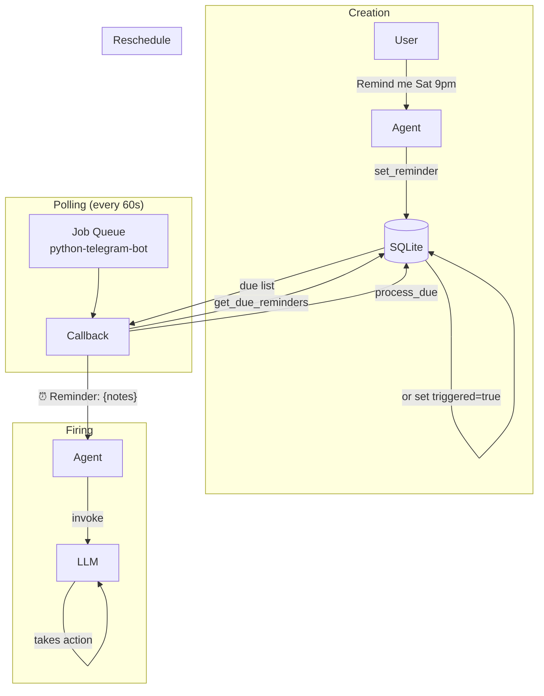

# Reminders Module

Scheduled notifications that fire by injecting a message back into the agent. The LLM sees the reminder as a user message and can take action (generate reports, check stock, etc.).

## Tools

| Tool | Description | Key Parameters |
|------|-------------|----------------|
| `set_reminder` | Create a scheduled reminder | `notes`, `reminder_at`, `frequency` |
| `get_reminders` | List all active reminders | (none) |
| `remove_reminder` | Delete a reminder | `reminder_id` |

## Data Model

```python
class Reminder(SQLModel, table=True):
    __tablename__ = "reminders"

    id: int
    chat_id: str
    notes: str              # max 1024 chars — what the LLM should do
    reminder_at: datetime   # next fire time
    frequency: str          # once | every_day | weekday list
    triggered: bool         # true for one-time reminders after fire
    created_at: datetime
```

## Scheduler Architecture



### Registration

The scheduler is registered in `bootstrap.py`:

```python
reminder_cb = make_reminder_callback(agent)
telegram.register_repeating_job(reminder_cb, interval=60)
```

Uses `python-telegram-bot`'s `JobQueue.run_repeating`:

```python
def register_repeating_job(self, callback, interval, first=0):
    self.app.job_queue.run_repeating(callback, interval=interval, first=first)
```

### Callback

```python
def make_reminder_callback(agent):
    async def callback(context: CallbackContext):
        with get_session() as session:
            due = get_due_reminders(session)
            for reminder in due:
                await _fire_reminder(agent, context, reminder)
                process_due(session, reminder)
    return callback
```

### Firing

The reminder fires by **calling the agent with a prefixed message**:

```python
async def _fire_reminder(agent, context, reminder):
    ctx = RequestContext(thread_id=reminder.chat_id)
    set_request_context(ctx)
    text = f"⏰ Reminder: {reminder.notes}"
    response = await handle_message(agent, text, reminder.chat_id)
    await send_text_safe(context.bot, int(reminder.chat_id), response)
```

The `notes` field is what the LLM should action. For example:

> Generate and send the weekly sales presentation. Call get_sales_summary() for the past 7 days, build a PresentationSchema...

The LLM sees this as a user message and proceeds to call tools, generate the PPTX, and send it.

### Post-Fire Processing

```python
def process_due(session, reminder):
    next_at = compute_next_occurrence(reminder)
    if next_at is None:
        reminder.triggered = True
    else:
        reminder.reminder_at = next_at
```

## Frequency System

| Frequency | Behavior | Next Occurrence |
|-----------|----------|----------------|
| `once` | Fire once, never repeat | `None` (→ triggered=true) |
| `every_day` | Same time + 24h | `reminder_at + timedelta(days=1)` |
| `monday,wednesday,friday` | Next matching weekday | See recurrence engine |
| `saturday` | Same day next week | See recurrence engine |

### Recurrence Engine

```python
def compute_next_occurrence(reminder):
    if reminder.frequency == "once":
        return None

    if reminder.frequency == "every_day":
        return reminder.reminder_at + timedelta(days=1)

    weekday_indices = parse_weekdays(reminder.frequency)
    current_wd = now.weekday()

    for wd in weekday_indices:
        if wd > current_wd:
            return now + timedelta(days=wd - current_wd)

    # wrap to next week
    first_wd = weekday_indices[0]
    return now + timedelta(days=7 - current_wd + first_wd)
```

### Validation Rules

```python
# Cannot combine once with every_day or weekdays
# Cannot combine every_day with weekdays
# Invalid weekday names raise ValueError
```

## Auto-Created Reminder

On first use of a new chat, `FirstTimeSetupMiddleware` creates a weekly Saturday 9 PM reminder:

```
notes: "Generate and send the weekly sales presentation..."
frequency: "saturday"
```

This ensures the owner never misses their weekly business review without any manual setup.

## Khata-Related Auto-Reminders

The kirana-store skill guides the LLM to automatically manage reminders for credit customers:

- **On credit**: Set a reminder for +14 days: *"₹500 due from Ramesh — ask for payment"*
- **On payment**: Remove old reminder. If balance remains > 0, set a new one for +14 days

This is driven by the LLM following the skill's instructions — not hardcoded in Python.

## Test Coverage

**16 test cases** — recurrence engine (all weekday transitions, once, every_day), create and process (once triggered, every_day rescheduled), get due excludes triggered, tool registration, list+remove flow, frequency validation.
