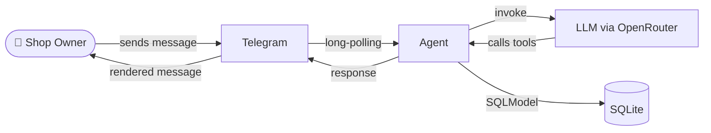

# Quartermaster — Your Kirana Store, on Telegram

**Quartermaster** is a conversational agent that lets you run your entire kirana store through **Telegram in plain language**. There's no web app, no admin panel — the chat *is* the product. Just type what you need, and the agent handles the rest.



## What You Can Do

### 🧾 Billing
Create bills by chatting. Start a bill for a customer, add items by name, adjust quantities, and finalize — all in natural language. Works in English and Hindi.

> *"Start a bill for Ramesh"* → *"Add 5kg Atta"* → *"Also 2L Oil"* → *"Finalize UPI"*

### 📦 Inventory
Receive stock, search products, update prices, or discontinue items. Every change is tracked with weighted-average cost pricing and automatic HSN/GST slab lookup.

> *"Receive 50kg Tata Salt at ₹32/kg"* → *"Find fortune oil"* → *"Update price of Britannia Milk to ₹56"*

### 📒 Customer Credit (Khata)
Track credit sales and payments per customer. The agent automatically reminds you to follow up on outstanding balances.

> *"₹500 credit for Ramesh"* → *"Ramesh paid ₹200"* → *"Show Ramesh's balance"*

### 📄 GST Invoices
Generate GST-compliant PDF invoices with one message. Each invoice includes CGST/SGST breakout, HSN codes, ₹ symbol, and Hindi Unicode — ready to share or print.

> *"Generate invoice for bill #42"*

### 📊 Sales Analytics
Ask for today's sales, top products, payment mode breakdown, or what needs reordering. Instant answers from your data — no spreadsheet required.

> *"Show me today's sales"* → *"What are my top 5 products this month?"* → *"What should I reorder?"*

### ⏰ Reminders
Schedule one-time or recurring reminders. The agent can generate and send weekly reports, daily stock checks, or payment follow-ups — automatically.

> *"Remind me every Saturday 9pm to send the weekly report"*

## Try It Live

The bot is running at [**@artemis_py_bot**](https://t.me/artemis_py_bot). Open Telegram and say something like:

> *Hi* — get a greeting and available commands  
> *Start a bill for Ramesh* — begin a new sale  
> *Show me today's sales* — see your day at a glance  
> *Generate invoice for bill #1* — get a GST PDF

The bot uses a live LLM, so responses take a moment — but everything is grounded in real data.

## How It Works

When you send a message, it flows through three layers:

```
You → Telegram → Agent → LLM (OpenRouter) → Tools → SQLite → Response → You
```

1. **Telegram** receives your message (text, voice, or photo)
2. **Agent** wraps it with context (datetime, your shop preferences)
3. **LLM** understands your intent and decides which tools to call
4. **Tools** query or update the database through business-logic layers
5. **Response** is rendered and sent back to you in Telegram

Voice messages are transcribed via Whisper. Photos of products can be used for identification. All data is isolated per Telegram chat.

## Design Pillars

1. **You never leave Telegram** — every operation happens in the chat. Billing, inventory, reports, reminders — all through conversation.

2. **The LLM composes tools freely** — there are no rigid intent routes. The model chains steps as needed (e.g. look up a customer → check stock → create a bill) within a single turn.

3. **Data is ground truth** — prices, GST slabs, and stock come from your database via tools. The model never invents numbers. Business rules are enforced in code, not hoped for in a prompt.

4. **Your data is yours alone** — every row is tagged with your Telegram chat ID. One shop owner's data never leaks into another's session.

5. **Real documents, not summaries** — GST-compliant PDF invoices via LaTeX, professional PowerPoint decks via a dedicated design subagent.

6. **Cross-cutting concerns stay invisible** — shop preferences, datetime, and error handling are injected automatically without cluttering tool logic.

## Built With

| Layer | Technology |
|-------|-----------|
| **Orchestration** | [deepagents](https://github.com/langchain-ai/deepagents) (LangGraph) |
| **LLM** | OpenRouter (default: `minimax/minimax-m3`) |
| **Messaging** | `python-telegram-bot` |
| **Database** | SQLite + SQLModel + Alembic |
| **Documents** | Jinja2 + xelatex (PDF), python-pptx (PPTX) |
| **Audio** | OpenAI Whisper via OpenRouter |
| **Runtime** | Python 3.13+, uv |

## Repository Layout

```
agent/
├── src/agent/
│   ├── app/bootstrap.py         # Wire everything together
│   ├── core/                     # Agent builder, LLM, prompt, handler
│   ├── db/                       # Engine, session, model registry
│   ├── infrastructure/           # Telegram, renderers, middlewares
│   └── modules/                  # 8 business domains (billing, inventory, ...)
├── skills/                       # LLM instruction files
├── subagent_skills/              # Subagent instruction files
└── tests/                        # 110+ test scenarios
```
